# 2022 年最佳时间追踪软件

> 原文：<https://medium.com/nerd-for-tech/top-time-tracking-software-for-businesses-in-2021-1a7b55376cfa?source=collection_archive---------4----------------------->

面向 2022 年企业的时间追踪软件

来源

“岁月不饶人。”杰弗雷·乔叟。

公理适合那些努力在各自领域达到新高度的企业和企业家。无论是金融、电信、医疗保健还是 it 部门。

众所周知，许多企业近年来一直在努力提高员工的工作效率，并在寻找一些监控员工工作效率的好方法。

但是用时间追踪软件能有效做到吗？员工时间跟踪应用程序有助于提高员工的工作效率吗？这些是商务人士为了提高员工的生产力而问的一些问题。

简单来说，时间跟踪软件是任何公司的必备软件，可以用来提高效率和生产力，同时降低成本。

**如何？**

**顶级时间追踪软件:**

●允许你检查你的团队在工作时间做了什么。

●帮助你了解工作时间是如何利用的。

●增强透明度和问责制。

●自动化重复的任务，如归档时间表和处理工资单。

●告诉你如何更有效地利用你的资源。

但是，当有许多选项可供选择时，您如何知道使用哪一个呢？

今天，在这篇博文中，我们将讨论市场上可用的 [**最佳时间跟踪软件**](https://www.workstatus.io/best-time-tracking-software-online?utm_source=hackernoon&utm_medium=gp-posting&utm_campaign=GP-vin) 选项以及它们提供的功能。因此，最终，您可以做出明智的决定，选择最适合您企业的产品。

让我们为您的企业找出最好的顶级跟踪软件。

**2022 年商业时间追踪软件排行榜**

# 1.nTask

nTask

NTask 是最好的任务跟踪软件之一，企业可以使用它来监控员工在日常任务中的进度。**任务管理**功能使用户能够密切关注员工完成特定任务所花费的工作量和时间。

该软件还包括一些功能，如管理有截止日期的项目，为任务添加注释，为任务添加意义，以及通过电子邮件通知与其他团队成员合作。

● **定价**

免费计划—不限成员、不限任务、不限会议和时间表、5MB 文件附件、100 MBs 存储空间

PRO plan——每个用户 1 美元起，无限项目。

# 2.每小时

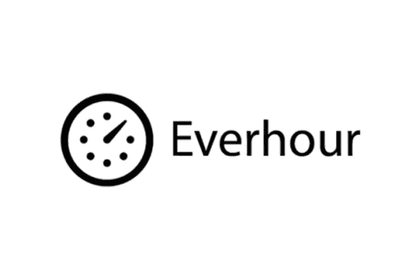

每小时

Everhour 是 2022 年要考虑的首要时间追踪软件之一。它是个人和企业主都可以使用的软件。这个软件可以让你记录一天中所有员工的活动。

你可以查看他们工作了多少小时，以及一天中的时间。它还有一个非常高效的客户管理系统，可以帮助有效地跟踪您的员工信息，从而提高工作效率。

● **定价**:

单用户计划——每月 8 美元

5 人团队计划—每个用户每月 5 美元

# 3.工作状态

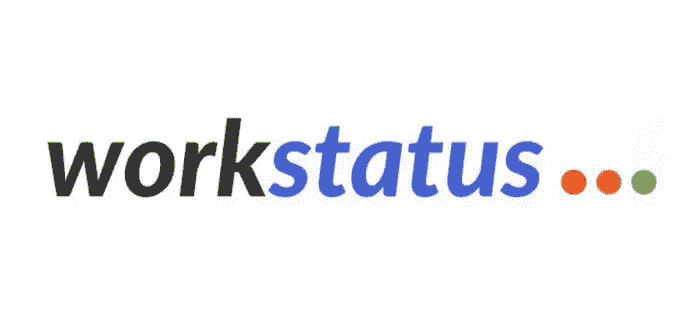

工作状态

[**Workstatus**](https://www.workstatus.io/?utm_source=hackernoon&utm_medium=gp-posting&utm_campaign=GP-vin) 是 2022 年商家最好的时间追踪软件之一。这对小企业是有益的，因为它非常容易使用，并且有一个免费版本。

该软件设计有一个直观的界面，任何用户都可以完全访问。要跟踪在特定项目上花费的时间，您只需要创建它并开始记录时间。

您可以将该软件用于多种目的，尤其是测量在特定项目上花费的时间。你可以用它来跟踪所有的电脑活动，包括浏览，信息，操作键盘，网上冲浪等。

**该软件的核心功能包括:**

●生产率监控

●截图

●用于审核的每日时间表

● URL 和活动跟踪

●在线开具发票

●项目预算

此外，该软件是为不同的企业定制的，包括承包商、软件开发人员、工程师、远程工作者、初创公司、中小企业和企业家。

这个软件最好的一点是，它可以集成你可能已经在使用的所有应用程序。应用程序本身提供集成，这意味着它们很简单，并且节省时间，不需要您做任何额外的工作。

● **定价**:

免费永久套餐:₹0

初级套装:₹366.07/user/month

秤包:₹732.87/user/month

企业套装:₹1320.49/user/month

# 4.收获

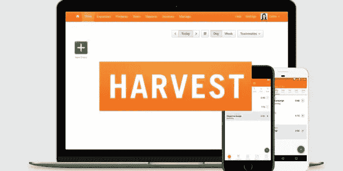

收获

Harvest 是 2022 年企业最佳员工时间跟踪软件之一。Harvest 允许在在线软件的帮助下为客户跟踪时间。可以使用许多过滤器和导出选项生成实时报告。还有一个通过第三方集成与 Harvest 连接的选项。

它向用户提供免费和付费版本，而付费版本比免费版本有更多的功能。用户可以创建无限的项目，而在免费版本中，用户最多可以创建 3 个项目。

● **定价**:

单用户—12 美元/月，无限制的评估和发票

# 5.t 工作表

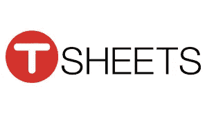

t 工作表

Tsheets 是 2022 年最突出的时间管理软件之一。它提供了各种功能，包括关键字搜索、无限用户、桌面通知和自定义字段。

它支持桌面和移动设备。该软件具有自动更新功能，有助于将您的所有数据同步到云服务器。Tsheets 也易于使用，具有直观的界面和简单的导航选项。

Tsheets 是一个易于使用的时间跟踪软件，它与员工一起记录工作所花的时间。它还有一个被称为“时间银行”的功能，可以记录时间并用于未来的项目。

● **定价**

免费计划-单用户。功能齐全

每个用户每月 4 美元+16 美元基本费用—2–99 个用户

# 6.Hubstaff

Hubstaff

Hubstaff 是 2022 年面向小企业主的顶级时间追踪软件之一。该软件还有一个免费的试用版，你可以在购买之前用来测试这项服务。

该计划是专门为自由职业者、远程团队和代理机构设计的。它提供实时时间跟踪，因此您可以在屏幕上实时看到团队的工作进度。

您还可以创建项目，并通过自动记录和手动输入选项跟踪计费时间。该应用程序甚至可以让你从你的电脑远程监控他们的屏幕，只要他们的设备上安装了该软件。

● **定价**:

免费计划-单用户。有限的功能

基本计划——208 美元/月。50 个用户。有限的功能

# 7.时间医生

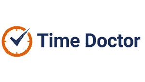

时间医生

时间医生是 2022 年企业最可靠的员工打卡 app 之一。它有助于管理和监控工作和出勤情况，并具有多种提高生产率的功能。该系统旨在根据您的业务工作流程进行定制，您可以使用它来提高生产率，同时通过提高效率来降低成本。

● **定价**:

免费计划—功能有限的免费计划

专业计划—每个用户每月 9.99 美元

# 8.时光营

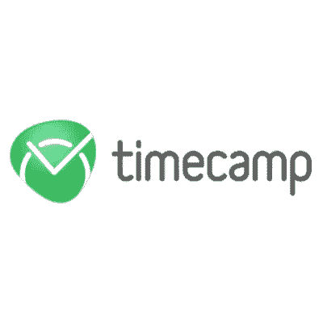

时光营

TimeCamp 是 2022 年最受企业欢迎的时间追踪应用。它允许企业跟踪员工工作时间、员工休息时间以及员工的工作效率。

它允许员工轻松记录他们的工作时间，并跟踪花费在活动和项目上的时间。这个软件还可以让你创建关于你的员工工作多少的详细报告。TimeCamp 可以在 PC 或 Mac 上使用。

# 9.托格尔

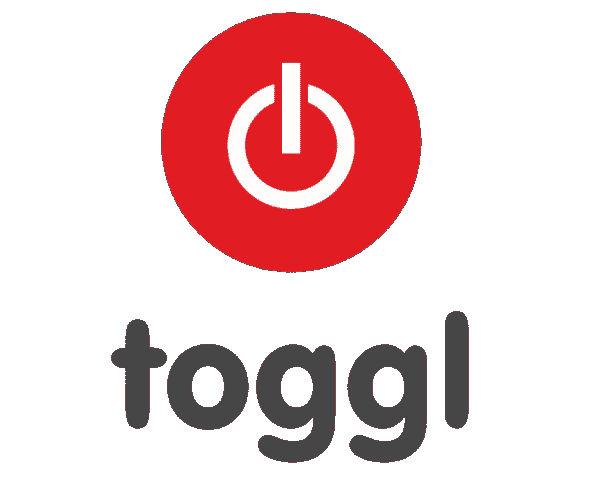

托格尔

Toggl 是市场上最流行的时间跟踪软件之一，它不仅仅可以用来跟踪员工在项目上花费的时间。此外，它还可以跟踪完成了多少任务，正在进行什么类型的项目，甚至是正在通过外包进行的项目。

Toggl 软件也有一个适用于智能手机和平板电脑的应用程序，因此员工可以轻松跟踪他们的时间，无论他们在哪里。

● **定价**:

入门版(每位用户每月 9 美元)

高级(每个用户每月 18 美元)

企业(定制定价计划)

# 10.及时的

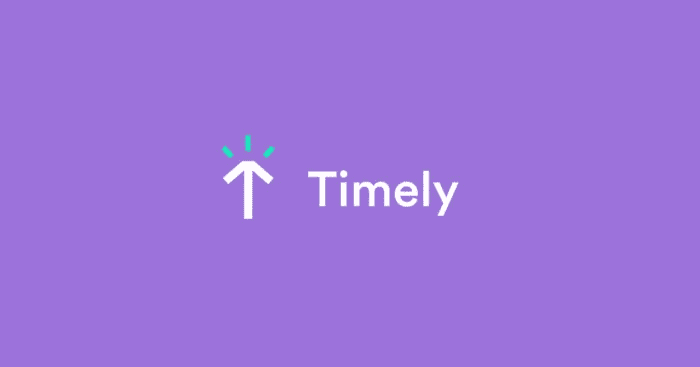

及时的

它是大团队最受欢迎和最精确的时间追踪器。它集成了一个时间跟踪器，可以跟踪你已经在业务中使用的所有工具，如项目管理工具或电子邮件服务。根据用户使用的网站和应用程序，及时自动创建用户活动日志。

时间跟踪现在被不同行业的企业广泛使用，它使公司能够毫无障碍地满足他们的计费需求，并降低成本。timedia 还提供了一个日程安排功能，允许您跨团队预定约会或会议。

● **定价**:

独奏(每月 7 美元)

基本(每月 14 美元)

公司(每月 21 美元)

# 11.大时代

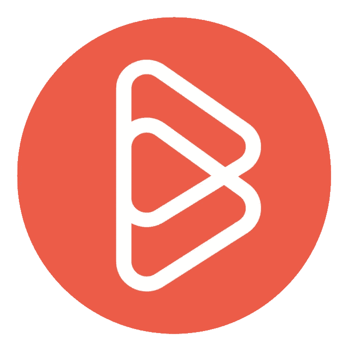

大时代

BigTime 是 2022 年商业最佳时间追踪软件。BigTime 允许雇主跟踪和监控员工的时间，该软件还可以提供所有员工每周时间和小时数的完整详细报告。

它让雇主专注于他们希望员工做的事情。此外，BigTime 的许多其他著名功能将有利于企业所有者和管理者。

● **定价**:

快速(每个用户每月 5.95 美元)

专业版(每个用户每月 17 美元)

Premier(每个用户每月 28 美元

# 12.重新计算时间

重新计算时间

RescueTime 是最好的员工时钟应用程序之一，可以用于商业目的。RescueTime 有一个功能，可以跟踪你访问的网站以及你在这些页面上花费的时间。

它还有一个功能，可以阻止令人分心的网站和应用程序，以保持工作效率，专注于工作，而不会被其他事情分散注意力。该网站将跟踪你的进展，并向用户展示他们在一段时间内的成效。

● **定价**:

无限用户永远免费。

# 13.滴答声

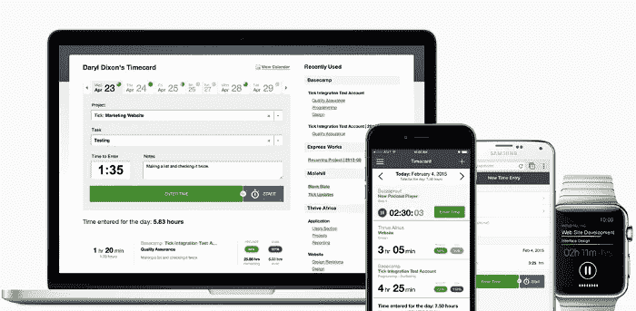

滴答声

是 2022 年商家最好的时间追踪软件之一。它可以帮助公司看到他们如何有效地利用时间以及他们正在做什么任务，从而使他们专注于最重要的任务，从而对公司的成功产生影响。

这是 Tick 在当今自由职业者、企业和企业家中越来越受欢迎的主要原因之一。它可以帮助您跟踪时间，同时还可以创建发票、费用和报告。

● **定价**:

1 个项目:免费

10 个项目:每月 19 美元，不限人数

30 个项目:每月 49 美元，不限人数

# 14.焦点我

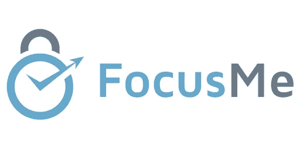

焦点我

FocusMe 是 2022 年企业最佳时间追踪软件。更多的公司选择它是因为它的可靠性和生产力。该软件有许多对雇员和雇主都有益的功能可供选择。

例如，它可以用来记录某人一天工作了多少小时，休息了多少次，以及他们在不同的任务上花了多少时间。

● **定价**:

年费:每月 2.50 美元

终身:119.99 美元，按时付款

# 15.蒂米尼耶

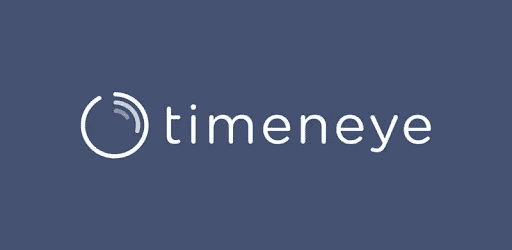

蒂米尼耶

Timeneye 是一个强大而有效的商业时间追踪器，它不需要安装在你的电脑上。这是你在 2022 年做生意的最佳时机。

●首先，Timeneye 有一个简单的界面，适合不同年龄的人。

●其次，项目和任务等众多功能可以帮助你管理时间，非常适合忙碌的专业人士。

●第三，该软件几乎兼容所有操作系统，包括 Windows 7+、Android 4+、iOS 10+等。

● **定价**:

自由的

赞成:每个用户每月 6 美元

# 16.我的时间

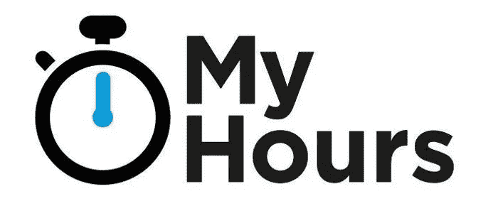

我的时间

我的时间是 2022 年企业最好的时间追踪软件。这个软件可以提供雇员工作时间的准确记录，雇主可以用它来扣除工资。

它还提供了一些有用的功能，如跟踪员工一整周的休息时间，在工作时间的不同时间间隔拍摄桌面截图，录制语音笔记，以及拍摄各种工作空间的照片。

● **定价**

免费套餐

专业套装(每个用户每月 6 美元)

# 17.桌面时间

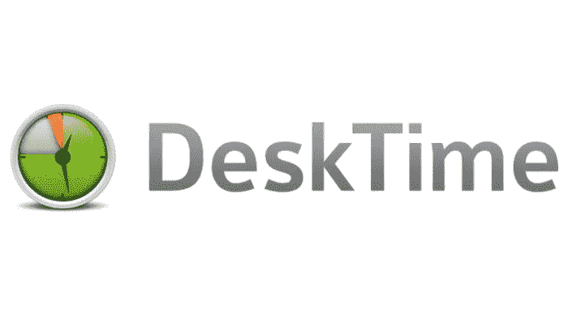

桌面时间

DeskTime 是一个时间跟踪软件，你可以跟踪你的员工在工作日的工作时间。办公桌时间将帮助你变得更有效率，不要把时间浪费在无关紧要的事情上。有空闲时间检测、任务模板和待办事项管理等功能，可以帮助您更快地完成工作。

此外，DeskTime 还附带了一个经济实惠的订阅计划，该计划以合理的价格包含了 DeskTime 的所有功能。

● **定价**

免费(适合一个用户)

桌面时间专业版(每月 7 美元)

18。 **Paymo**

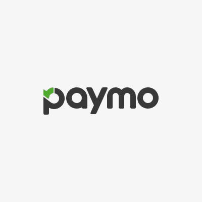

佩莫

Paymo 是一个很好的商业时间跟踪软件，因为它提供了无限数量的项目和用户。它还有一个“智能”界面，可以根据公司的需要进行配置。

Paymo 提供的功能包括高级图形报告、移动时间跟踪、即时员工开始/停止、快速、可访问的报告和可定制的任务列表。

它有一个简单的安装过程，非常用户友好和直观，所以你可以马上开始使用它。它还通过网站上的客户区为所有用户提供免费支持，以及教程。

● **定价**

免费(仅限一名用户)

小型企业(每个用户每月 9.56 美元)

Office(每个用户每月 15.16 美元)

# 19.TMetric

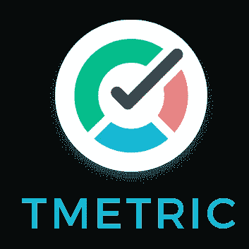

TMetric

TMetric 是最好的**员工时间追踪 app** 。它兼容四种不同的操作系统，并且有无限数量的项目。TMetric 配备了一个移动应用程序，可以帮助您跟踪员工在旅途中完成任何项目的时间。

使用移动应用程序，您还可以看到每个员工在每个项目上花费了多少时间。

TMetric 云报告功能使您能够随时生成报告。例如，如果你想知道哪些员工把大部分时间花在了具体的项目上，点击“云报告”标签，你就能立刻获得这些数据。

然后，您可以使用这些信息为那些积极参与生产项目的员工提供更多资源。

● **定价**

免费(最多 5 个用户)

商务(每月 4 美元)

# 20.时钟化

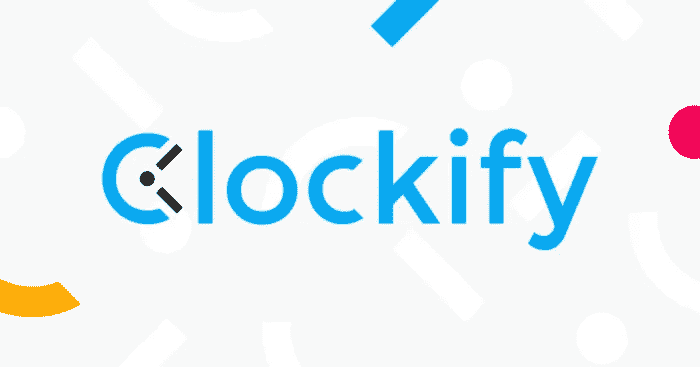

时钟化

Clockify 是最好的**时间追踪应用**，企业可以用它来监控员工的活动。这个软件使用起来非常简单，这意味着你的员工在学习如何使用它时不会有困难。

有了 Clockify **员工时间跟踪应用**，你再也不会有打卡和打卡的麻烦，因为这款软件带有使用指纹扫描的生物识别登录功能。

付费版本为您的业务提供了出色的自动化，在这个过程中为您节省了大量时间。有了这个神奇的软件，你可以设置提醒和警报。

● **定价**

免费(不限用户和项目)

外加(每月 10 美元/工作空间)

高级(每月 30 美元/工作空间)

# 21.每小时地

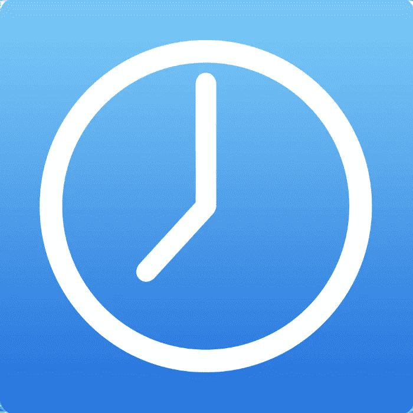

每小时地

Hourly 是 2022 年企业顶级时间追踪软件之一。他们可以跟踪时间，但他们也可以根据一天中的时间段来分配任务。对于企业来说，这是一个很好的方式来跟踪他们的工作负载，并确保他们不会错过任何东西。在 Hourly 之前，市场上没有类似的服务。

● **定价**:

每位用户每月 8 美元+每月 40 美元。无限用户。

# 22.电子邮件分析

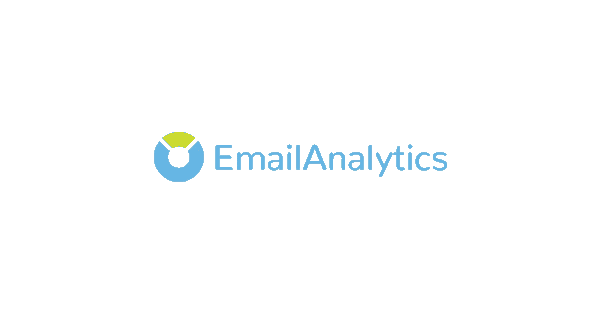

电子邮件分析

EmailAnalytics 是 2022 年企业最佳时间追踪软件。这是易于使用和有效的，它有一个直观的界面，使它非常用户友好。

此外，它为许多不同的平台提供了许多集成，包括 Google Drive、Basecamp、Outlook、Slack 等。它提供了一个有效的时间跟踪工具，为所有员工提供洞察力，无论他们身在何处。

● **定价**:

14 天免费试用(不需要信用卡)

专业版(每个用户每月 15 美元)

企业(每个用户每月 5-12 美元)

# 23.蒂梅罗

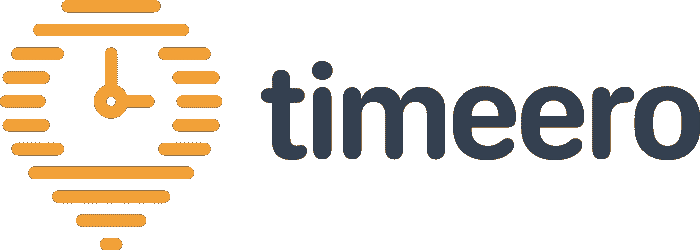

蒂梅罗

它是企业用来跟踪员工工作时间的最佳时间跟踪软件。很难掌握员工的工作时间，Timeero 会帮你记录所有的工作时间，并在员工完成项目时自动提交。

此外，设置很容易，它提供的报告非常详细，信息丰富。你永远不会忘记他们做了什么，或者他们在那个项目上花了多长时间。

● **定价**:

5 美元/用户/月+10 美元基本月费—每月

月费 10%折扣—年费(10%折扣

# 24.时间轨迹

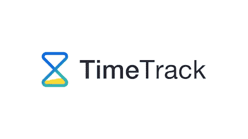

时间轨迹

TimeTrack 是 2022 年企业最佳时间追踪软件。该软件可以帮助管理任务、项目和员工日程。这样，您可以看到员工完成任务所需的时间。

它还能够导出 Excel、PDF、CSV 和 XML 格式的数据，使导出数据更加容易。您还可以使用 TimeTrack 报告来有效地估计公司员工的生产率。

● **定价**:

标准计划:每个用户每月 4 美元

高级计划:每个用户每月 8 美元(包括高级项目管理功能)

黄金计划:每个用户每月 10 美元(包括发票功能)

# 25.点击时间

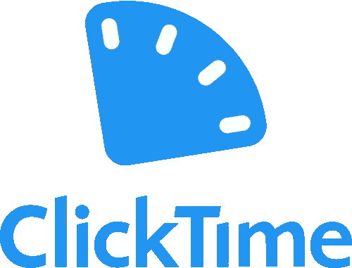

**点击时间**

ClickTime 是目前市场上最好的时间追踪应用。这背后的原因是它为企业提供的功能和它提供的一系列基于位置的工具。ClickTime 包括员工日程安排，允许您在项目开始前可视化任何项目将花费的时间。

此外，您可以毫不费力地将数据导出为时间表或电子表格格式，以便于分析。它也有 GPS 监控，所以经理们可以看到员工上下班的时间。

对企业来说，最好的功能是团队管理工具，它允许经理从一个位置创建时间表、设置任务期限、跟踪时间和安排团队成员的轮班。

● **定价**:

入门——每个用户每月 9 美元

团队—每个用户每月 12 美元

Premier —每个用户每月 24 美元

# 最终拍摄

所以，这是关于 2022 年商务人士可以使用的顶级时间管理软件。

正确的时间跟踪软件可以帮助你了解你的员工是如何度过他们的一天的。对于个人和企业主来说，使用这种类型的 [**劳动力管理系统** t](https://www.workstatus.io/solutions/workforce-management-software?utm_source=hackernoon&utm_medium=gp-posting&utm_campaign=GP-vin) 改善工作流程的可能性是无穷无尽的。

从更有效地安排会议到寻找减少浪费时间的方法，好的时间跟踪软件可以为你做很多事情。

那么为什么现在要推迟呢？获取 Workstatus、BigTime 或 Toggl，从今天开始跟踪您的员工生产力。

祝你好运！

# [更多来自 Anayagrewal](/@anayagrewal207?source=post_page-----3e051c396742-----------------------------------)