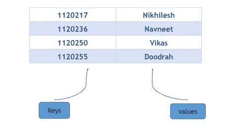
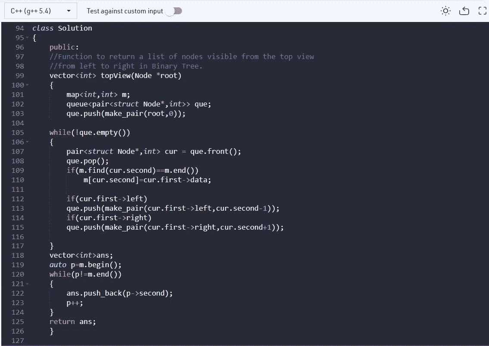
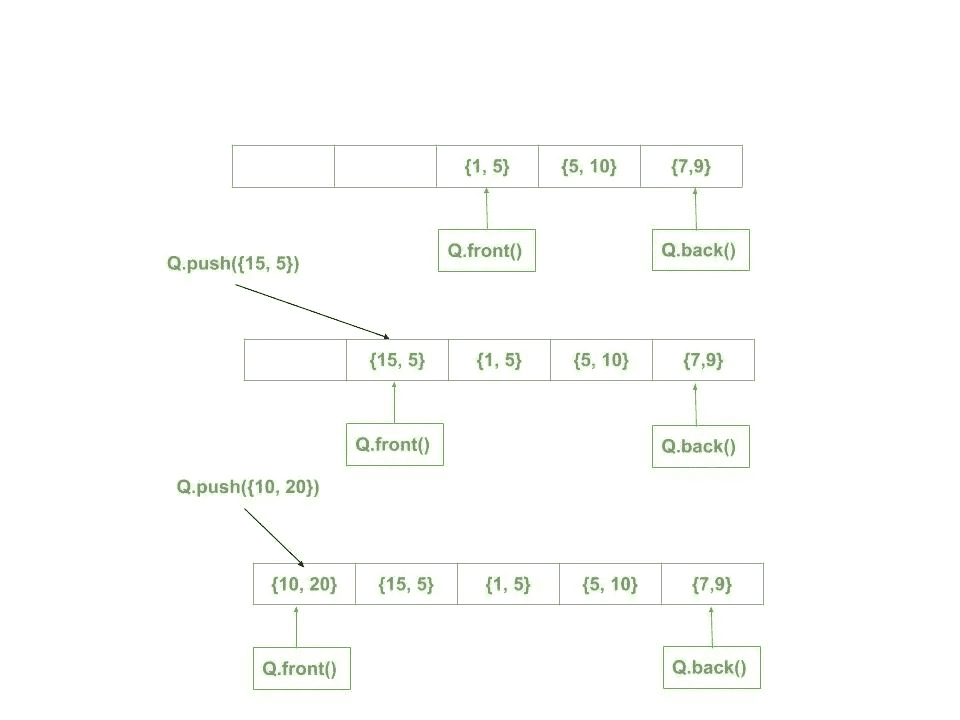

# 二叉树的俯视图

> 原文：<https://medium.com/nerd-for-tech/top-view-of-a-binary-tree-6de9576a8673?source=collection_archive---------5----------------------->

下面给出的是一棵二叉树。任务是打印二叉树的顶视图。二叉树的顶视图是当从顶部查看该树时可见的节点集。对于下面给定的树。

```
**Note:** Return nodes from **leftmost** node to **rightmost** node.
```

**例 1:**

```
**Input:
**      1
   /    \
  2      3
**Output:** 2 1 3
```

**例二:**

```
**Input:
**       10
    /      \
  20        30
 /   \    /    \
40   60  90    100
**Output:** 40 20 10 30 100
```

**任务:**
完成函数 **topView()** ，该函数以**根节点**为参数，从左到右返回俯视图中可见的节点列表。打印顶视图结束后打印 endline。

**期望时间复杂度:** O(N)
**期望辅助空间:** O(N)。

**约束:**
1 ≤ N ≤ 10^5
1 ≤节点数据≤ 10^5

我将使用地图、配对和队列来寻找解决方案。让我们先了解这些。

1.  [***地图***](https://www.geeksforgeeks.org/map-associative-containers-the-c-standard-template-library-stl/)



它是一个以键值对形式存储数据的容器，如上图所示。没有两个映射值具有相同的键值。一些基本函数有:begin()、end()、clear()等。

**2 *。*** [***对***](http://geeksforgeeks.org/pair-in-cpp-stl/)

它是由两个数据元素或容器组成的容器。

**语法为:** pair(数据类型 1，数据类型 2) Pair_name

> **代码:**

```
vector<int> topView(Node *root)
 {
 ***//map where key and value pair are of int type*** 
 map<int,int> m; 

 ***// queue of pair*** 
 queue<pair<struct Node*,int>> q;**//constructs a pair object with its first element set to x i.e. root****//and its second element set to y i.e. 0**
 q.push(make_pair(root,0));

***// while the queue has elements***
 while(!q.empty())
 {
 ***// pair points to the front of the queue*** 
 pair<struct Node*,int> current = q.front();***// pop the front element from the queue*** 
 q.pop();***// if second element in the current pair is equal to the end element in map*** 
 if(m.find(current.second)==m.end())***//then the value at that index in the map will store the 
//data which is held by first element of the current pair*** 
 m[current.second]=current.first->data;***//if element at left is not NULL*** 
 if(current.first->left)
***// recursive call*** 
 q.push(make_pair(current.first->left,current.second-1));***//if element at right is not NULL***
 if(current.first->right)
***// recursive call* ** q.push(make_pair(current.first->right,current.second+1));

 }***//vector to store the answer*** 
 vector<int>ans***// pushing the top view elements from the map in the vector*** 
 auto p=m.begin();
 while(p!=m.end())
 {
 ans.push_back(p->second);
 p++;
 }
 return ans;
 }
```

> **代码片段**



**便于理解的参考&可视化:**

1.  下图显示了配对队列的可视化效果。

```
 Queue of Pairs: (10, 20) (15, 5) (1, 5) (5, 10) (7, 9)
```



希望有帮助！！😀既然你喜欢看我的博客，为什么不请我喝杯咖啡，支持我的工作呢！！[https://www.buymeacoffee.com/sukanyabharati](https://www.buymeacoffee.com/sukanyabharati)☕