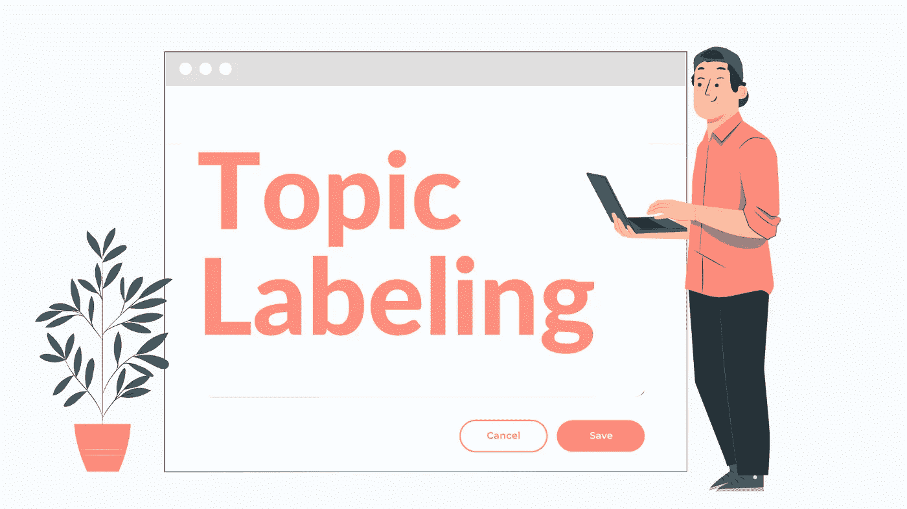
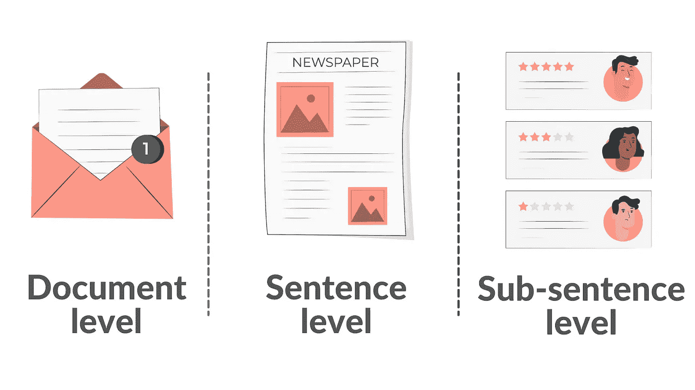
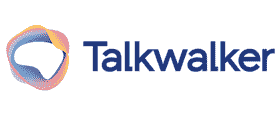
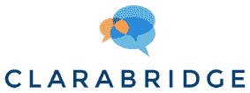
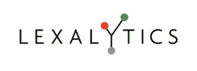

# 主题标注

> 原文：<https://medium.com/nerd-for-tech/topic-labeling-16f0a1335450?source=collection_archive---------1----------------------->

主题标注是一种机器学习技术，用于通过基于每个单独段落的主题或主题分配“标签”或组来组织和理解大量文本数据。

主题标注是一种无监督机器学习技术。这意味着它可以推断模式并对相似的语句进行分组，而不需要建立主题标签或训练数据。

考虑这样一种情况，当你需要检查大量的评论来确定人们对你的产品的评价时。主题标签和情感分析可以结合起来，以确定你的产品的哪些功能或主题是最常被讨论的，以及人们对它们的感受。基于方面的情感分析是这种方法的名称。

主题标签可以用于各种目的，除了品牌监控之外，还包括社交媒体监控、客户支持、客户意见分析、业务分析、品牌管理、SEO、产品分析和组织学习。

## 主题标签适用于不同级别的范围:

*   在文档级别，主题模型从完整的文本中提取各种主题。考虑电子邮件或新闻故事的主题。
*   主题模型在句子层面获取单句的主题。考虑新闻标题的主题。
*   主题模型在子句子级别从短语中检索子表达式的主题。例如，在产品评估的一句话中，可以讨论许多主题。

# **主题标注的应用**

*   使用主题识别和分析，检测和跟踪人们讨论最多的业务的不同方面，以获得关于您品牌的见解。
*   当你接到客户联系时，你可以利用主题分类器来识别潜在的买家，并立即直接联系他们。
*   机器比人工作得更快，而且不会疲劳，因此即使工作量增加，它们也不会错过一笔销售。
*   完成购买的机会越高，团队就能越快地通过主题识别注意到购买意图并做出反应。
*   标准的统一性确保了所有客户对话都在相同的设置下，使用相同的流程和方法进行分析。

# 用于主题标注的工具

1.  [bytes view](https://www.bytesview.com/)

[BytesView](https://www.bytesview.com/topic-labeling) 是一个高效的工具，您可以使用它来自动对文档进行主题标记和文本分类。

任何行业中的大型组织每天都必须处理大量的文档。它可以在几分钟内从非结构化文本数据中识别单词簇，从而帮助您分离文档，并保证准确性。

**2。Talkwalker**

这个工具最好与你的社交媒体渠道结合使用，因为它可以准确地告诉你人们如何看待你公司的社交媒体账户。

另一个优秀的话题标注工具是 Talkwalker。它声称拥有目前最好的文本分析技术，可以区分讽刺和其他模糊形式的负面提及。

**3。克拉布里奇**

Clarabridge 是一个多方面的平台，包括客户体验管理。文本分析是这个解决方案的一个组成部分。工具中的文本分析非常详细，考虑了解析、框架、行业和来源。

**3。** [**猴子学**](https://monkeylearn.com/)

MonkeyLearn 是一个以适应性著称的文本分析程序。只需创建标签，然后手动突出显示文本的不同部分，以显示哪些内容属于哪个标签。

随着时间的推移，该软件可以自行学习，并可以同时处理多个文件。它包含一组预先训练好的模型，可用于主题标签、情感分析、关键词提取、意图检测等任务

**4。品牌手表**

Brandwatch 也是我常用的分析工具之一。它分析品牌情绪，显示趋势，并包括一个很酷的功能，称为“图像洞察力”就像主题可以与您的品牌名称相关联一样，该功能可以识别与您的品牌徽标相关联的图像。

**5。词汇分析**

Lexalytics 是一个商业智能解决方案，可以分析各种类型的文本。Lexalytics 处理社交媒体评论、调查、评论和任何其他类型的文本文档。除了情感分析，该工具还执行情感检测、主题提取和主题标记，这可以帮助用户看到完整的上下文。

# 我希望你读得很好