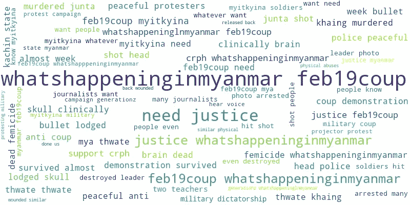
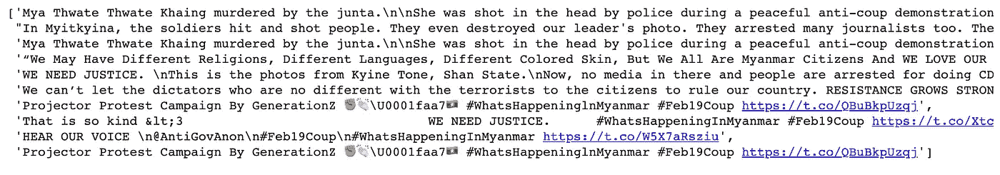
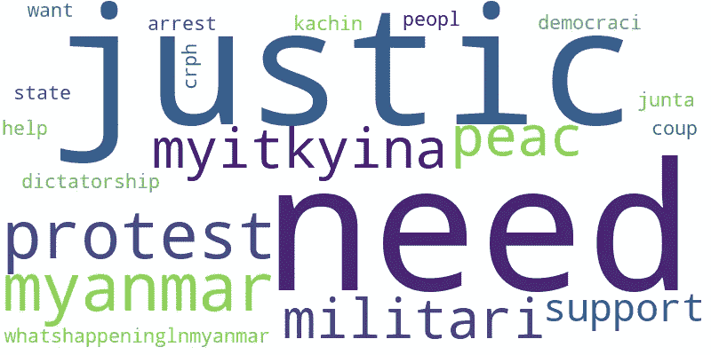

# 缅甸发生了什么-主题建模

> 原文：<https://medium.com/nerd-for-tech/topic-modelling-whats-happening-in-myanmar-c9a1eaa41466?source=collection_archive---------17----------------------->

推特# 2 月 19 日政变的词汇云

缅甸，原名 Burma，是东南亚国家之一。2 月 1 日，军方在大选后夺取了控制权，诺贝尔和平奖得主昂山素季的全国民主联盟(NLD)党以压倒性优势获胜。

自军事政变以来，公众一直在推特上及时地用特定的哈希标签发布关于缅甸发生的事情。

本文使用主题建模方法分析了推特标签趋势，人们在推特上发布了什么，缅甸在特定的一天发生了什么。

*主题建模是一种无监督的机器学习技术，通过聚类词组和相似表达从一组文本文档中提取潜在主题。潜在狄利克雷分配(LDA)是实现主题建模的算法之一。*

## Twitter API 连接

首先，为了获取 tweets 信息，我们需要有一个 twitter 账户，并通过 developer.twitter.com 的[申请开发者账户。然后，设置应用程序并生成凭证密钥。](http://developer.twitter.com)

一旦密钥准备好了，我们就可以开始使用 [tweepy](https://www.tweepy.org/) python 库获取推文，如下面的代码片段所示。

## 数据预处理

当我们看一看随机的推文时，可以看出文字并不干净。我们不希望在我们的分析中使用表情符号、换行(\n)或 https 超链接。如果我们把垃圾放进我们的模型，垃圾就会出来。因此，我们必须进行数据预处理。

不干净的随机推文片段

对语料库进行数据预处理，以转换成小写字母，去除不必要的上下文——表情符号、https 链接、新换行、标点符号、基于英语词典的停用词，最后对语料库进行词干处理。

## 培训 LDA

干净数据用于创建术语字典，其中每个唯一术语被分配一个索引，然后将它们转换成文档术语矩阵。之后使用 [Gensim](https://radimrehurek.com/gensim/) python 库，利用创建的文档术语矩阵来构建和训练 LDA。

从结果中，可以提取 2021 年 2 月 19 日发生在缅甸的三个主要话题。

下面的代码是可视化的每个结果主题的重要词汇。

其中一个主题的文字云

请随意使用 [github](https://github.com/ZinTun/TopicModelling) 中的代码。