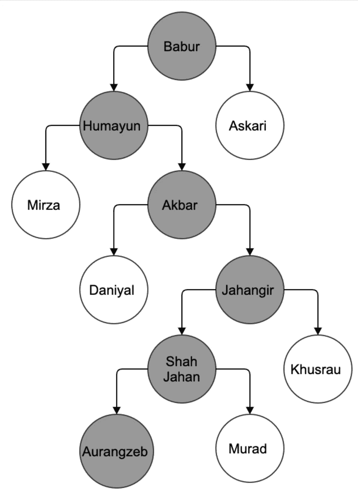

# 带有莫卧儿风格的 Python 中的拓扑排序

> 原文：<https://medium.com/nerd-for-tech/topological-sort-in-python-with-a-mughal-touch-7e66e68465d6?source=collection_archive---------20----------------------->


莫卧儿王朝已经统治了南亚两个世纪，并对印度次大陆产生了巨大影响。一个这样的例子是[泰姬陵](https://en.wikipedia.org/wiki/Taj_Mahal)。在这篇博客中，我们将使用莫卧儿帝国的家谱来理解图论中的拓扑排序。

在[图论](https://en.wikipedia.org/wiki/Graph_theory)中，拓扑排序是最有趣的话题之一。这个博客将涵盖拓扑排序的理论，拓扑排序在 python 中的实现，拓扑排序解决的问题以及关于莫卧儿帝国的有趣事实。

[拓扑排序](https://en.wikipedia.org/wiki/Topological_sorting)在[有向无环图(DAG)](https://en.wikipedia.org/wiki/Directed_acyclic_graph) 中也称为拓扑排序，是顶点的线性排序，使得对于从顶点 U 到顶点 V 的每条边 UV，在排序中 U 在 V 之前。

在以家族成员的名字作为树的顶点的家族树上运行拓扑排序将导致家族代 1 首先被处理，然后是家族代 2。



上面显示的有向图代表了修剪下来的莫卧儿族谱。详细的家庭可以访问[这里](https://en.wikipedia.org/wiki/Template:Mughal_family_tree)。在上图中，顶点代表家庭成员的姓名，边代表家庭成员之间的父子关系。灰色顶点代表莫卧儿帝国皇帝的家庭成员。

让我们看看实现拓扑排序的算法，

*   **初始化数据结构定义图:**
    对于拓扑排序我们需要初始化顶点(父子)之间的关系以及每个顶点的[的度数](https://en.wikipedia.org/wiki/Directed_graph#Indegree_and_outdegree)。使用顶点之间的父子关系，可以创建图的[邻接表](https://www.geeksforgeeks.org/graph-and-its-representations/)。
    [需要 Inde degree](https://en.wikipedia.org/wiki/Directed_graph#Indegree_and_outdegree)来推导顶点之间的依赖关系。如果一个顶点度数为零，这意味着该顶点没有传入边，且不依赖于任何其他顶点。
    在代码中，使用了一个字典来存储 graph 和 indegree。它也可以表示为一个类。

```
indegree = {i: 0 for i in vertices}
graph = {i: [] for i in vertices}
```

*   **填充索引和图:**
    从给定的一组边中，用邻接表和每个顶点的索引更新图字典

```
for edge in edges:
    parent, child = edge[0], edge[1]
    graph[parent].append(child)
    indegree[child] += 1
```

*   **将零度顶点加入队列:**
    零度顶点不依赖于任何其他顶点。将其添加到队列中以供进一步处理。

```
sources = deque()
for source, degree in indegree.items():
    # store vertex with indegree zero
    if degree == 0:
    sources.append(source)
```

*   **处理加入队列的顶点:**
    从队列中弹出顶点，处理弹出顶点的所有子顶点。如果索引变为零，则将子顶点添加到队列中。

```
while sources:
    source = sources.popleft()
    sortedOrder.append(source)
    for child in graph[source]:
    # decrement indegree of child vertex
        indegree[child] -= 1
        # if indegree is zero then add it to the queue
        if indegree[child] == 0:
            sources.append(child)
```

*   **检查顶点之间的循环:**
    当顶点 A 依赖于顶点 B，顶点 B 依赖于顶点 A 时，会出现循环，这样顶点 A 和顶点 B 的度数都永远为 1，永远不会被拓扑排序处理。可以通过比较排序列表的长度和图字典的长度来检测循环。在运行拓扑排序后，如果不是所有的顶点都被添加到 sorted_list 中，那么这意味着即使在移除所有的依赖关系后，也只有少数顶点的度数不等于零。

```
if len(sortedOrder) != len(vertices):
    return list()
```

下面是拓扑排序的 python 代码，

上述程序的输出是:

```
Topological sort: ['Babur', 'Humayun', 'Askari', 'Akbar', 'Mirza', 'Jahangir', 'Daniyal', 'Shah Jahan', 'Khusrau', 'Aurangzeb', 'Murad']
```

在哪里使用拓扑排序:

*   **顶点排序:**
    可以用来解决多个项目之间的依赖关系。例如，安装软件包，其中一个软件包是安装另一个软件包的先决条件。
*   **在图中寻找回路:** 这是上述观点的延伸。例如，顶点 A 依赖于顶点 B，顶点 B 依赖于顶点 C，顶点 C 依赖于顶点 A。这在顶点 A、B 和 C 之间创建了一个循环。拓扑排序可用于检测此类循环。在上面的代码示例中，这是在第 44 行实现的。

关于莫卧儿帝国的有趣事实

*   泰姬陵由沙贾汗建造，是世界遗产中的杰作之一。
*   皇帝[胡马云](https://en.wikipedia.org/wiki/Humayunhttps://en.wikipedia.org/wiki/Humayun)被赶下台，但他克服一切困难重新夺回了帝国，这对所有人来说都是一个很好的教训。一个人完全可以通过努力工作来克服障碍。
*   皇帝[阿克巴](https://en.wikipedia.org/wiki/Akbar)被认为是[诵读困难](https://en.wikipedia.org/wiki/Dyslexia)。

另外，本博客中讨论的例子也可以用 BFS 来解决，因为我们正在处理一棵树(图的特例)。我选择拓扑排序来解释算法。

谢谢你阅读博客。我希望它对你有用。