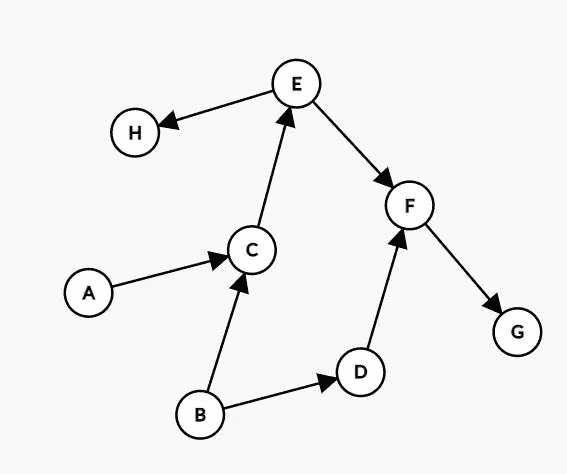
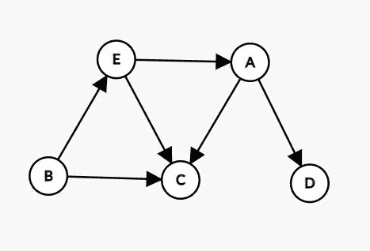
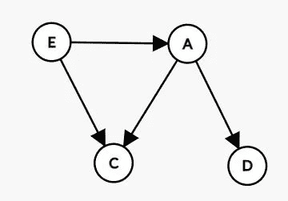
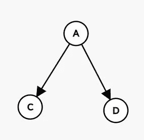
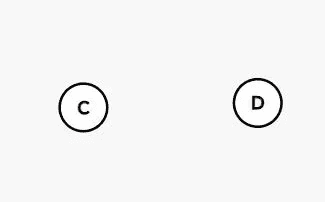

# 面试的拓扑排序

> 原文：<https://medium.com/nerd-for-tech/topological-sorting-for-interviews-f8213ef1c3bb?source=collection_archive---------7----------------------->

拓扑排序是图中顶点的排序，使得对于有向边(u，v)(从顶点“u”到顶点“v”)，u 的排序低于 v 的排序。

> 它是图‘G’的顶点的标号，使得如果 F(v)是图中顶点的排序，那么对于 G 中的(u，v)，F(u) < F(v)

有向图的一个例子

对于上图，拓扑排序将是:“A B D C E F G H”

## 注意:

1.  可能有多种排序方式。
2.  拓扑排序只适用于有向无环图。如果有循环，那么我们不能决定哪个顶点可以先排序。

那么我们如何得到订单呢？对我们来说，只看小图就能想出顺序是很容易的。但是我们如何将它转换成有效的代码呢？

## 简单的方法

1.  从没有传入边的节点开始，即那些度数为零的节点。这些节点在拓扑排序中排在第一位。
2.  然后从图中移除那些度数为 0 的节点，因此我们进一步得到一些没有传入边的节点。重复此操作，直到图形中不再有节点。
3.  重复 1 和 2，直到不再有节点。

> 如果还有一些节点，但如果它们都有输入边，那么这意味着有一个循环。

示例:

考虑下图:

*   B 的度数:0
*   E 的度数:1
*   C 的度数:3
*   A 的度数:1
*   D 的度数:1
*   拓扑顺序:[ ]

由于 B 的度数为 0，因此将其移除并添加到拓扑排序中，并将 B 中带有边的顶点的度数减 1。

*   E 的度数:0
*   C 的程度:2
*   A 的度数:1
*   D 的度数:1
*   拓扑顺序:[ B ]

E 的度数为 0，将 E 从图中移除，并将其添加到拓扑排序中，并将带有 E 边的顶点的度数减少 1。

*   C 的度数:1
*   A 的度数:0
*   D 的度数:1
*   拓扑顺序

A 的度数是 0，从图中删除 A，并将其添加到拓扑排序中，并将 A 中带边的顶点的度数减 1。

*   C 的度数:0
*   D 的度数:0
*   拓扑排序

由于 C、D 都没有任何引入的边，所以它们可以被添加到拓扑排序中。C，D 的顺序不重要。

最终的拓扑排序是[ B E A C D]

编写代码的步骤:

1.  计算所有顶点的度数。
2.  将索引为 0 的节点追加到拓扑排序中，并将索引为 0 的节点的所有边的索引减少 1。
3.  重复步骤 2，直到不再有节点。如果还有一些节点，但如果它们都有输入边，那么这意味着有一个循环。

## 时间复杂度:O(M+N)其中 M 是边的数量，N 是节点/顶点的数量。

## 拓扑排序的应用:

拓扑排序在调度有依赖关系的任务时非常有用。一个例子可以是在你的计算机上安装一个特定的程序。该程序可能需要在您的计算机上安装其他程序，拓扑排序通过检查是否安装了所有依赖项来帮助处理这种情况。

涉及拓扑排序的问题也是面试中非常常被问到的。一个这样的问题是“外星人字典”。

## 问题陈述:

给定一个外国语言的排序字典(单词数组)，找出该语言中字符的顺序。

E.x: words=["wrt "，" wrf "，" er "，" ett "，" rftt" ]

输出:[西、英、法、俄、西]

## 解决方案:

考虑“wrt”、“wrf”这些词。因为它们在外星人字典中出现的顺序，我们可以推断出“r”在“f”之前，即 **(r- > f**

考虑一下“wrf”，“er”。我们可以推断出在外星人字典中 w 在 e 之前。因此 **w- > e**

考虑“er”、“ett”，我们得到 **r- > t**

考虑“ett”，“rftt”，我们得到 **e- > r**

所以我们有:

*   右->右
*   西->东
*   r->t
*   e->r

我们有依赖关系，现在使用拓扑排序，我们可以很容易地得到排序。

这个问题在 leetcode 上被标记为“难”。但是如果我们知道拓扑排序的概念，那么这个问题就是小菜一碟了。