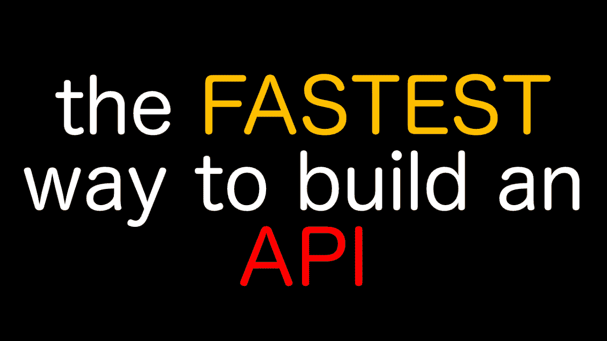

# 走向更好的无服务器

> 原文：<https://medium.com/nerd-for-tech/towards-a-better-serverless-28330158e5a6?source=collection_archive---------12----------------------->

我曾经在 Google Cloud 工作过，也做过一个功能即服务(FaaS)产品(Firebase Functions)。我看到客户不断抱怨同样的事情:

*   部署时间太长
*   冷启动过于频繁
*   FaaS 很难调试/模仿

然后，我继续担任三种主要云的云顾问，我也听到了客户对云的抱怨，特别是

*   来自云提供商的巨额账单的无限风险。
*   操作的不透明性

作为数字服务的消费者。我被激怒了

*   ISP 出售我的数据
*   出售我的数据的应用程序
*   对 API 边界另一边发生的事情完全缺乏透明度

现在，我决定停止工作，以我们都希望的方式重建云，但大云选择不采取行动。

首先改善无服务器的开发者体验

*   基于浏览器的开发托管于[可观察](http://observablehq.com)。
*   没有部署，而是动态获取代码

冷启动减少了，因为运行时是多租户的，所以每个人都共享同一个工作池，这就像一个多租户级别的胖 lambda 架构。

因为 Observable 实际上是一个前端开发环境，后端也是一个浏览器，所以第一次共享前端和后端代码真的很简单。

因此，部署一个端点大约需要 30 秒钟:-

2 行代码，几乎瞬间完成部署。

注意这不是“低码”。这是真正的 Javascript 编程，只是没有原生工具需求。你可以在这里找到快速入门[。](https://observablehq.com/@endpointservices/serverless-cells-quickstart)

除了增加开发的人体工程学，我还想在隐私和计费方面进行创新。

因为运行时只执行公共源代码，所以最终用户可以在向端点发送数据之前审核代码。我希望这将有助于让公司对他们处理数据的方式负责。Observable 本身会记录笔记本的版本历史，因此您可以及时查看给定端点的代码运行情况。**总是可审计的代码。**我正在尝试将开源扩展到服务器。

最后，我想鼓励开源开发者创造软件。

*   账单可以提前支付，以消除个人大额账单的风险
*   当消费者将一项功能导入另一台笔记本电脑时，这实际上是将该功能重新部署到新的主机上，因此向消费者笔记本电脑收费。支付基础设施费用的是图书馆的消费者，而不是图书馆的作者。这将有望消除编写流行的开源服务器端服务的经济损失。

Observable 本身有许多很好的特性来支持开源开发。所有笔记本都可以分叉、评论、导入为 ES6 模块。

我只是一个单独的开发人员，所以我需要聪明地工作，依靠什么是可用的。我没有托管基础设施，这只是一个围绕谷歌云运行和 Firebase 的包装。通过重用其他云基础设施，我可以提供对现有生产就绪功能(如 Google Cloud Monitoring)的控制台访问。

Happy hacking，这里是为了更开放透明的云。点击此处查看日益增多的服务[https://observablehq . com/collection/@ endpoint services/services](https://observablehq.com/collection/@endpointservices/services)