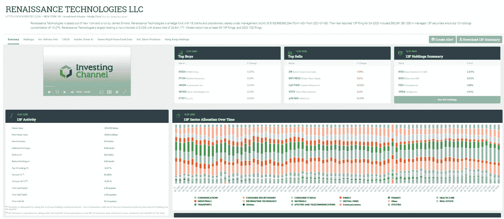
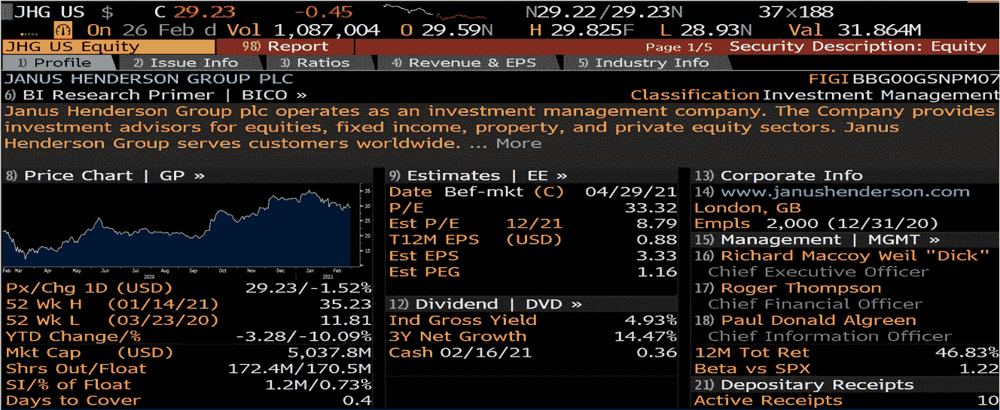
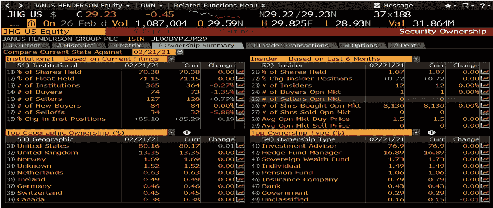
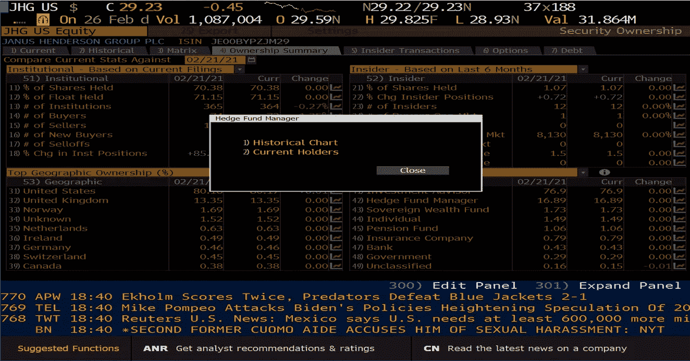
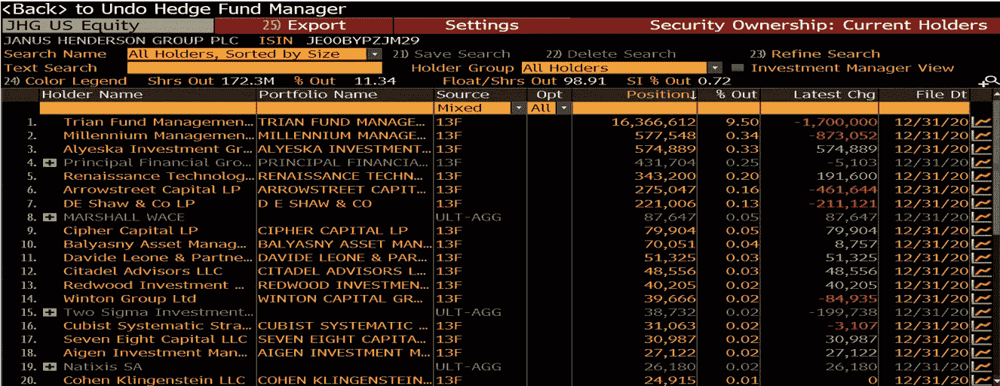
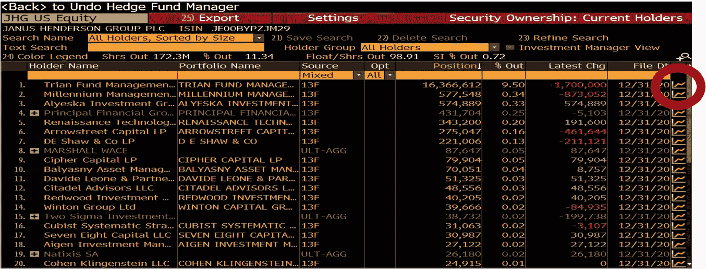
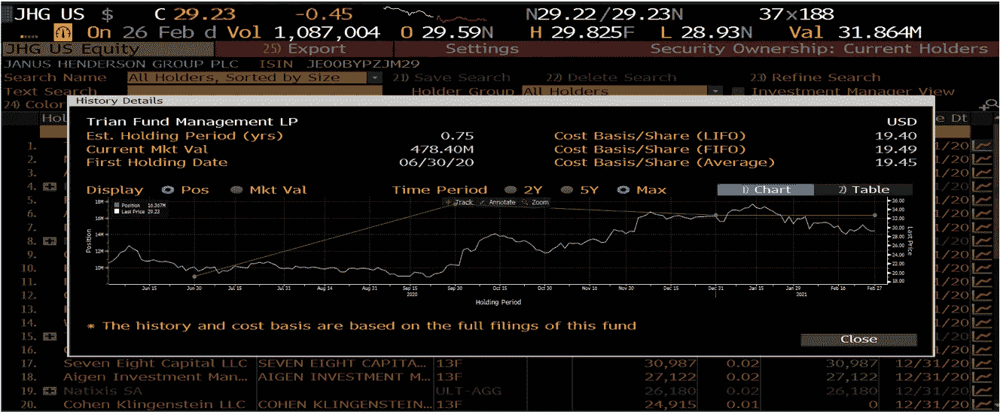
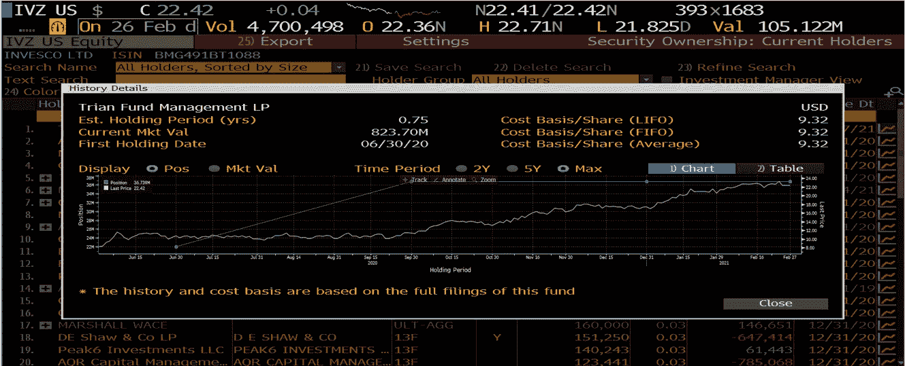
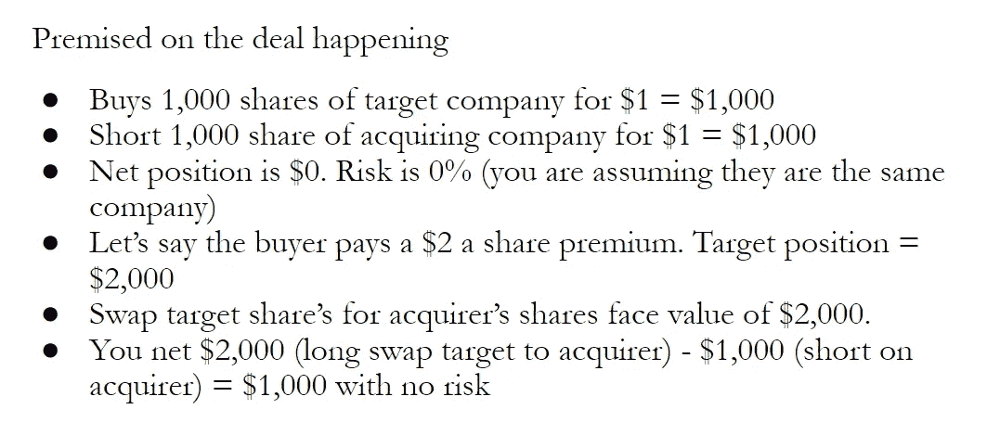

# 跟踪骏利亨德森景顺可能的合并

> 原文：<https://medium.com/nerd-for-tech/tracking-the-possible-janus-henderson-invesco-merger-ea36623d1097?source=collection_archive---------13----------------------->

在 10 月 10 日的《经济学人》上，著名财经作家 Buttonwood 谈到了资产管理公司 Janus Henderson 和 Invesco 合并的可能性。有迹象表明可能会有合并，因为 Trian Partners 的维权投资者 Nelson Peltz 已经在两家公司建立了相当大的头寸。我们会仔细查找 Trian Partners 在两家公司的职位。在本文发表时，有更多的消息与这一可能的交易有关。11 月 20 日，景顺的首席执行官表示，Trian Partners 不会寻求景顺和骏利亨德森的合并交易。本文将介绍如何在 Bloomberg Terminal 中找到一个基金的持有情况，以及一个合并套利的例子。

激进投资者是指那些购买公司股票，试图改变公司结构的投资者。这可能是游说合并，或分割，或改变管理方面。Trian Partners 是一个激进的投资者。仅作为免责声明，本出版物的内容不构成投资建议。

对于这种寻找基金持股的方法来说，先看公司，然后找股东，再找基金要容易得多。虽然彭博终端以一种更简单的方式展示了这些信息，但是没有彭博终端也可以找到这些信息。如果你不用彭博终端就能找到它，最简单的方法就是寻找投资基金的持股，然后搜索这家公司。最好的方法是浏览鲸鱼智慧，它是一个 13F 聚合器。

观察一只基金持有的资产有一个警告。这是因为大多数基金通过法律要求的表格 13F 披露他们的持有情况。13F 表格是一份季度报告，要求在一家公司拥有超过 1 亿美元资产的基金经理填写。13F 是持有量的快照。很多人喜欢看 13F 持有的成功基金，然后复制他们的交易，但它们只是快照。以复兴科技 13F 为例。如果我们去查他们关于鲸鱼智慧的 13F，它会是这样的。

但请记住，这只是季度末的快照。复兴科技是一个基于算法的交易基金，可能以高或中频交易。因此，他们可能会公布 13F 持仓，但在公布后，他们执行了大量交易，现在他们的持仓看起来完全不同。另一方面，大多数算法交易者可能甚至不会选择他们购买的单个证券，它可能只是满足他们正在寻找的参数。因此，他们挑选股票背后的推理与传统投资者完全不同。在考察 Trian Partners holdings 时，我们也需要记住这一点。

我们先来看看杰纳斯·亨德森。我已经调出了股票并使用了 DES 函数。

如果您键入 OWN，您会看到列出了 4 个表

左上方显示了机构投资者的持股变化。右上方显示了内部人员在过去 6 个月中所做的更改。左下角显示了投资者的地理位置。右下角显示了按所有权类型分列的持股情况。我们感兴趣的是右下角，特别是“对冲基金经理”标签。如果我们点击它，我们会得到这个。

我的首选方法是使用当前持有者方法。它会像这样出现。

我们可以看到，它列出了基金名称、投资组合名称、来源、opt、持仓、最新变更和文件 Dt。我们特别寻找处于顶端的 Trian Partners。如果你点击右边的图表按钮，你会看到这样一个页面。

表格和图表上有很多需要理解的东西。在左手边，写着基金和 est。持有期(年)，当前市场价值，首次持有日期。这些是不言自明的。右侧显示了与成本基础相关的统计数据。因为 Trian partners 可能在一系列不同的订单中买入股票，所以他们以不同的价格买入。成本基础/股份(LIFO)他们最后购买的股份的价格(后进先出)。成本基础/股份(先进先出)表示他们第一次购买股份时支付的金额(先进先出)。和成本基准/平均值表示他们为所有订单支付的价格之间的平均值。

当看图表时，有两个东西正在绘制，所以很难理解哪条线对应哪张图。我建议不要改变时间段或查看表格的方法，而只查看 Pos。

绿色位置记录了他们拥有的股份数量。与这条线相关的轴是左手边，它显示了百万股的数量。绿线有些误导。我们可以看到，线上有一些点正好与 Trian 发布 13F 的时间一致。这条绿线会让 Trian 看起来从 6 月 30 日到 9 月 30 日每天都稳定地买入相同数量的股票。事实可能并非如此，他们可能在某一天买入所有股票，或者买入更多，然后卖出一些。有无数种方法可以解决这个问题。彭博终端选择直线，因为他们不确定，这是最简单的方法。

白线显示股票的价格，其对应的 Y 轴在右边。白线标出了股价。再来看景顺。我们将使用相同的方法，键入股票，然后单击“OWN ”,选择“Hedge fund manager ”,然后选择“Current Holders”。他们目前的持有人名单如下

Trian Partners holding 看起来像这样。

这种交易背后的想法具有合并套利的潜力。金融的名字很恰当，所以如果我们定义每个词，我们就可以展示合并套利交易是如何工作的。合并是指公司合并，套利是利用以不同价格提供的相同证券。注意套利的定义，因为理论上它相对容易理解，但在应用中你会遇到人们如何“延伸”这个定义来使它起作用。

合并套利的目标取决于交易的进行。“相同的证券，不同的价格”部分的出现是因为你认为两家公司的股票是相同的。这里有一个交易如何进行的例子。

