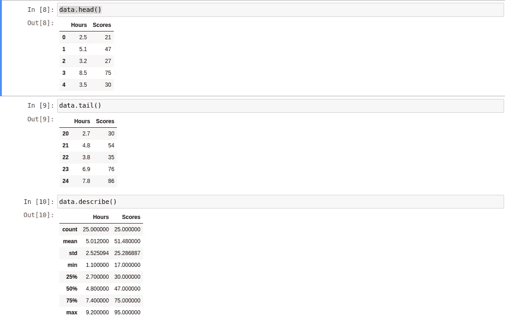
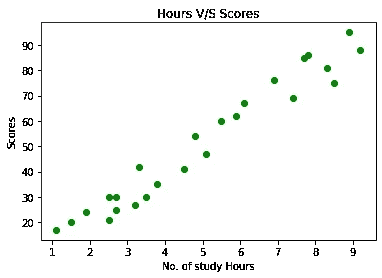
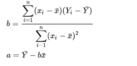
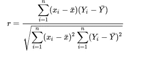
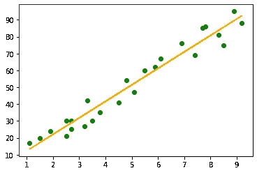

# 传统的最大似然线性回归(数学和代码)

> 原文：<https://medium.com/nerd-for-tech/traditional-ml-linear-regression-maths-and-code-ec67e25ea500?source=collection_archive---------22----------------------->

这是我关于传统机器学习算法的第一篇文章，我将从线性回归开始。


线性回归是一种统计工具或程序，用于根据其他变量的值来预测某个变量值。一个更技术性的定义是，从自变量计算或预测因变量的统计工具或程序。在深入这个话题之前，让我们先定义因变量和自变量。

1.  自变量:这些变量独立于所提供数据中的其他变量，并且基本上是原因。
2.  因变量:这些变量的值依赖于自变量，并且是那些原因的结果

*从这些定义中，我们可以清楚地得到一种因果关系的感觉，我们可以很容易地从散点图或任何其他图表中得到这种类型的关系的想法。*

让我们来看一些问题陈述的例子

1.  学生在期末考试/测验中的得分有多高。
2.  给定里程数和车龄，预测汽车价格(2 个独立变量)。

线性回归使用数学方程 y = b*x + a，该方程描述了 *y* (因变量)和 *x* (自变量)之间关系的最佳拟合线**。**回归系数**，即 *r^* 2，暗示了 *y* 由于 *x 的变化程度，b 是直线的斜率，a 代表截距。***

> **假设**

假设是检查特定数据集是否可以使用线性回归进行分析的好方法。

1.  因变量和自变量都必须是连续的。
2.  绘制时，我们应该注意到两个变量之间的某种线性关系。
3.  数据必须显示同方差，即当您沿着最佳拟合线移动时，沿着该线的方差保持相似。
4.  绘制时，如果您注意到一些异常值，请确保将其删除
5.  “y”的所有值都是相互独立的，尽管依赖于“x”


线性散点图

现在，让我们处理第一个问题陈述，看看我们的数据是什么样的

```
import numpy as np
import matplotlib.pyplot as plt
import pandas as pd
from sklearn.model_selection import train_test_split
from sklearn.linear_model import LinearRegressiondata = pd.read_csv('./data_set/scores')
data.head()
```



让我们也看看情节是怎样的

```
plt.scatter(x = data.Hours ,y = data.Scores ,color="green")
plt.xlabel("No. of study Hours")
plt.ylabel("Scores")
plt.title("Hours V/S Scores")
plt.show()
```



在继续之前，我们必须跳进去做一些数学计算。我们如何得到 a 和 b 的值，即我们要画的回归线的截距和斜率？这里有一些公式，让你明白是怎么做到的。



皮尔逊系数

这里的 x 和 Y 代表各自的意思。

r 是 Y 在 x 上的线性回归可以解释的 Y 的总方差的比例。1-r 是回归不能解释的比例。因此 1-r = s xY / s Y。

**决定系数**是因变量总变化的一部分，可以用自变量的变化来解释。r 给出一个从 1 到 0 的值，如果它是+1，则因变量和自变量之间存在完美的关系，当它接近 0 时，这种关系就很弱。

> **将数据集拆分成训练**

```
x = data.drop("Scores" ,axis ="columns")
y = data.drop("Hours" ,axis ="columns")X_train,X_test,Y_train,Y_test = train_test_split(x,y,test_size = 0.2 ,random_state = 40)## you can always print and check how x,y,X_train,Y_train etc looks like or what their shape is(just to confirm)
```

> **实现线性回归**

```
lin = LinearRegression()
lin.fit(x,y)
line = lin.coef_*x + lin.intercept_plt.scatter(x,y ,color = "green")
plt.plot(x,line,color = "orange")
plt.show()
```



> **做预测**

```
Y_predicted = lin.predict(X_test)
pd.DataFrame(np.c_[X_test,Y_test,Y_predicted] ,columns = ["Study hours" ,"original marks" ,"predicted Marks"])
```

这将给出一个包含所有预测值和实际值的表格。现在为了检查我们模型的准确性，

```
lin.score(X_test,Y_test)
```

我的模型有 0.95 的精确度

通过使用相同的概念，我们可以用多个独立变量进行多元线性回归和多项式回归。

谢谢你抽出时间