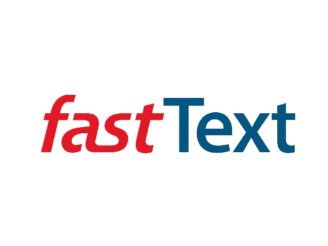

# 用 FastText 训练 Python 代码嵌入

> 原文：<https://medium.com/nerd-for-tech/train-python-code-embedding-with-fasttext-1e225f193cc?source=collection_archive---------2----------------------->

嵌入模型广泛用于深度学习应用中，因为需要将数据从原始形式转换为数字形式。存在许多训练嵌入的方法，每种方法都有优点和缺点，也有它们自己的使用案例。这些方法中的大多数已经被应用于自然语言处理问题。今天，我们将在 Python 代码上应用 FastText，这是一种著名的嵌入技术。

出于本教程的考虑，我们使用 Gensim 的实现。可以通过运行以下命令获得 Gensim 包: ***pip3 安装 gensim***

# 要求

为了训练嵌入模型，我们需要大量的代码和耐心。

# 获取数据

通过克隆一些库，我们可以从 GitHub 获得大量的代码。例如，我们通过运行以下命令克隆 scikit-learn 存储库: ***git 克隆***[***https://github.com/scikit-learn/scikit-learn.git***](https://github.com/scikit-learn/scikit-learn.git)

# 准备数据

我们首先需要从项目的所有文件中加载代码。使用下面的代码片段就足够了。

加载完所有文件的代码后，我们需要对代码进行令牌化。通常这些文件包含自然语言文本和代码。我们对自然语言文本使用 NLTK tokenize，对代码使用 Python 标准 tokenizer。以下代码实现了对代码进行令牌化所需的函数。您可能需要安装 NLTK 包。

最后，在将代码加载到内存中之后，我们使用令牌化器对代码进行令牌化。

# 训练模型

为了训练快速文本模型，我们使用以下超参数。如果需要，您可以更改或调整它们。

之后，我们实例化模型并训练它。

# 查询模型

下面的代码展示了三个不同的查询，您可以在训练后询问模型:

*   最相似的令牌
*   两个记号或两个字符串之间的相似性
*   令牌的嵌入向量

## 更新:

训练好的模型可以在:[https://drive . Google . com/file/d/1 vvrsncwdpc 2 nn 5 q 4 xlzda 0 zinhlbwy 31](https://drive.google.com/file/d/1vVRsnCWdpC2NN5q4xLzDa0ZInHLbwY31/view?usp=sharing)上找到