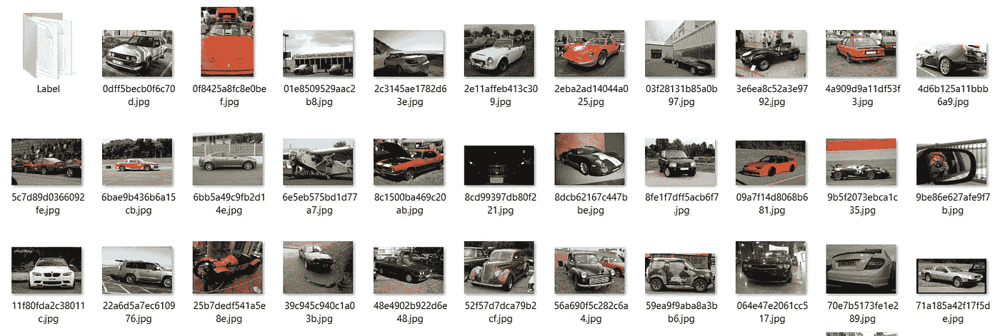
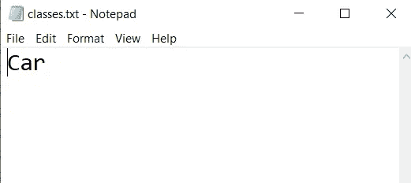
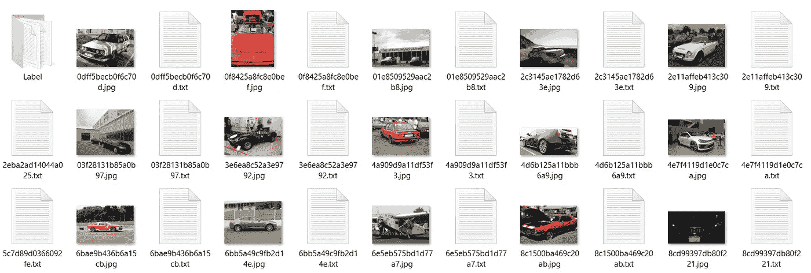

# 来自 Google & OIDv4 自定义对象检测工具包的 YOLO 架构的训练测试数据。

> 原文：<https://medium.com/nerd-for-tech/train-test-data-for-yolo-architecture-from-google-oidv4-toolkit-for-custom-object-detection-6e755312521d?source=collection_archive---------1----------------------->

*这篇博客引用了许多研究人员和知识库的资料，整篇文章中都有列出。特别感谢他们！！*

# **简介**

Yolo 是最先进的物体检测架构，其最新版本 YOLOv4 旨在实现最佳速度和精确度，可以在这里找到。使用 YOLOv4 架构，可以训练我们自己的自定义对象检测器来检测特定对象，如汽车、人等。

# 数据

训练我们自己的自定义对象检测器并参考基于人工智能的模型，最重要的事情是数据。谷歌提供了一个开源的[开放图像数据集 V6+](https://storage.googleapis.com/openimages/web/index.html) ，其中有大约*900 万张*带注释的图像。

# OIDv4 工具包

这个神奇的工具包使我们可以很容易地从开放的图像数据集中获取训练和验证数据，并将其存储在本地以训练我们的自定义模型。

让我们从一个例子开始，这个例子向我们展示了如何获取训练数据来构建一个定制的*汽车*物体检测器。

1.  从这里的[到](https://github.com/theAIGuysCode/OIDv4_ToolKit)，由[人工智能的家伙](https://www.youtube.com/channel/UCrydcKaojc44XnuXrfhlV8Q)，使用命令`git clone`[https://github.com/theAIGuysCode/OIDv4_ToolKit.git](https://github.com/theAIGuysCode/OIDv4_ToolKit.git)，派生或克隆 OIDv4 工具包的库
2.  克隆完成后，为了下载汽车数据集的训练数据，输入命令`python main.py downloader --classes Car --type_csv train --limit 500`。这将为汽车下载 500 幅训练图像，并将它们存储在一个名为 OID 的文件夹中。
3.  以类似的方式验证，数据集可以通过输入命令`python main.py downloader --classes Car --type_csv validation--limit 50`来下载。

样本数据集

标签汽车必须以与它出现在[开放图像数据集 V6+](https://storage.googleapis.com/openimages/web/index.html) 的搜索栏中完全相同的方式键入。可以找到并下载其他几个标签。

# 它下载什么？

以上命令下载图像和相应的标签文件。标签文件由对象在图像中出现的坐标组成。

## 样本标签文件

汽车 0.0 73.9994171 15.22585561.238542
汽车 50.431268

# YOLOv4 的更改

标签图像架构必须针对 YOLOv4 的输入进行轻微调整。

1.  在文件`classes.txt`中，仅在单独一行中输入我们已下载的标签名称。在我们的单一汽车对象检测器中，该文件如下图所示。

Classes.txt

2.第二步可以通过命令`python convert_annotations.py`来完成。该命令的结果如下图所示。

3.然后可以在训练前移除文件夹标签。

感谢那些精彩的文章和参考资料，我忘了提到他们，甚至是我提到的那些人。

如有疑问，请点击这里联系我[，点击这里](https://www.linkedin.com/in/adnan-karol-aa1666179/)[联系我](/@adnanmushtaq5)获取更多我的文章。