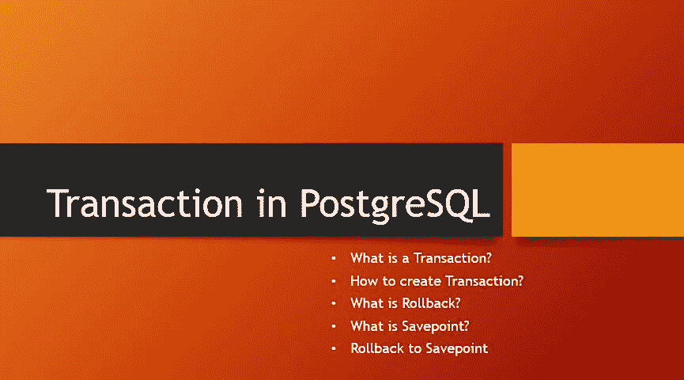

# PostgreSQL 中的事务|回滚|保存点

> 原文：<https://medium.com/nerd-for-tech/transaction-in-postgresql-rollback-savepoint-23987dc6c533?source=collection_archive---------7----------------------->



事务被定义为可以包含多个操作的单个任务单元。只有当事务的所有操作都正确执行时，它才标记为完成。当它的任何操作在任一点失败时，它会回滚。

事务必须具有原子性、一致性、持久性和隔离性，这些通常被称为 ACID 属性。

***原子性:*** 事务是任务的单个单元。要么完全执行，要么不执行。无意味着它不能处于部分执行状态。

***一致性:*** 保证交易后的数据变化处于有效状态并遵循定义的规则。

***持久性:*** 表示交易完成后的数据变化，即使系统出现故障，也是持久的。

***隔离:*** 一项交易应与其他交易隔离进行。其他正在执行的事务不应影响它。

PostgreSQL 中的事务语法是

```
[ BEGIN TRANSACTION | BEGIN ]
 defined operations 
[ COMMIT TRANSACTION | COMMIT ]
```

要启动一个事务，您可以使用`BEGIN TRANSACTION`或仅使用`BEGIN`，要提交事务，您可以使用`COMMIT TRANSACTION`或`COMMIT`。

让我们假设两个用户(`David and John`)正在玩手机游戏，并且`David`赢得了游戏。现在`John`宝石会转移到`David`。我们来看看宝石将如何通过交易进行转让。

在数据库中创建一个用户表，

```
DROP TABLE IF EXISTS users;CREATE TABLE users(
 id INT GENERATED BY DEFAULT AS IDENTITY,
 name VARCHAR(50),
 gems DEC (10),
 PRIMARY KEY (id));
```

用默认数量的宝石填充用户表，

```
INSERT INTO users (name, gems) VALUES ('David', 1000); 
INSERT INTO users (name, gems) VALUES ('John', 1000); 
```

转让 gems 交易将被写为

```
BEGIN;UPDATE users 
SET gems = gems — 100
WHERE id=2;UPDATE users 
SET gems = gems+100
WHERE id=1;COMMIT;
```

现在，要获得更新的记录，只需编写 SELECT 语句，您将看到 David 拥有 1100 颗宝石，John 拥有 900 颗宝石。

```
SELECT * FROM users;
```

若要撤消事务所做的更改，请使用以下方法之一:

```
[ ROLLBACK TRANSACTION | ROLLBACK ];
```

让我们在下面的查询中回滚一个事务，

```
BEGIN;UPDATE users 
SET gems = gems — 100
WHERE id=2;UPDATE users 
SET gems = gems+100
WHERE id=1;ROLLBACK;
```

运行上述查询后，您将不会在 users 表中看到 gems 从一个用户转移到另一个用户。回滚恢复事务所做的所有更改。

> 保存点是事务内部的特殊点，它保存以前执行的命令的状态，并为保存点之后执行的命令建立回滚。

保存点是在事务内部用它的名字声明的，

```
SAVEPOINT savepoint_name;
```

要回滚到特定的保存点，请使用以下命令，

```
ROLLBACK TO SAVEPOINT savepoint_name;
```

让我们在 users 表中添加 Joe 的另一个用户，

```
INSERT INTO users (name, gems) VALUES ('Joe', 1000);
```

现在在事务中，在从 David 扣除 100 宝石之后，将标记一个保存点。实际上，大卫的宝石将转移到乔，但不小心转移到约翰。接下来，将建立到标记的保存点的回滚，之后 David 的 gems 将被转移到 Joe，最后，事务将被提交。

```
BEGIN;
UPDATE users 
SET gems = gems — 100
WHERE id=1;SAVEPOINT point1;UPDATE users 
SET gems = gems+100
WHERE id=2; ROLLBACK TO SAVEPOINT point1;UPDATE users 
SET gems = gems+100
WHERE id=3;COMMIT;
```

要在事务内部的任何阶段销毁保存点，请使用以下语句，

```
RELEASE SAVEPOINT savepoint_name;
```

Release savepoint 在当前事务的任何阶段销毁先前定义的特定保存点。当事务处于中止状态时，不可能释放保存点。如果多个保存点具有相同的名称，那么只有最近的保存点会被释放。