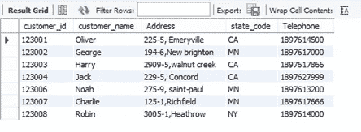
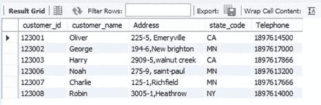
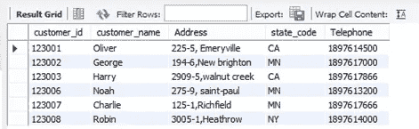
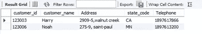
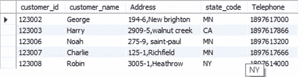
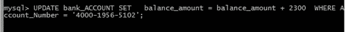
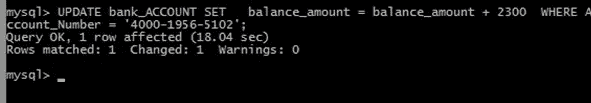
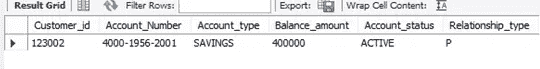
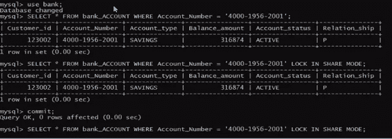

# SQL 中的事务、保存点和锁

> 原文：<https://medium.com/nerd-for-tech/transactions-save-points-and-lock-in-sql-bb438b6e8787?source=collection_archive---------2----------------------->

________________________________________________________________

**酸:**原子量一致性隔离耐久性

**原子性:**要么完成事务，要么在出现任何问题的情况下，回滚整个事务。

**一致性:**完成交易前后总金额必须相等。

a 交易到 B 1000/-,如果假设。

A = 2000/-

第一步是读取 A，看它是否有足够的交易金额。如果它实现了，那么用 ALU 数学上 1000/-将被减去，并且值将被存储在 RAM 中。

B=3000/-以 b 为单位的当前数量(本地存储器)

现在完整的数据将从本地存储器转移到主存储器。

现在 A= 1000/-(借记 1000/-和 B=4000/-(贷记 1000/-这意味着总额是 5000/-正如我们所预料的。这是完整的交易。

**隔离:**不允许并行事务。简而言之，并行计划被转换为串行计划。那么事务现在**一致**。

**持久性:**数据库中的每一个变化都应该永久保存在硬盘中。和前面一样，如果事务完成，数据集中的更改必须是永久的。

**对他人的交易，一个简单的代码:**

设置 SQL _ SAFE _ UPDATES = 0；

开始交易；

UPDATE account _ details SET balance = balance—1000 其中 FIRST _ name = ' MONICA

UPDATE account _ details SET balance = balance+1000 其中 FIRST _ name = ' JOSEPH

提交；

**1000/——从莫妮卡账户转到约瑟夫账户。**

开始交易；

检查银行余额:

SELECT Balance _ amount FROM BANK _ ACCOUNT WHERE ACCOUNT _ Number = ' 4000–1956–2001 '；

从 ATM 机取款:

插入到 BANK_ACCOUNT_Transaction 值(' 4000–1956–2001 '，-2300.00，' ATM 取款'，' CA '，NOW())；

更新 BANK _ Account SET balance _ amount = balance _ amount-2300，其中 Account _ Number = ' 4000–1956–2001 '；

银行对取款收取 0.2%的费用:

插入到 BANK_ACCOUNT_Transaction 值(' 4000–1956–2001 '，-2300.00 * 0.02，' ATM 取款'，' CA '，NOW())；

用新余额更新旧余额:

更新 BANK _ ACCOUNT SET balance _ amount = balance _ amount-2300 * 0.02，其中 ACCOUNT _ Number = ' 4000–1956–2001 '；

提交；

**保存点:**

最初的表格是这样的:

设置 SQL _ SAFE _ UPDATES = 0；

开始交易；

保存点 customer _ 1；

从银行客户中删除，其中客户标识= 123004；

保存点 customer _ 2；

从银行客户中删除，其中客户标识= 123001；

保存点 customer _ 3；

从银行客户中删除，其中客户标识= 123002；

回滚到 customer _ 2；

提交；

保存点之后，该表如下所示:

123004 删除。

删除保存点:

最初，这张桌子是这样的:

开始交易；

保存点 customer _ 1；

删除

来自银行 _ 客户

其中 CUSTomer _ ID = 123001

保存点 customer _ 2；

删除

来自银行 _ 客户

其中 CUSTomer _ ID = 123002

保存点 customer _ 3；

删除

来自银行 _ 客户

其中 Customer _ Id = 123007

保存点 customer _ 4；

删除

来自银行 _ 客户

其中 Customer _ Id = 123008

释放保存点 customer _ 3；

**角色返回前的输出:**

回滚到 customer _ 2；

回滚后，我们希望保存 customer_3 的数据，除此之外将是安全的。但在此之前，所有交易都被删除了。因此，如果我们想要回滚被删除的内容，只会给出输出，而不是每个语法都会给出一个错误。

回滚到 customer _ 4； ***错误***

回滚到 customer _ 3； ***错误***

回滚到 customer _ 2； ***执行***

我们发布了保存点 customer_3，这意味着在 customer_3 之前，所有(保存点中提到的)数据都已被删除。如果我们想回忆起来，我们必须使用那个被删除的保存点上唯一的回滚。

回滚到 Customer _ 1；

回滚到 Customer _ 2；

**以上两项均已删除，因此他们中的任何人都可以回忆起我们已删除的数据。**

**回滚到客户 _1** 将保护**客户 _1** 以及**客户 _2** ，其中**回滚到客户 _ 2**将仅保护**客户 _2** 。

**更新为已读:**

**设置交易读写**；

更新银行账户

SET balance _ amount = balance _ amount-2300

其中 Account _ Number = ' 4000–1956–2001 '；

这将更新该特定帐户中的当前金额。

**设置交易只读**；

这将只允许读取事务，我们不能向数据集中写入任何内容。

**会话交易:**

设置会话事务读写；

在读写模式下:

开始交易；

将会话事务设置为只读； ***从下一笔交易开始生效***

更新银行账户

设置

balance _ amount = balance _ amount-2300

其中 Account _ Number = ' 4000–1956–2001 '；

只有一个事务将被写入会话，其余的将只遵循另一个读取条件。

**隔离读写:**

这使一个事务保持等待状态，直到它没有完成同一帐户的另一个事务是不允许的。以下几种隔离转换:

可重复读

已提交读取

可序列化

— — — — — — — — — — — — — — — — — — — — — — — — — — — — — — —

**可重复读取**

设置会话事务读写；

设置事务隔离级别可重复读取；

如下所示，多个事务在一次提交中是可读的:

SELECT Balance _ amount FROM bank _ ACCOUNT WHERE ACCOUNT _ Number = ' 4000–1956–2001 '；

SELECT Balance _ amount FROM bank _ ACCOUNT WHERE ACCOUNT _ Number = ' 4000–1956–3456 '；

但是如果写更新在一个平台上以不同的方式进行，那么另一个事务就不可能在同一个实例上进行。

更新 bank _ ACCOUNT SET balance _ amount = balance _ amount+2300，其中 ACCOUNT _ Number = ' 5000–1700–6091 '；

如果尚未提交；

更新 bank _ ACCOUNT SET balance _ amount = balance _ amount+2300，其中 ACCOUNT _ Number = ' 4000–1956–5102 '；

这将一直等待，直到我们不提交之前的事务。

只要我们提交上一个事务，这个事务就会自动完成。

**读取已提交的**

这与前一个相同， **REPEATABLE READ** ，因为它一次只允许一个事务，但肯定表是完全锁定的，我们可以将数据插入数据库。这里，这两种操作在两个平台上都是允许的，不需要回滚或提交。但是在前面的**可重复读取中，**在两个平台上只允许一个操作。这是两种情况下最简单的区别。

更新 bank _ ACCOUNT SET balance _ amount = balance _ amount+2300，其中 ACCOUNT _ Number = ' 5000–1700–6091 '；

插入到 bank_ACCOUNT 值(123002，' 4000–1956–9999 '，'储蓄'，69000，'活动'，' P ')；

**最重要的一点:**这里只允许使用 insert 进行更新，因为表当前是锁定的。我们不能在两个平台上同时更新。

**在数据库管理系统中锁定:**

数据库à表à页à行(这些可以为 DML 进程锁定。为了保持数据完整性和酸性)

**共享/读锁:**这是可以提供给多个用户读取的事务。

**独占/写锁:**这是用来写事务的锁，只有一个用户可以访问，这根本不是共享模式。我们不能向多个用户提供此服务。如果初始共享锁定模式对任何事务都是激活的，默认情况下，如果我们使用 UPDATE 函数，就会激活排他锁。

如果有任何事务以独占锁处于活动状态，则任何其他事务都不能获取任何类型的锁，除非它没有被提交。

开始交易；

SELECT * FROM 银行账户

其中 Account _ Number = ' 4000–1956–2001 '

在共享模式下锁定；

在另一个实例中，类似的事务读取是可能的。比如多个用户可以读取事务。如果共享锁被提升为独占锁，则只允许一方事务。这个锁不会被完成，除非并且直到提交没有被排序，仍然有另一个事务不能占用任何锁。它必须等到提交。

设置 SQL _ SAFE _ UPDATES = 0；

更新银行账户

设置余额 _ 金额=余额 _ 金额+ 0.04 *余额 _ 金额

其中 Account _ Number = ' 4000–1956–2001 '； ***执行***

但是在另一个平台上，读事务处于等待状态，直到上面的写进程没有提交。

**如何为更新应用独占锁？**

开始交易；

SELECT * FROM bank _ customer WHERE customer _ id = 123002 进行更新；

更新 bank _ customer SET Address = ' 2999 New Brighton ' WHERE customer _ id = 123002；

提交；

**如果您不想允许任何来源使用该表，该怎么办？我们来看看题型。**

编写一个查询来确保没有其他 MySQL 会话能够插入任何用户 id 或密码

锁表 id _ 密码写；

此时，不会执行任何操作。要重新使用桌子，只需发出解锁桌子的命令。

如果我们需要一些锁定表上的 DML:

更新 bank _ customer SET Address = ' 2999 New Brighton ' WHERE customer _ id = 123002；

这是我们即将面临的错误。现在要解除锁定:

解锁表格；

**你现在在一个简单的条件下申请锁。**

死锁:不工作也不让其他人工作是一种固执或自我。

**互斥:**事务的来源必须一次对一个进程有效。所有交易都应该持续进行。

**无抢占:**如果一个事务正在处理，不要允许另一个事务处理，直到前一个事务没有得到提交。

**暂停并等待:**暂停一个流程，直到它没有完成，然后等待另一个流程。

**循环等待:**如果一个流程 P1 尚未完成并等待另一个来源 S1，同时另一个流程 P2 尚未完成并等待来源 S1，那么任何一个事务都不会发生。因此，这是一个循环等待。

现在，通过查看 4 个条件，我们可以假装我们是否正遭受**死锁**情况。为了避免这种情况，我们必须至少完成一个事务，以允许另一个进程进入下一个进程。您可以回滚或提交任何一个进程。这是唯一的解决办法。

死锁的典型例子:

编写一个查询，以便用户可以对 bank_customer 中的同一个 customer_id = 123002 执行并发 DML 操作。

一个用户使用“2999 New Brighton”更新 customer_id 的住宅地址

另一个用户使用 189891899 更新电话号码。

解决方案:

**第 1 节:**

开始交易；

SELECT * FROM bank _ customer WHERE customer _ id = 123002 进行更新；

更新 bank _ customer SET Address = ' 2999 New Brighton ' WHERE customer _ id = 123002；

提交；

**第二场会议:**

更新 bank _ customer SET phone = 189891899 其中 customer _ id = 123002

提交；

如果我们同时激活上述两个事务，就会发生死锁，这使得任何事务(流程)都无法完成。因此，第一次提交完成了第一个事务，然后第二个进程非常准确地完成。如果事务中的任何地方超时，任何一个事务都会自动中止，因为编译器认为可能会出现死锁的情况。

**FOR UPDATE 只是一个独占锁的演示。**