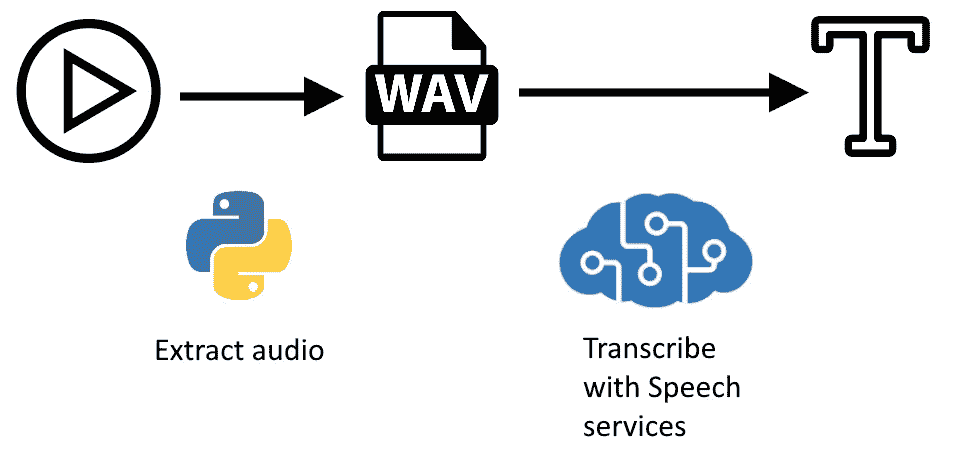
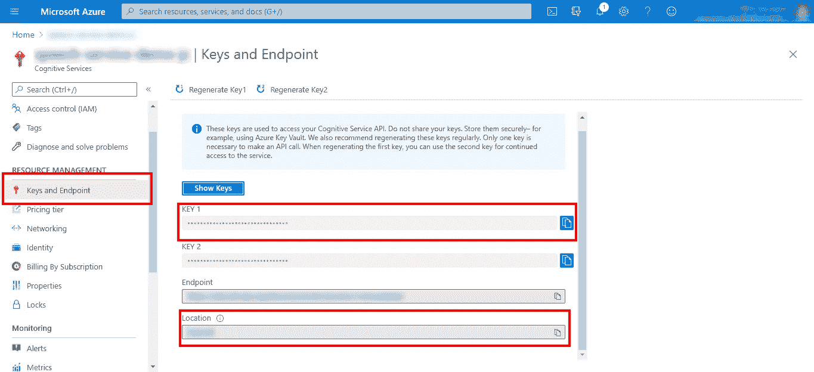

# 使用 Azure 认知服务从视频转录音频

> 原文：<https://medium.com/nerd-for-tech/transcribe-audio-from-video-with-azure-cognitive-services-a4589a12d74f?source=collection_archive---------2----------------------->

虽然我们在分析结构化和半结构化数据方面取得了长足的进步，但非结构化数据仍然落后。当然，第三种类型提出了其他两种类型中没有的挑战，但是我们正在稳步地为这项工作找到更多的选择和工具。

正如所料，其中一个工具是人工智能。微软 Azure 为这项工作提供了一些有趣的选项，即[认知服务](https://azure.microsoft.com/en-us/services/cognitive-services/)。根据他们的描述，

> “认知服务让每个开发人员都可以接触到人工智能，而不需要机器学习专业知识”。

今天，我将通过向您展示如何使用认知服务的语音服务从音频转录语音，向您介绍如何在实践中实现这种描述。

教程图

# 先决条件

*   Azure 订阅
*   Azure 中的认知服务或语音资源
*   Python(将所有东西粘在一起)
*   [针对 Python 的 Azure Speech SDK](https://docs.microsoft.com/en-us/azure/cognitive-services/speech-service/get-started-text-to-speech?tabs=script%2Cwindowsinstall&pivots=programming-language-python)
*   [MoviePy](https://pypi.org/project/moviepy/) 影音分离库

# 提取音频

如果您从视频开始，那么第一步是提取音频。这是 MoviePy 中一个简单的操作。

提取视频音频

而。wav 文件大于. mp3，我们需要它用于认知服务。

# 设置身份验证

假设你的 Azure 订阅中已经有了认知服务或语音资源，我们可以在下面的 Python 片段中处理认证部分。

请注意，语音是认知服务的一部分，因此我们可以在这里互换使用。然而，我们可以使用语音，因为我们有一个特定的需求。

在您的资源中，导航到“Keys and Endpoint”菜单(在“resource blade ”/左侧窗格上),复制 KEY 1 和 location。

服务密钥

这是处理认证的代码片段。

使用 SDK 进行身份验证

# 转录音频

最后，我们到达使用 Azure 服务转录音频的脚本。

在编写脚本之前，让我承认这个解决方案主要基于文档中的这些[代码片段](https://docs.microsoft.com/en-us/azure/cognitive-services/speech-service/get-started-speech-to-text?tabs=script%2Cbrowser%2Cwindowsinstall&pivots=programming-language-python#continuous-recognition)和我在 GitHub 线程上找到的[代码](https://github.com/Azure-Samples/cognitive-services-speech-sdk/issues/345#issuecomment-522416202)。

使用 Azure 认知服务转录音频

前 12 行是前面的身份验证代码片段，增加了一些特色。除了导入之外，请注意用于配置的`audio_config`。作为我们的音频来源。

第 14–17 行声明了保持脚本运行的标志，以及包含所有转录的列表。你看，转录不是一个字一个字地进行的，因为它们是从音频中理解的，而是以几个短语的块接收的(在文档中称为话语)。我们将在脚本快结束时回到这个话题。

`stop_cb`和`recognised`功能虽然简单，但对操作是必不可少的。前者处理到达转录的结尾，后者处理接收到的每个识别/转录。这些函数的赋值见第 38、41 和 43 行。

在第 46 行，我们将转录本身设置为[连续识别](https://docs.microsoft.com/en-us/azure/cognitive-services/speech-service/get-started-speech-to-text?tabs=script%2Cbrowser%2Cwindowsinstall&pivots=programming-language-python#continuous-recognition)。它不是转录一个单独的话语，而是继续转录，直到我们告诉服务停止。第 48 行的 while 循环是我们使用`done`标志来保持脚本运行的地方。如果在某个时候`stop_cb`被调用了，那么`done`就被改成了`True`，我们可以认为这是转录完成了。

最后，在第 52 行，我们将字符串转录列表转储到一个 [Pickle 文件](https://docs.python.org/3/library/pickle.html)。当然还有其他输出选项，但是这样我们保留了列表的最后状态，并且可以在一个单独的脚本中加载它以供进一步分析。