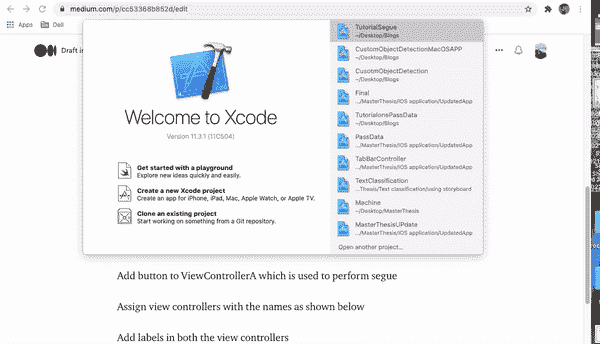
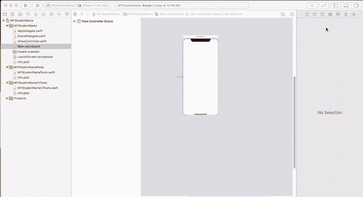
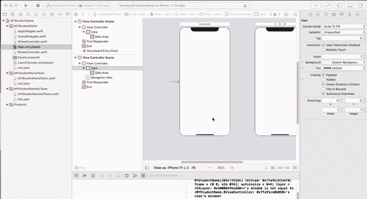
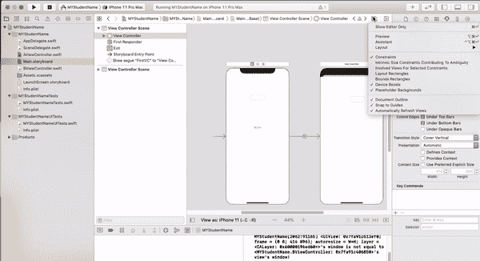

# 在 UIKit 中的 ViewController 之间传输数据(基本分步指南)

> 原文：<https://medium.com/nerd-for-tech/transfer-data-between-the-viewcontroller-in-uikit-basic-step-by-step-guide-cc53368b852d?source=collection_archive---------16----------------------->

约书亚·索蒂诺在 [Unsplash](https://unsplash.com?utm_source=medium&utm_medium=referral) 上拍摄的照片

在 XCode 中有很多方法可以将数据从一个视图控制器传输到另一个视图控制器，其中一种方法是使用 performSegue()方法将数据从一个视图控制器传输到另一个视图控制器。

如果您正在使用 StoryboardUI 开发应用程序，并希望将数据从一个视图控制器传输到另一个，那么您可以使用 performSegue 函数在视图控制器之间传输数据。

要启动 segue，viewController 中必须有一些按钮、手势等。假设我们有两个名为 A 和 b 的视图控制器。我们希望将名称作为 viewController A 中的输入，并在 viewController B 中显示它。我们应该首先在第一个视图控制器中给出一个接受名称的标签，并给出一个执行 segue 的按钮。

让我们创建一个应用程序，它在一个视图控制器(即视图控制器 A)中接受学生信息，并在第二个视图控制器(即视图控制器 B)中显示这些信息

**步骤 1:创建一个新的 Xcode 项目**

打开 Xcode ->创建一个新的 Xcode 项目->选择 iOS 和单视图应用程序并继续->命名您的项目->给出它应该存储的路径并点击创建。

创建新的 ios 项目

**第二步:创建一个新的 ViewController**

导航到 main.storyboard 单击 Xcode 右上角的+或按(command + shift + L)一次，这将显示一个下拉菜单，然后选择 UIViewController 并将其拖动到 main.stroyboard 中

在 main.storyboard 中添加 UIViewController

**第三步:在 ViewControllers 中添加文本编辑器和按钮**

使用右上角的+按钮在两个视图控制器中拖放文本标签，或者按(Command + Shift + L)然后将其拖动到视图控制器。对按钮执行相同的操作。

添加按钮和文本标签后。右键单击 main.storyboard 中 FirstViewcontroller 的按钮，按 control 并将光标拖动到第二个视图控制器，将出现一个弹出窗口，选择 show 这是我们创建的手动序列。在下面的示例视图中，根据您的意愿将该片段命名为 FirstVC

添加文本标签和按钮

**第四步:在 AViewController 和 BViewController 中定义 IBOutlet 和 I action**

我们在 AViewController 中定义了一个文本编辑器来接受名称，并在 BViewController 中定义了另一个文本编辑器来显示在 AViewController 中输入的名称。此外，我们还声明了一个按钮来执行 segue。

IBAction 和 IBOutlet

**步骤 5:执行 segue 并在视图控制器之间传输数据**

在 AViewController 中，当点击按钮时，它将调用 performSegue()函数，该函数将启动到 BViewController 的 segue way。我们将这个 segue 标识符命名为 firstVC。

在 override func prepare(for segue:)函数中，发生数据传输。该函数覆盖 performSegue 函数，并在视图控制器之间传输数据。

为了传输数据，在 BViewController 中定义了一个变量，并将其分配给我们输入数据的 NameTwo 文本字段。

在下面找到完整代码的链接

 [## AkshayDevkate/SwiftTest

### 测试并实现 swiftUI。在 GitHub 上创建一个帐户，为 AkshayDevkate/SwiftTest 开发做贡献。

github.com](https://github.com/AkshayDevkate/SwiftTest/tree/master/MYStudentName)