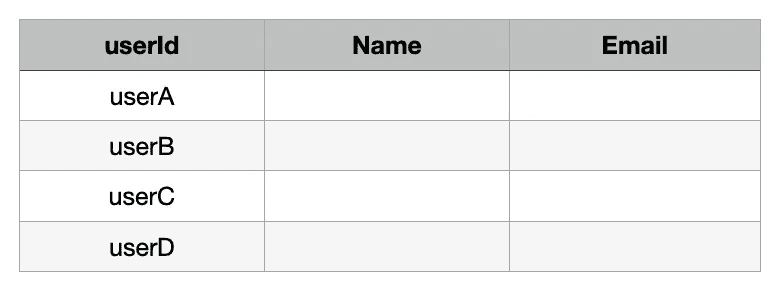
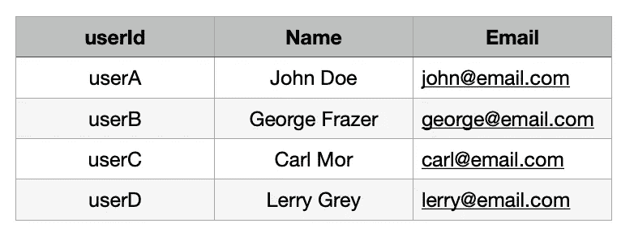

# 使用 MongoDB、Node.js 和 Streams 处理批量数据！

> 原文：<https://medium.com/nerd-for-tech/transform-export-bulk-database-response-without-memory-overflow-using-mongodb-node-js-streams-bcbb3415dd9c?source=collection_archive---------0----------------------->

照片由[卡斯帕·卡米尔·鲁宾](https://unsplash.com/@casparrubin?utm_source=medium&utm_medium=referral)在 [Unsplash](https://unsplash.com?utm_source=medium&utm_medium=referral) 上拍摄

最近，我不得不在 MongoDB **~50 Mn** 文档中查询一个非常大的数据集，并且大约有 **~0.5 Mn** 的响应被处理并以所需的格式导出到`*csv*`文件。

注:如果赶时间，完整的解决方案附在最后，否则，我会推荐通读。

为了更好地理解，我们将继续一个例子，在这个例子中，我们将需要填充数据库中的空数据列。

所以，我在这里是为了让你更容易，如果你遇到类似的事情。我将把解决方案分成几个小部分:

1.  从文件*获取查询输入。xlsx(可选)*
2.  设置数据库连接，准备触发🔥
3.  自定义流来转换数据*(可选)*
4.  csv 字符串流:生成 CSV 友好数据*(可选)*
5.  将数据导出到输出 *(process.stdout 或。csv 文件)*

*够了，该码了！*

# 从文件中输入查询数据进行查询

从中读取数据。xlsx 文件，我会用`*xlsx*`包。带有一些要填充的字段的示例输入文件:

输入参数的 input.xlsx 文件

这里，我们需要从数据库中的用户集合中填充**名称、电子邮件**。首先，我们在一个数组中收集来自工作表 *(userId)* 的输入，并查询数据库。

读书。查询参数的 xlsx 文件

现在，我们有了查询的参数。让我们进行下一步。

# 设置数据库连接

是时候连接数据库了，我们将使用`connectDB`函数发起一个连接，并在`main`函数*(魔法发生的地方)*中调用它。

节点中的 mongoDB 连接

如果你仔细观察，我们没有用 promise 处理数据库查询响应，而是使用了一个游标，这将是我们的 [**ReadableStream。**](https://developer.mozilla.org/en-US/docs/Web/API/ReadableStream)

使用流，我们通过管道将数据流传输到所需的任意多个流，在本例中，是一个自定义转换流、CSV-stringy 流和输出流。

# 用于数据转换的自定义流

这是最有趣的部分，我们将使用[**transform stream**](https://developer.mozilla.org/en-US/docs/Web/API/TransformStream)**定制一个流处理程序来转换数据。**

自定义流操作示例

在这个例子中，我们转换了传入的流，就像我们将*的名字和*的姓氏组合起来形成**的名字**。

在操作之后，简单地将数据传递给`this.push()`函数，但是在使用您自己的定制流处理管道时，要检查您要传递给下一个流的数据类型，以及管道中的下一个流是否支持该数据类型。

> "有些流只接受受限制的数据类型，如:缓冲区，字符串."

# CSV 丝状流

现在，我们将继续使用另一个流，它将数据转换成一种 *csv* 友好格式，不要担心，我们不需要实现它，一个包提供了这种现成的格式`csv-stringify`😁

使用 csv-stringify 生成 csv 就绪数据

Stringifier 返回 **ReadableStream** ，我们将把它进一步传送到输出流 *(stdout，file)。*

# 将数据导出到输出流

最后，我们将在期望的输出流中逐块导出数据。最简单的方法是使用`process.stdout`流作为:`stream = stream.pipe(process.stdout)`

这样，整个数据将在 stdout(终端)上流式传输，但是如果我们想将数据存储在一个文件中，这里是如何:

使用 CSV 文件作为输出流的参考

# 结论

现在，我们已经完成了所有的过程，是时候输出了👀

输出. csv

这是所有步骤之后的预期输出文件，数据填充在其他列中。

仅此而已！🎉完整文件的链接是:

 [## dhruv479/dhruv479

### 在 GitHub 上创建一个帐户，为 dhruv479/dhruv479 开发做出贡献。

github.com](https://github.com/dhruv479/dhruv479/blob/main/scripts/stream-mongo-node.js) 

希望你喜欢这篇文章，鼓掌并关注更多。