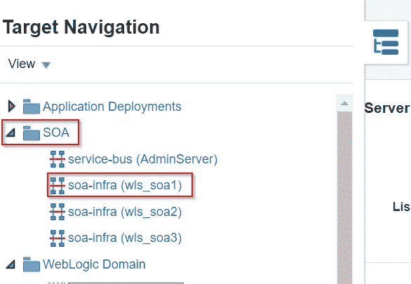
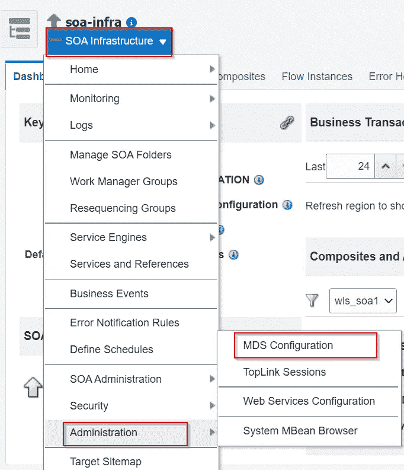
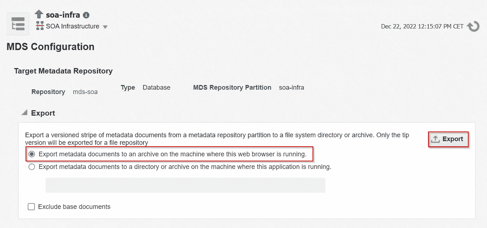
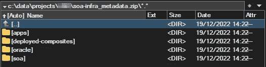
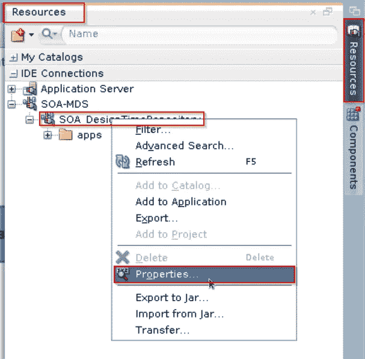
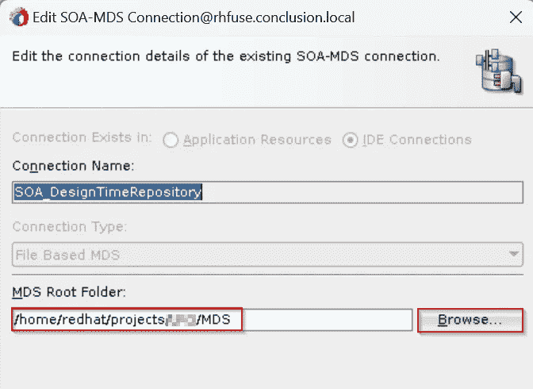
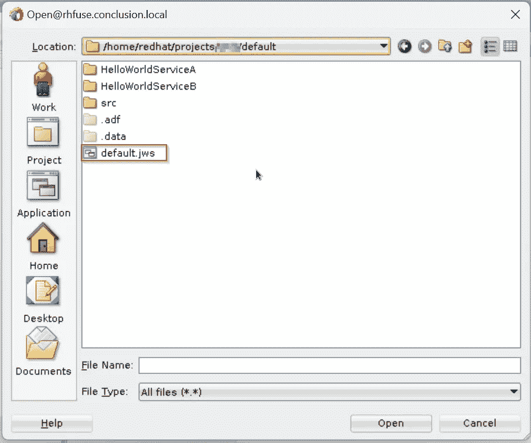
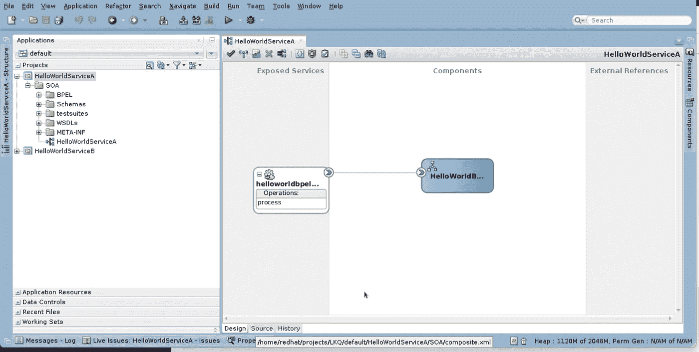

# 将您的 Oracle SOA MDS 转换到 JDeveloper 工作区

> 原文：<https://medium.com/nerd-for-tech/transform-your-oracle-soa-mds-to-jdeveloper-workspaces-1a37538946f3?source=collection_archive---------1----------------------->

这几周，我帮助一个客户强化他们的 SOA 基础设施环境，并使其高度可用。

Oracle 融合中间件 12c，尤其是 SOA 套件，确实很好地支持了高可用性。但是，您应该知道高可用性支持的不同领域。其中一个领域是适配器的配置。为了能够进入其中，你需要手头有实际的复合材料。

如果您手头没有实际的源代码，或者您想要研究特定环境的已部署组合，那么您可以从该 SOA 套件环境中导出 MDS。所有的代码都在那里，既有您用*oramds:/*—URL 引用的工件，也有实际部署的组合。

您可以创建一个单独的 SOA 应用程序，然后用一个空的组合创建一个 SOA 项目，然后将特定的已部署组合的内容从 MDS zip 复制到项目文件夹中。然后，您需要更改 DesignTimeRepository 的引用，以使 JDeveloper 复合设计器能够引用 MDS 引用。这可以很容易地手动完成。但是，如果您需要对数以百计的复合材料进行这样的操作，那将是一项乏味的工作。

然后阿帕奇蚂蚁来救援了。我创建了一个脚本，可以将导出的 MDS 的内容转换成包含 Oracle JDeveloper SOA 应用程序和项目的结构。可以导入*。jws* 文件导入 JDeveloper 并无缝地打开组合。

该脚本是我的 [WeblogicScripts](https://github.com/makker-nl/WeblogicScripts) GitHub 知识库的一部分，可以在[AnalyseUtils/transform MDS 2 jws](https://github.com/makker-nl/WeblogicScripts/tree/master/AnalyseUtils/TransformMDS2JWS)找到。

# 出口 MDS

要导出 MDS，请登录 Oracle Enterprise Manager—SOA 套件环境的融合中间件控件。

在目标导航器中，导航到 SOA -> soa-infra。选择一个 soa-infra 条目:



目标导航— SOA 基础架构

然后在 *SOA 基础设施*下拉菜单中，导航到*管理*->-*MDS 配置*:



菜单 SOA 基础设施—管理— MDS 配置

然后选择第一个单选按钮选项(默认)，并单击 Export:



将元数据导出到归档

这可能需要几分钟的时间，MDS 数据库中的所有工件都被提取并压缩，然后下载为 *soa-infra_metadata.zip* :


此 zip 具有包含以下文件夹的结构:



SOA-基础架构 _ 元数据. zip

这里您可以看到以下文件夹

*   *apps* :这个文件夹包含了所有共享的 MDS 工件，你可以在你的合成中使用 *oramds:/* URL 进行引用。
*   *deployed-composites* :该文件夹包含每个 SOA 套件文件夹的子文件夹(在 11g 命名分区中)。这些子文件夹包含所有复合修订。
*   *甲骨文*:这个文件夹包含关于 ADF 的预置工件。
*   *soa* :这个文件夹包含了关于 soa 基础设施的预置工件。

将此 zip 文件解压缩到 JDeveloper 环境可访问的文件夹中。

# FMW 12c 环境

要运行这些脚本，您需要设置您的融合中间件环境。为此，我使用了以下脚本的某种形式: [scripts/fmw12c_env.sh](https://github.com/makker-nl/WeblogicScripts/blob/master/scripts/fmw12c_env.sh) 。

该脚本设置以下环境变量:

*   *ORACLE_BASE* : /app/oracle
*   *JAVA _ HOME:*$ ORACLE _ BASE/product/JDK 8
*   *FMW _ 主页*:$ ORACLE _ BASE/product/jdeveloper/12214 _ SOAQS
*   GMDS : ~/。jdeveloper/system/default domain/store/gmds

可以看出，我使用的是 Linux 安装。但是，这可以很容易地转换成 Windows 变体。您所需要的只是 Oracle SOA quick start 12c(12.2.1.4)安装。

GMDS 变量指的是用户主目录中嵌入式 Weblogic 域位置的 gmds 文件夹。

设置完这些环境变量后，它从*$ FMW _ HOME/Oracle _ common/common/bin*中调用 *setWlstEnv.sh* 。它把这个文件夹添加到$ *PATH* 变量中。这使您的环境能够运行 *ant* 和 *wlst.sh* 命令。

调整 *JAVA_HOME* 和 *FMW_HOME* 变量以适应各自的安装位置。

在 Linux 下运行这个脚本

```
. fmw12c_env.sh
```

# 性能

[build.properties](https://github.com/makker-nl/WeblogicScripts/blob/master/AnalyseUtils/TransformMDS2JWS/build.properties) 文件包含驱动脚本的相关属性设置。主要属性有:

*   *fmw.home* :引用$ *FMW_HOME* 环境变量。这是访问 ant-contrib 库所必需的。
*   *source . MDS*:SOA-infra _ metadata . zip 文件解压到的文件夹。
*   *target . folder*:SOA 应用应该登陆的文件夹。
*   *soa.apps.folders* :必须作为 soa 应用程序复制的 SOA 文件夹的逗号分隔列表。

修改该文件，以引用提取的 *soa-infra_metadata.zip* 和目标文件夹，您希望在其中保存您的 soa 组合。

我建议创建这个项目的副本，并在复制的脚本集中修改属性文件。

# 对部署的组合进行重复数据删除

形式为 *composite_rev1.0* 的 MDS 中已部署组合的名称。例如*hello world service a _ rev 1.0*。 *_rev* 后的数字是部署时的实际修订号。

目前，该脚本不允许同一个组合的多个部署。它目前无法确定应该采用哪个复合版本。这可能是对脚本的增强，因为 zip 文件中的文件夹 *deployed_composites* 包含一个名为 *deployed-composites.xml* 的文件。在这个文件中，注册了所有已部署的组合及其修订版，以及哪个修订版是默认的。

现在，您应该预先删除所有的复合修订，为您想要复制的每个复合保留一个单独的修订。

# 运行脚本

在提取了 *soa-infra_metadata.zip* 并修改了 *build.properties* 文件之后，您可以如下运行脚本:

```
$ ant -f transformMDS2JWS.xml
```

实际的脚本 [transformMDS2JWS.xml](https://github.com/makker-nl/WeblogicScripts/blob/master/AnalyseUtils/TransformMDS2JWS/transformMDS2JWS.xml) 是一个 Ant 脚本，将执行以下操作:

*   它将 MDS 源文件夹中的 *apps* 文件夹复制到目标文件夹的 *MDS/apps* 子文件夹中。
*   对于 soa.apps.folders 中的每个文件夹，它在目标文件夹中创建一个应用程序文件夹。然后它创建一个基本的 *application.jws* 文件，一个 *src/META-INF* 文件夹，带有一个 *jps-config.xml* 和一个*。带有 *adf-config.xml* 文件的 adf/META-INF* 文件夹。
*   对于应用程序文件夹中的每个文件夹，它都会在目标中创建一个 SOA 项目文件夹。它创建了一个 *project.jpr* 文件和一个 *SOA* 子文件夹。源项目文件夹的内容被复制到 *SOA* 子文件夹中。
*   每个创建的 *project.jpr* 文件被添加为对 *application.jws* 文件的引用。
*   最后，它将结束标记添加到 *application.jws，*，这样它就是一个有效的 XML 文件。
*   此外，它还创建了一个符号链接，该链接指向用户主文件夹中 JDeveloper 的嵌入式 Weblogic 的 DefaultDomain 中的 GMDS 文件夹中的 MDS/应用程序文件夹。我以后可能需要禁用它。但是这允许嵌入式 Weblogic 中的 SOASuite 引用基于文件的 MDS 中的工件。

[*ADF-config . XML*](https://github.com/makker-nl/WeblogicScripts/blob/master/AnalyseUtils/TransformMDS2JWS/SOA/_adf/META-INF/adf-config.xml)*，*[*jps-config . XML*](https://github.com/makker-nl/WeblogicScripts/blob/master/AnalyseUtils/TransformMDS2JWS/SOA/src/META-INF/jps-config.xml)*，*[*project . jpr*](https://github.com/makker-nl/WeblogicScripts/blob/master/AnalyseUtils/TransformMDS2JWS/SOA/SOATemplateProject.jpr.tpl)*和[*application . jws*](https://github.com/makker-nl/WeblogicScripts/blob/master/AnalyseUtils/TransformMDS2JWS/SOA/SOATemplateApp.jws.tpl)*文件是基于项目中的模板文件。它们可能包含对复制时展开的 Ant 属性的引用。**

**对于项目文件夹和 *project.jpr* 文件的名称，它将从源代码中的文件夹名称中删除修订。在德 MDS 文件夹的名字是这样的:*hello world service a _ rev 1.0*。这个项目将被命名为 HelloWorldServiceA。Ant 处理字符串的能力较差。为此，我使用了一小段 JavaScript 代码。一个简单的正则表达式就可以做到。但是，我觉得这个更好读。**

# **SOA 设计时存储库**

**为了使 JDeveloper 能够以适当的方式引用所有工件中的*oramds:/*URL，您应该将 SOA DesignTimeRepository 定向到包含 *apps* 文件夹的目标文件夹中的 mds 文件夹。打开资源窗格，展开 *IDE 连接- > SOA-MDS* 。右键单击 *SOA 设计时仓库*，并单击*属性*:**

****

**打开 SOA 设计时仓库属性**

**然后设置 *MDS 根文件夹*:**

****

**设置 MDS 根文件夹**

**注意，你应该选择*应用*文件夹的父文件夹，而不是*应用*文件夹本身。它也不需要有种子 *oracle* 和 *soa* 文件夹。它们是从 JDeveloper 安装主文件夹中获取的。**

# **在 JDeveloper 中打开 SOA 应用程序**

**现在可以在 JDeveloper 中打开生成的应用程序。单击打开文件图标并导航到。 *jws* 文件:**

****

**开放式 SOA 应用程序**

**然后选择并打开文件。然后你就可以打开复合材料了:**

****

**使用 SOA 组合设计器的 SOA 应用程序**

# **结论**

**Ant 是一个非常有用的工具。它是作为一种用于 Java 编译的 *make-* 工具(对于那些还记得 *C/C++* 的人来说)而诞生的。但是，几乎没有人会将它用于 Java 构建。Maven 更适合这一点，因为它有依赖性管理。**

**但是，对于文件的大型文件夹结构的转换、处理或检查，ANT 是非常强大的。您可以轻松选择符合特定标准的文件，并从那里开始工作。通过使用 JavaScript 片段，您也可以进行智能字符串处理。**

**使用这个脚本，可以非常容易地将大型 SOA 套件部署的 MDS 导出结果与 JDeveloper 中的大量 SOA 组合一起导出。**