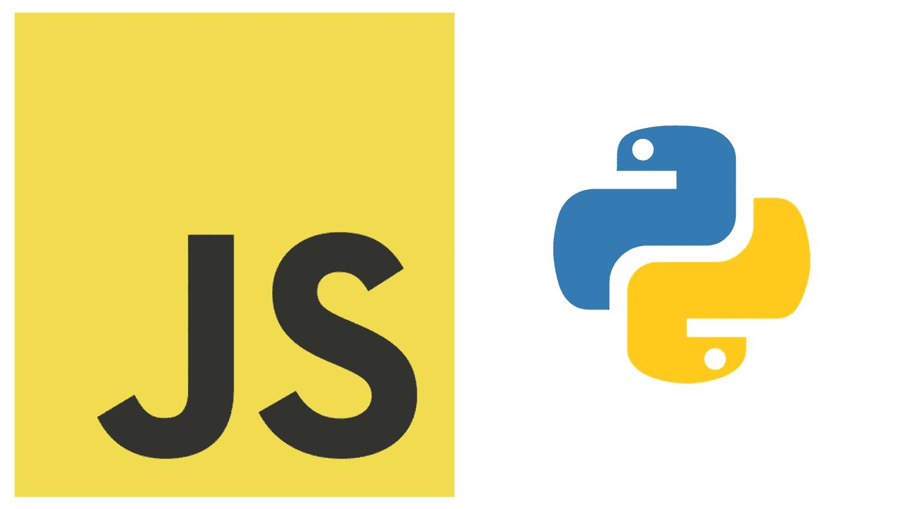

# 从 JavaScript 到 Python 的翻译:01 _ 预热

> 原文：<https://medium.com/nerd-for-tech/translations-from-javascript-to-python-01-warming-up-d0342de6b689?source=collection_archive---------21----------------------->



如果你以前端工程师的身份开始了你的软件工程职业生涯，并想尝试更多与数据相关的领域或改变你的主要语言，那么你可能需要学习一门新的语言。在我见过的许多案例中，从 *JavaScript* 到 *Python* 的转变就发生了。

大部分数据结构和算法问题的教程都是用 Java 编写的，而 Python 是这一领域的新趋势。从 JavaScript 直接过渡到 Java 可能是一个巨大的飞跃，而从 JavaScript 过渡到 Python 可能是一个更平稳的选择。还有足够多的针对 DSA 的 Python 教程(每天都有更多的教程被创建出来！).

所以，这篇文章是关于这个转变的热身。这个系列可能由 3-4 篇文章组成(我们会看到~)。在这里你可以学习这些语言的一些非常基础的部分。欢迎来到双语俱乐部！

# 变量(例如变量名称，“我的变量”)

***JavaScript***

```
const myVariable = "Hello World" 
// notice that the variable name is camelCase
let myVariable = "Hello World"
var myVariable = "Hello World"
// avoid var keyword
```

***Python***

```
my_variable = "hi"
# variable names in Python is snake_case and there is no keyword before the name
```

# 表示缺少某物

*:`null`*

****Python*** : `None`*

# *布尔值*

****JavaScript***:`true / false`*

****Python*** : `True / False`*

# *打印到控制台*

****JavaScript***:`console.log("Hi, there!")`*

****Python*** : `print("Hi, there!")`*

# *条件语句*

***JavaScript***

```
*if(x > y) {
  console.log("x is greater than y")
} else if(x < y) {
  console.log("x is less than y"
} else {
  console.log("x is equal to y")
}*
```

****Python****

```
*if x > y:
  print("x is greater than y")
elif x < y:
  print("x is less than y")
else:
  print("x is equal to y")*
```

# *字符串或数组的长度*

**:`'abcd'.length / [1, 2, 3].length`**

*****Python***:`len('abcd') / len([1, 2, 3])`(Python 没有数组只有列表)**

# **用于循环**

*****JavaScript*****

```
**const nums = [1, 2, 3, 4, 5]
for(let i = 0; i < nums.length; i++) {
  console.log(nums[i])
}
for(const num of nums) {
  console.log(num)
}**
```

*****Python*****

```
**nums = [1, 2, 3, 4, 5]
for i in range(len(nums)):
  print(nums[i])
for num in nums:
  print(num)**
```

# **将项目添加到数组/列表**

*****JavaScript***:`arr.push("item")`**

*****Python*** : `arr.append("item")`**

# **检查项目是否在数组/列表中**

***:`arr.includes(3)`***

******Python*** : `3 in arr`***

# **通过索引从数组/列表中删除特定项目**

***:`arr.splice(index, 1)`***

******Python*** : `arr.pop(index)`***

# **从数组/列表中删除特定项目**

*****JavaScript***:`arr.splice(arr.indexOf("banana"), 1)`**

*****巨蟒*** : `arr.remove("banana")`**

# **使用关键字和值迭代对象/字典**

*****JavaScript*****

```
**for(const [key, value] in Object.entries(myObj) {
  console.log("key: ${key}, value: ${value}")
}**
```

*****Python*****

```
**for key, value in my_dict.items():
  print(f"key: {key}, value: {value}")**
```

**我知道，还有很多其他的比较，我甚至没有解释在这篇文章中使用的一些差异(例如，插值，你可以参考[这个代码示例](https://www.codegrepper.com/code-examples/python/javascript+string+interpolation+polyfill))。在下一篇文章中，我会写这两种语言的其他不同之处。直到那时，编码快乐~！！！**