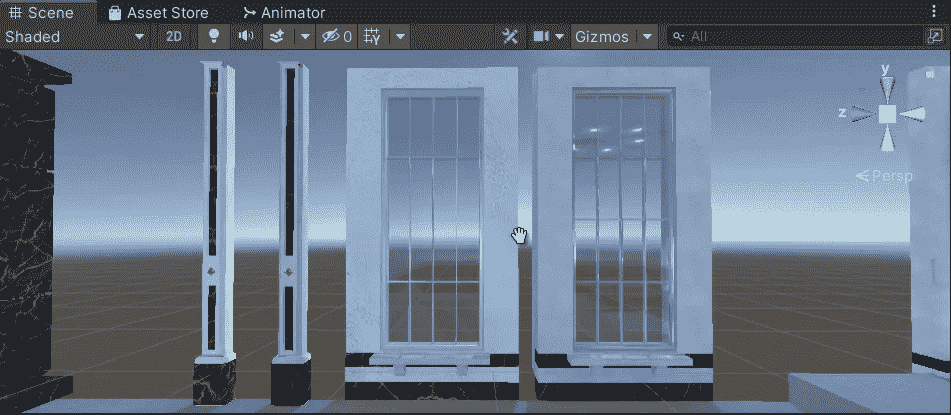

# 如何在 Unity 资产上创建透明窗口效果

> 原文：<https://medium.com/nerd-for-tech/transparent-window-bonus-698f0e324ec5?source=collection_archive---------8----------------------->

## 剧透警告:通过调整它的着色器属性

**目标**:用材料再造一个透明的玻璃窗

我们将使用材料及其特性来创建透明玻璃效果。

## 窗户