# 旅行？？呆在家里/工作/玩耍

> 原文：<https://medium.com/nerd-for-tech/travel-stay-work-play-at-home-accb2425e4d6?source=collection_archive---------29----------------------->

明白我的意思吗？

不，不是另一个咆哮的帖子。
与在家保持高效工作无关。
亦谈不上旅行怀旧。

够神秘了，对吧？**所以在这篇文章中，我将** `**briefly**` **分享一个关于 Javascript** 中逻辑运算符用法的提示，以及 2021 年更新的使用方法。

与标题无关，是吗？其实不是。你会明白为什么。

# TLDR；
使用带赋值的逻辑运算符:

> 1) &&=
> 
> 2) ||=
> 
> 3) ??=

博文标题？

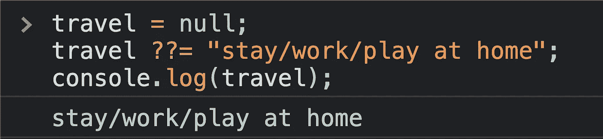

=======================================

## Javascript 中使用逻辑运算符的最基本方式

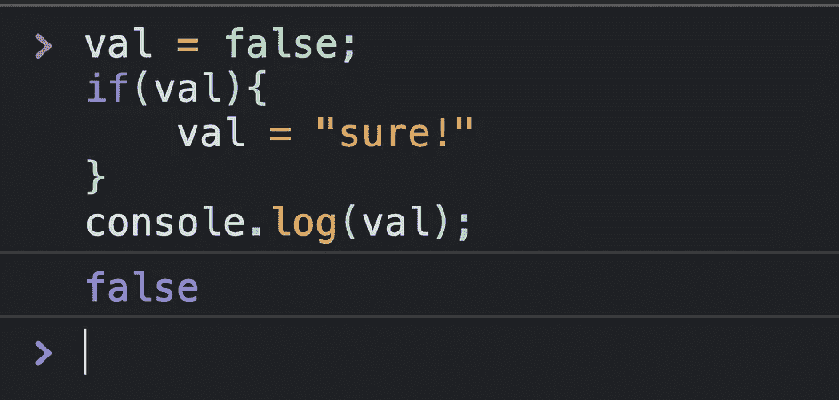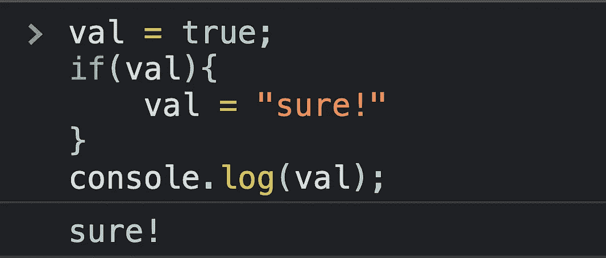

现在，让我们把它变得更简单。

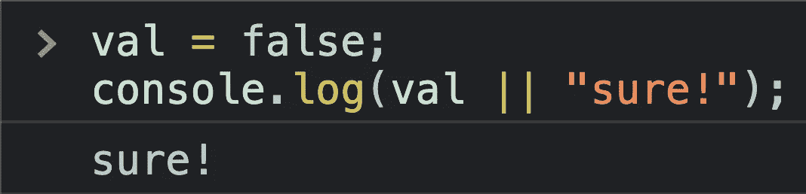

到目前为止都很简单？但是你知道我们也可以使用逻辑运算符赋值吗？让我们看看。

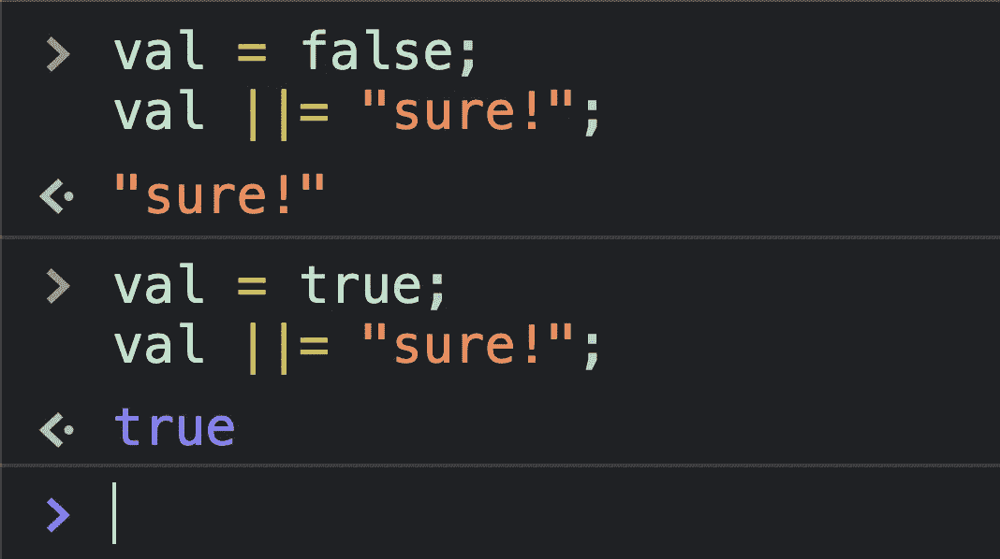

这类似于我们一直使用的数字运算符`+=` :-

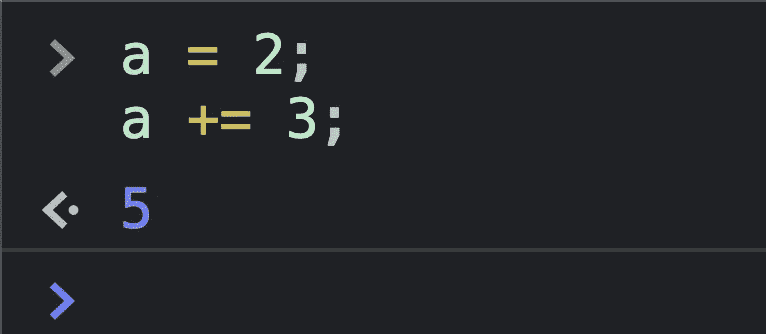

让我们看看更多使用逻辑运算符的赋值例子。

## 使用&&运算符

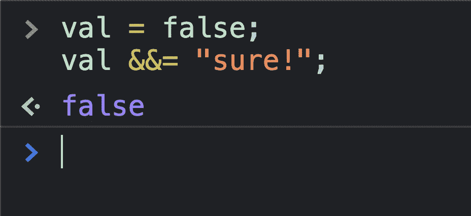

使用`&&`操作符，如果‘val’为真，则打印右侧，否则打印 LHS。

## 使用零化合并运算符

nullish 合并操作符专门检查 null 或 undefined，因此，如果变量为 null 或 undefined，则返回替代值，否则返回变量中的值。

> 非分配用法

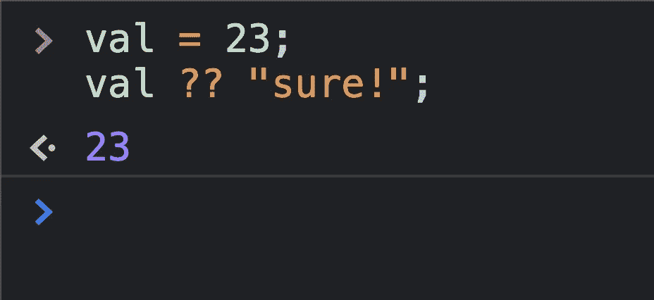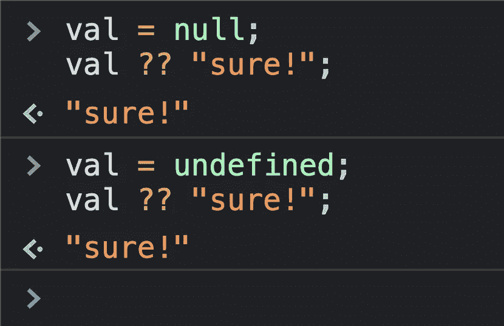

> with-赋值用法

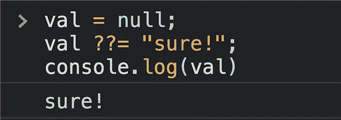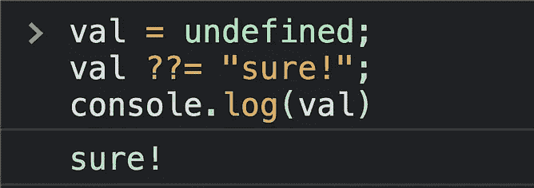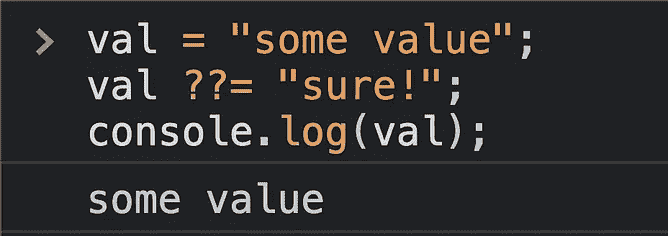

我们对这个 javascript 特性做了一个小的但是有用的增强。

哦，还记得吗？

再见！:)