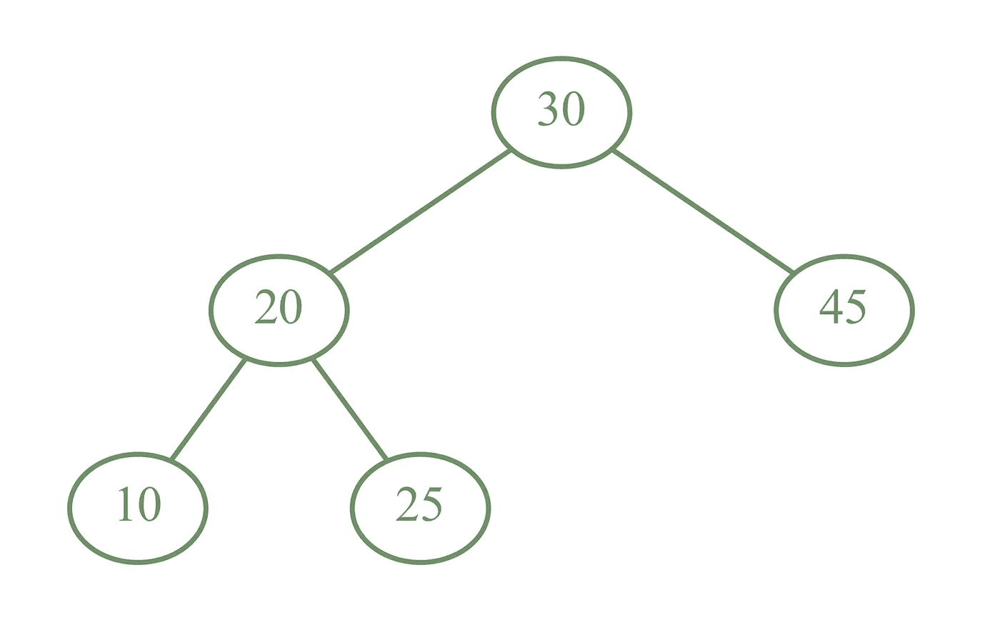
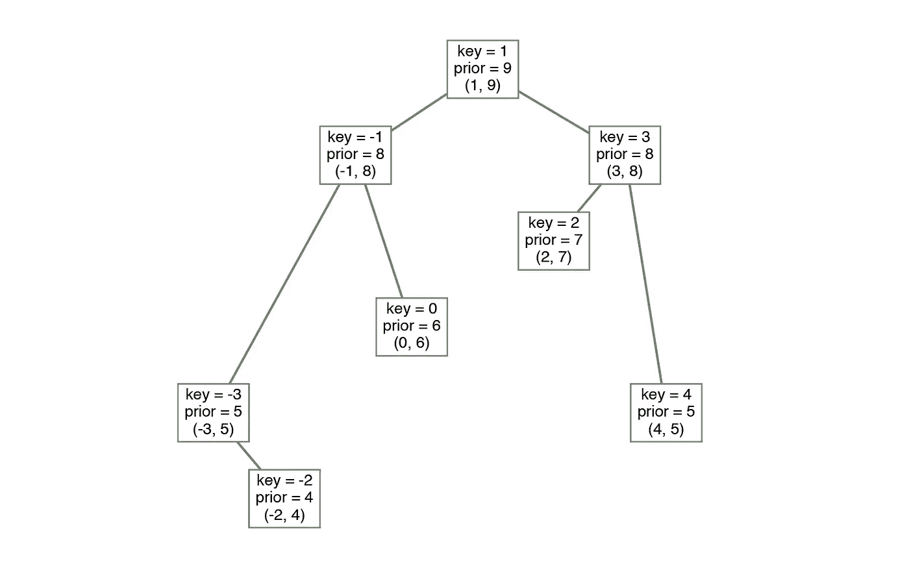
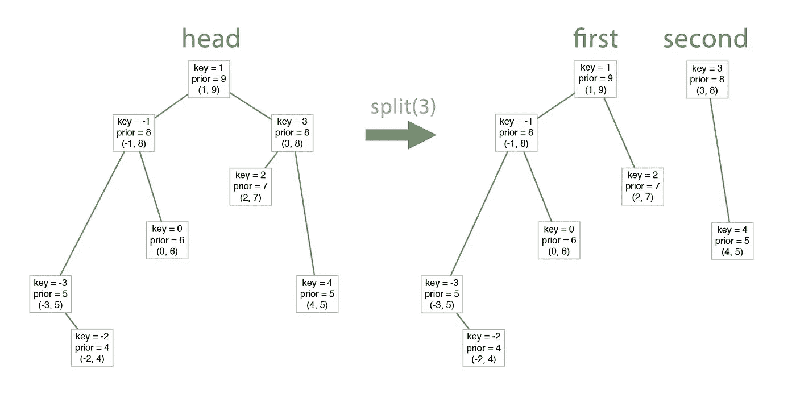
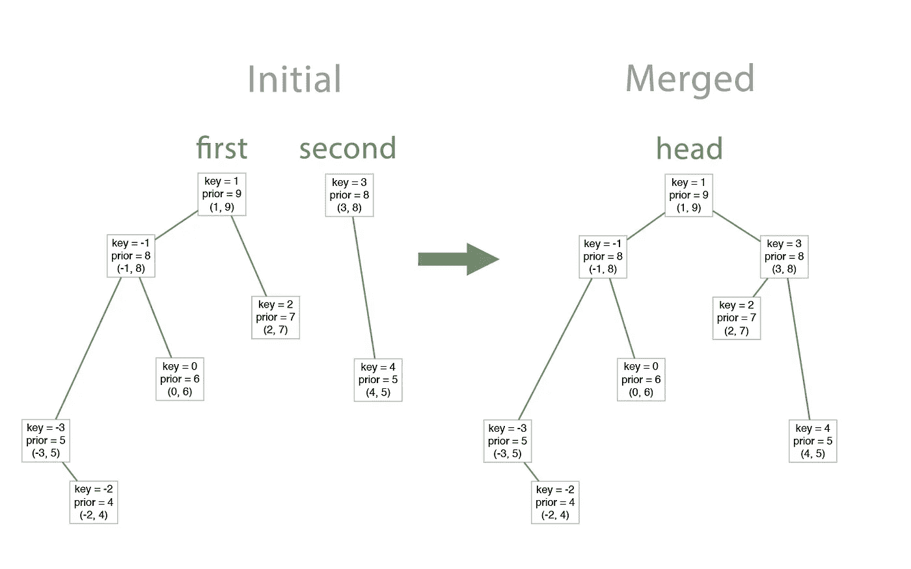
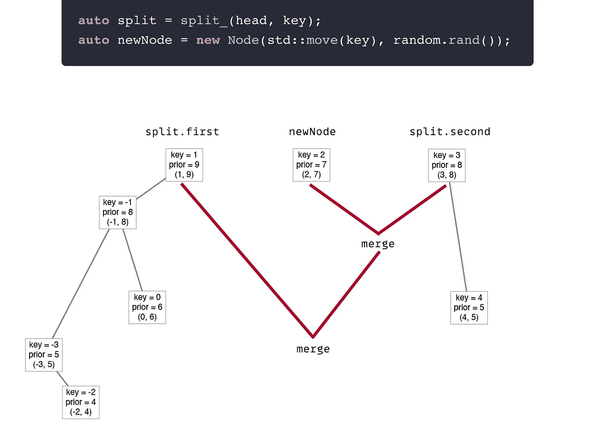
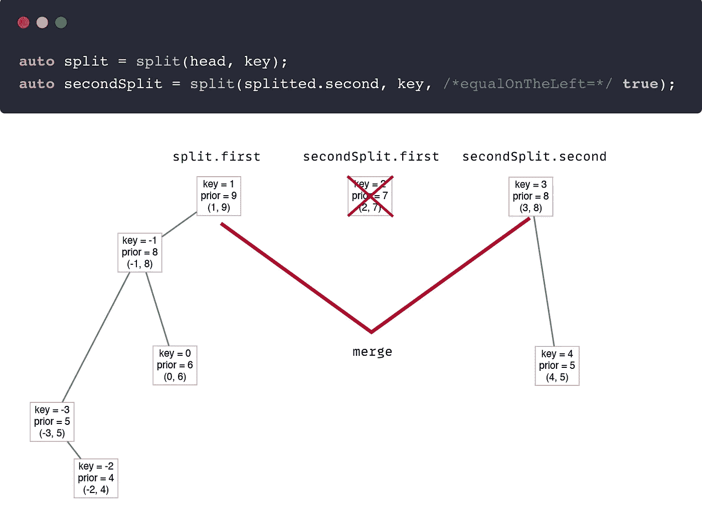
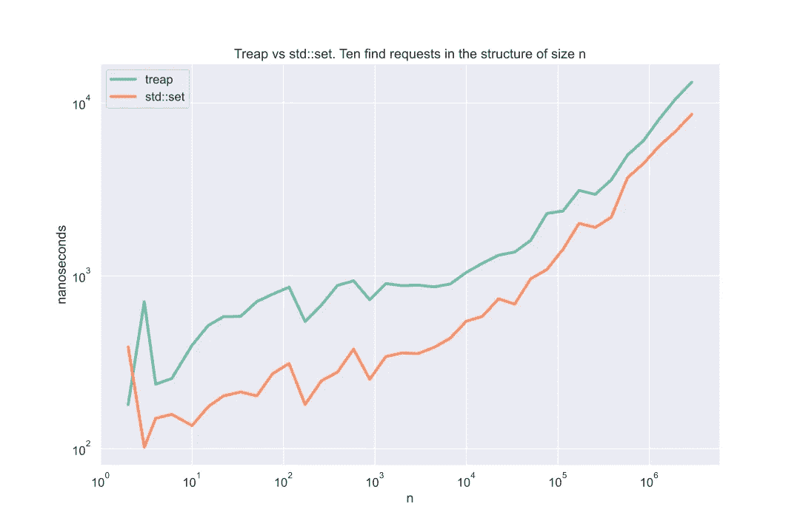
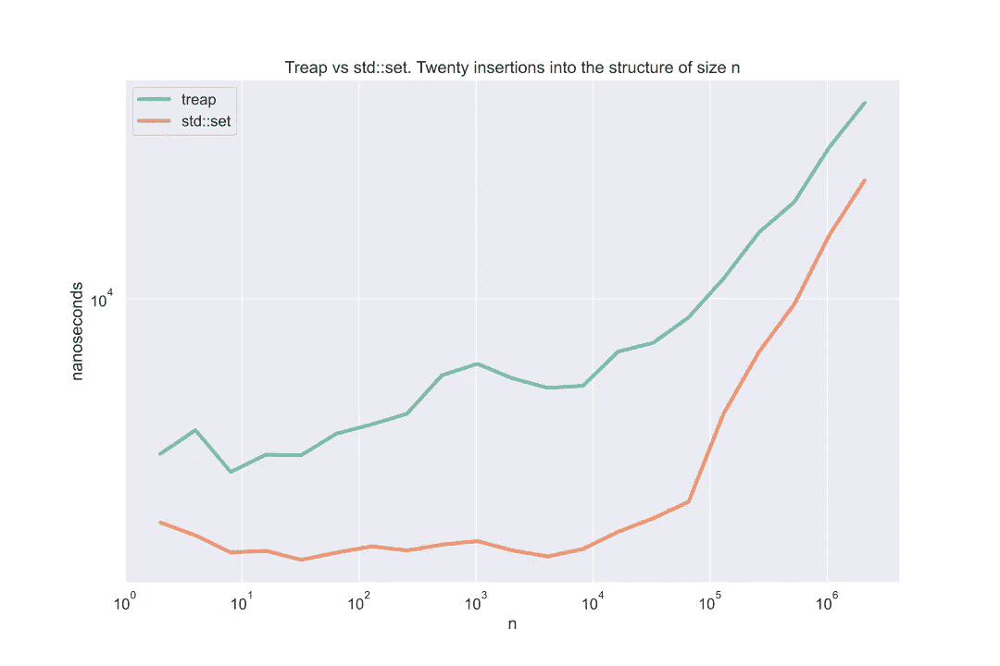

# Treap:最简单的搜索树(解释)| Alex Dremov

> 原文：<https://medium.com/nerd-for-tech/treap-the-easiest-search-tree-explained-alex-dremov-c82c9dc3c5e5?source=collection_archive---------0----------------------->

## 二分搜索法树很硬。我将解释一种最简单、最有效、最强大的平衡二叉树——treap 或笛卡尔树。



**笛卡尔树或 treap** (二叉查找树+二进制堆)是一种快速而简单的数据结构。它同时符合核心搜索二叉树性质和二叉堆性质。尽管很简单，treap 会自我平衡，导致所有常见操作的平均复杂性。

很神奇，对吧？

> 💥该算法使用随机值。因此，`O(logn)`复杂度平均为**。然而，`O(logn)`的许多条目几乎总是真实的。因此，在本文的后面，我将只使用`O(logn)`，而不使用“平均”加法。**

**此外，还有一个修改(隐式 treap，带隐式键的 treap)让你像通常的数组一样使用 treap，带有`O(logn)` **随机插入和** **随机删除**。是不是很酷？在本文中，我将解释如何创建一个并在 Swift 中提供实现。此外，我将把 treap 与标准库中的通用`set`进行比较。开始吧！**

> **💡在二叉查找树中，对于每个节点，左子树中所有项目的值都小于该节点的值，而右子树中所有项目的值都大于该节点的值**

# **核心算法**

**正如我前面所说，treap 结合了 heaps 和二分搜索法树。因此，我们至少要存储两个属性:`key`(或值)和`priority`。Key 是一个值，对于哪个树是搜索树，对于优先级，它是一个二进制堆。**

> **💡二进制堆是一棵二叉树，其中每个子节点的值都小于该节点的值**

****

**Treap 示例**

**在上图中，您可能会注意到，对于每个节点，所有子节点的优先级都降低了。另一方面，左侧的所有子节点的键都比节点中的键小，而右侧的所有子节点的键都更大。**

> **💡它也被称为**笛卡尔树**，因为它可以显示在一个规则的 2D 网格上，每个节点都有(键，优先级)坐标。就像上图一样。**

**为了创建一个全功能的搜索树，我们需要实现:**

*   **发现**
*   **插入**
*   **去除**

**像`lower bound`和`upper bound`这样更奇特的操作也非常简单，与其他搜索树中的操作没有什么不同。而所有这些操作都可以用**仅仅两个辅助操作**来实现！**

**怎么做呢？**

> **💥**拆分**
> 
> 根据给定的`value`将树拆分成两棵树。左树中的所有值都比`value`小**比**大**比**大。并且两个结果树都是正确的树。我们将使用一个特殊的标志来决定是发送等于左树还是右树的值。**

****

**分裂函数结果示例。向右发送的相等值**

> **💥**合并**
> 
> 将两个 treap 合并成一个大 treap。
> **前提:**第一棵树中的所有项目都小于右边树中的项目。**

****

**合并示例**

**因此，如果我们实现这两个方法，实现所有其他三个操作将是微不足道的。**

## **裂开**

**让我们在这个阶段开始考虑代码。我将在`C++`中解释这一点。在`Swift`中重写下面的代码实际上非常容易。如果你需要帮助，请在下面留下评论。**

**对于拆分，我们有一个`head`节点和一个`key`节点需要进行拆分。这个方法使用递归非常简单。**

## **算法**

**设当前头像为`p`。**

*   **如果`p->key`比`key`中的小，那么我们需要将**向右移动**并进一步分割`p->right`。

    同样，分割`right`也会带来两棵树，第一棵树的节点比`key`的键**少**。然而，它们比`p->key`更大(因为它们在第一次分裂的第二棵树中)。
    因此，我们将`p->right`设置为拆分`right`结果的第一个**树。

    **结果:** `p`，分割右边的第二棵树****
*   **如果`p->key`大于**或等于`key`的**，那么我们需要将**向左**并进一步分割`p->left`。

    与上面的情况类似，我们将`p->left`设置为左分裂的第二个**树**。

    **结果:**分割左边的第一棵树，`p`**

**上面的算法在第二棵树中留下了一个等于分裂值的节点。对称地，我们将使用`equalOnTheLeft`标志离开左树中的节点。**

**所以，最后的代码:**

> **💡在分割过程中，不使用也不改变优先级。生成的树具有正确的优先级顺序，就像最初的树一样**

## **合并**

**合并类似于拆分，但是它使用**优先级**来完成工作。我之前提到过，有一个**前提**:第一个合并树中的所有项目必须少于第二个树中的项目。如果不是这样，就必须使用另一种算法。**

## **算法**

**与`split`类似，`merge`也是递归的。让我们合并两棵树:`l`和`r`。**

*   **我们需要选择哪棵树来代表新的头。这很简单——头部必须具有最高优先级，因此我们基于此选择`l`或`r`。**

> **💡请注意，`l`中的头节点在整个`l`树中具有最高的优先级，因为它是正确树的属性。同样适用于`r`。**

*   **如果`l`有更高的优先级，那么`l->left`子树肯定会比`r`保持原样作为左子树，这与它无关。

    然后，`l->right`子树必须与`r`合并，它将成为新的`l->right`子树。**
*   **如果`r`具有更高的优先级，那么类似于上面的例子，`r->right`将保持不变，并且`r->left`必须与`l`合并**

**为什么是正确的？**

**似乎没有什么能阻止我们打破搜索树结构，其中左子树中所有项目的值都小于节点的值，而右子树中所有项目的值都大于节点的值。**

> **💡**先决条件**保存二叉查找树属性，因为项目永远不会被重新排序，并且`l < r`属性总是保持不变**

# **实现搜索树方法**

**你相信我所有的方法都很容易通过`split`和`merge`实现。是时候证明这一点了。**

> **这个故事最初发表在 [alexdemov.me](https://alexdemov.me) 上。**
> 
> **查看其他帖子并订阅我的时事通讯，以获得更多的算法解释、编码技巧和许多其他有趣的东西。**

**[](https://alexdremov.me/treap-algorithm-explained/) [## Treap:最简单的搜索树(解释)| Alex Dremov

### 二分搜索法树大多是坚硬的。写红黑树是一场噩梦。在这里，我要去…

alexdremov.me](https://alexdremov.me/treap-algorithm-explained/) 

## 发现

Find 的实现就像一般的搜索树一样。我们利用左子树中的键大于节点中的值这一事实。

## 插入

让我们从拆分和合并的角度来考虑插入。我们有一棵大树，我们需要插入一棵新的`key`。

*   通过`key`将树分裂成新的树:`first`和`second`。然后，我们将有两棵树:第一棵树(其值小于`key`)和第二棵树(其值大于或等于`key`)。

    我们可以检查节点已经存在:尝试在正确的树中找到它。

> 💥实施要求每个项目只满足**一次**。

*   创建一个新节点来存储新的`key` — `newNode`。这个节点是只有一个节点的正确树。

    对于新节点，需要设置**一个随机优先级**

> 💥随机优先级是复杂性的关键。这使得笛卡尔树自身平衡，使得所有操作变得复杂

*   新的负责人将会是`merge(first, merge(newNode, second))`

看到了吗？就这么简单。



插入示例

## 去除

和`insert`很像。然而，这就是使用`equalOnTheLeft`标志的地方。

> 💡记住由`split`生成的`second`树包含大于或等于所选键**的项目**

因此，`second`树将包含需要删除的值。但是怎么把它从树上去掉呢？

再次分裂。

我们可以通过键分割`second`树，将`equalOnTheLeft`标志设置为`true`。因此，节点将从`second`树分离到新树。

> 💡在进行两次分割并分离出删除的节点后，不需要的节点很容易被移除，其他的都被合并。



移除示例

## 完整代码

你可以在我的网站上下载稍微优化过的 Treap 的 C++代码

[](https://alexdremov.me/treap-algorithm-explained/) [## Treap:最简单的搜索树(解释)| Alex Dremov

### 二分搜索法树大多是坚硬的。写红黑树是一场噩梦。在这里，我要去…

alexdremov.me](https://alexdremov.me/treap-algorithm-explained/) 

# 与`std::set`比较

首先，treap 的实现版本利用了`split`和`merge`方法。请注意，使用旋转会有更高效的实现。然而，treap 的真正威力在于其他搜索树无法轻易做到的`split`和`merge`方法。

## 查找测试



可见渐近性是相似的。尽管如此，treap 总是有更大的开销。尽管如此，还是个不错的结果！我们正在与一个完全优化的标准库数据结构竞争。

## 插入



插入的开销甚至更大。这是意料之中的:递归调用 merge 和 split 不会提高性能；).你可以在我的网站上找到测试代码。

## 比较结论

没错，treap 的性能比`std::set`差。然而，结果是可比较的，随着数据量的增加，treap 越来越接近于`std::set`，它实际上是一棵红黑树。

相信我，

你不想写你自己的 RB 树。简直是噩梦。

# 用例及修改

我们开发这种数据结构不仅仅是为了丢失`std::set`。有几个有用的应用。

## 区间中数字的和

我们需要修改`Node`结构，增加`sum`字段。它将存储所有子节点和自身的总和。

```
template<typename T>
struct Node {
	T key;
	size_t prior;
	long long sum;
	Node* left = nullptr, *right = nullptr;

	Node(T key, size_t prior) :
		key(std::move(key)),
		prior(prior) {
	}
};
```

更新`sum`极其容易。每次换孩子，`sum = left->sum + right->sum`。因此，您可以实现某种类型的`update`函数，并在返回值之前在 split and merge 中调用它。就是这样。

如何应约回答？

我们收到间隔`[l, r]`。要计算这个区间上的数字之和，我们可以用`l`分裂树，然后用`r+1`分裂结果的第二棵树(或者用`r`，左边留相等的元素)。最终，我们将得到一个包含区间`[l, r]`中所有相加数字的树。

**复杂:** `O(logn)`对`O(n)`幼稚。

## 使用值的散列来代替优先级

您可以使用值的散列作为优先级，因为好的散列函数是相当随机的。它带来了什么好处？

如果键和优先级是固定的，那么无论你如何构造 treap 或者添加元素，它总是会有相同的结构。

> 💡你可以这样想:键固定 x 轴，优先级固定 y 轴

因此，您可以比较`O(n)`中的两个集合，因为包含相同值的 treaps 将具有**完全相同的结构。**

## 隐式处理

如果我们用左子树的大小作为一个键会怎么样？然后，我们可以用这个键作为索引。哇哦。这意味着我们可以将一个规则的有序数组表示为一个 treap！

通过这样做，我们可以:

*   通过随机索引
    `O(logn)`对`O(n)`进行插入
*   通过随机索引
    `O(logn)`对`O(n)`进行删除

权力越大，责任越大。

> 😡在标准阵列中，通过随机索引的访问降级为`O(logn)`而不是`O(1)`。

如果您的算法需要大量的数组修改和很少的访问/输出，那么它是正确的选择。此外，您可以将 treap 转换为数组，并以`O(n)`的复杂度转换回来。

> 💥我在 Swift 中实现了隐式 treap。它的行为就像通用数组一样，并实现了许多优化。看看吧！

[](https://github.com/AlexRoar/swift-collections/tree/main/Sources/OrderedCollections/TreeArray) [## swift-collections/Sources/ordered collections/tree array 位于主 AlexRoar/swift-collections

### 此时您不能执行该操作。您已使用另一个标签页或窗口登录。您已在另一个选项卡中注销，或者…

github.com](https://github.com/AlexRoar/swift-collections/tree/main/Sources/OrderedCollections/TreeArray) 

## 剪切粘贴问题

想象一下，你有一根很长的绳子，有人请求你剪下一部分，然后把它插入某个地方。

这个问题可以通过使用带有隐式密钥的 treaps 来解决。您可以使用分割来剪切所需的部分，并合并来插入它。

## 常见问题解答

> 笛卡尔树最适合什么？

当您需要收集某个区间的某种特征(例如，sum)或对该区间进行一些修改时，Treap 非常有用。当您需要用很少的访问来应用大量的随机树插入/删除时，使用隐式键的 Treap 也很有用。

> 为什么我们不用数组索引作为隐式 treap 的键呢？

因为在插入的情况下，我们需要重新计算高于插入索引的所有索引。所以它把复杂度降级为`O(n)`。

> treap 是随机树吗？

是的，它是。但是它也可以使用散列值来代替随机值。

> 我知道没有分割和合并的实现。它利用左转弯和右转弯。好点了吗？

比如 GeeksforGeeks 用的就是这样的实现，我知道。但是我相信 treap 的真正价值在于无缝的分离和融合。您已经通过例子看到了它是多么有用。当你可以建造可能会更快的 AVL 时，为什么要实施轮流交换呢？

# 喜欢数据结构吗？

看看我在惊人的跳过列表上的文章吧！虽然很多人从未听说过它，但跳表非常漂亮，可以以最有效的方式解决，例如，寻找第 n 个最大值的问题或滚动中值问题。

[](https://alexdremov.me/skip-list-indexation-and-kth-maximum/) [## 跳过列表索引和第 k 个最大值| Alex Dremov

### 这是一个很好的结构，可以让你执行插入，搜索，和寻找第 n 个…

alexdremov.me](https://alexdremov.me/skip-list-indexation-and-kth-maximum/) 

另外，你可以查看我博客的整个算法部分

[](https://alexdremov.me/tag/algorithms/) [## 亚历克斯·德雷莫夫|算法

### 二分搜索法树大多很硬。写红黑树是一场噩梦。在这里，我将解释其中一个…

alexdremov.me](https://alexdremov.me/tag/algorithms/) 

# 参考

[算法介绍](https://books.google.de/books?id=NLngYyWFl_YC&pg=PA298&lpg=PA298&dq=treap+algorithm&source=bl&ots=BASmGA8mBd&sig=ACfU3U17YFycVO2ztnR-zjL5yLbhEfv3VQ&hl=en&sa=X&ved=2ahUKEwjxqr_r0qf3AhXD0qQKHcWWDjcQ6AF6BAgyEAM#v=onepage&q=treap%20algorithm&f=false)

[аекартоводрево—алгоитмика](https://algorithmica.org/ru/treap)

[https://www.cs.cmu.edu/~scandal/papers/treaps-spaa98.pdf](https://www.cs.cmu.edu/~scandal/papers/treaps-spaa98.pdf)**