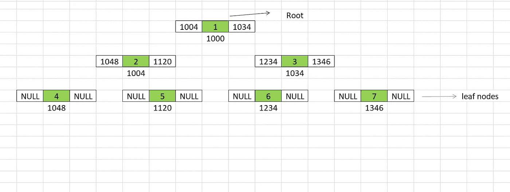

# 树形数据结构

> 原文：<https://medium.com/nerd-for-tech/tree-data-structure-ce938cf157e?source=collection_archive---------2----------------------->

到目前为止，我们已经探索了各种数据结构，如数组和链表。今天我们将深入探讨一下**树形数据结构**。如果你还没有读过我以前的关于指针的文章，请查看并回来。

 [## 关于指针你需要知道的一切-第 1 部分

### C 语言中最重要的概念之一是指针。此外，这一概念被认为是最令人困惑和一…

vaidhyanathansm.medium.com](https://vaidhyanathansm.medium.com/all-you-need-to-know-about-pointers-part-1-1470d2d24d78)  [## 关于指针你需要知道的一切-第 2 部分

### 本文是指针系列文章的第二部分。在上一篇文章中，我们讨论了…的基础

vaidhyanathansm.medium.com](https://vaidhyanathansm.medium.com/all-you-need-to-know-about-pointers-part-2-b6153ed93fe) 

## 什么是树形数据结构？

树是一种 ***非线性层次数据结构*** ，在各个领域都有应用。树中最顶端的节点被称为根节点。左边的分支称为*左子树*，右边的分支称为*右子树。*每个有子节点的节点称为父节点。

一棵树看起来像这样:

礼貌:极客为极客

从上图可以看出，1 是树的根。2 和 3 是父节点 1 的子节点，它们本身分别是 4、5 和 6、7 的父节点。节点 8、9、10、11、13、14 被称为叶节点。

## 为什么是树？

1.  当我们想要存储形成层次结构的信息时，我们需要使用树数据结构。一个很好的例子是计算机上的**文件系统**。
2.  访问树的元素比链表快，但比数组慢。

**树木的一些应用包括:**

> 1.数据库中的索引。
> 
> 2.路由算法
> 
> 3.编译器中的语法分析

## 二叉树

各种应用中最常用的树是**二叉树**。二叉树是这样一种树，其中每个父树最多有 2 个子树，即。，左边和右边的孩子。树被表示为节点的分层连接，每个节点由以下部分组成:

1.  数据
2.  指向左侧子节点的指针
3.  指向正确子节点的指针

上图显示了树在内存中的结构。

现在让我们看看如何实现一个二叉树数据结构。整个演示过程中使用的语言是 **C++** 。第一步是创建一个节点。

现在让我们使用上面的节点类创建树结构。

现在，我们如何访问元素或遍历树的元素。我们有 3 种遍历方法来完成这个任务。

1.  有序遍历
2.  前序遍历
3.  后序遍历

**按序遍历**

在这种类型的遍历中，我们首先遍历左边的子树，然后访问根，然后遍历右边的子树。

**前序遍历**

在这种类型的遍历中，我们首先访问根，然后遍历左边的子树，然后遍历右边的子树。

**后序遍历**

在这种类型的遍历中，我们首先遍历左边的子树，然后遍历右边的子树，然后访问根。

## 二分搜索法树

现在，让我们来看看一种特殊的二叉树，叫做**二叉查找树(BST)** 。如果二叉树满足以下条件，它就有资格成为 BST:

1.  节点的左子树只包含键小于该节点键的节点。
2.  节点的右边子树只包含键大于节点键的节点。
3.  左侧和右侧的子树都必须是二叉查找树。

让我们看看实现。

我们可以从上面的类定义中看到，有 3 个成员函数，即。，insert()，contains()和 printInorder()。contains()方法用于检查或搜索 BST 中的特定键。

节点的插入必须在不影响 BST 属性的情况下进行。让我们看看插入是如何进行的。

contains()方法检查 BST 中是否存在特定的键。它返回一个**布尔**值，表明该元素是否被找到。

我们利用有序遍历来访问和打印树的元素。

下面给出了测试这些方法工作的示例代码:

## 练习:

1.  作为练习，尝试实现一个 **delete** 函数，该函数将从 BST 中删除指定的元素。

希望你喜欢阅读这篇文章！

如果您有任何疑问，请在下面的**评论**部分发帖。在 [LinkedIn](https://www.linkedin.com/in/vaidhyanathansm/) 上与我联系。此外，如果你想看看我开发的惊人的应用程序集，别忘了查看谷歌 Play 商店。

了解我更多[在这里](https://vaidhyanathansm.tech/)。

话虽如此，感谢您阅读我的文章和*快乐编码！*