# 树遍历

> 原文：<https://medium.com/nerd-for-tech/tree-traversal-527078f2a50a?source=collection_archive---------1----------------------->

有很多方法可以遍历二叉树。遍历二叉树的两种最常见的方法是深度优先搜索和广度优先搜索。

**深度优先搜索**

深度优先搜索的工作方式是从根节点开始，沿着树的分支尽可能远地遍历。一旦搜索到达一个分支的末端，它将递归返回并开始搜索下一个分支。深度优先搜索使用三种类型的遍历。

**顺序遍历**按照左-根-右的顺序进行。

打印树的数字的例子

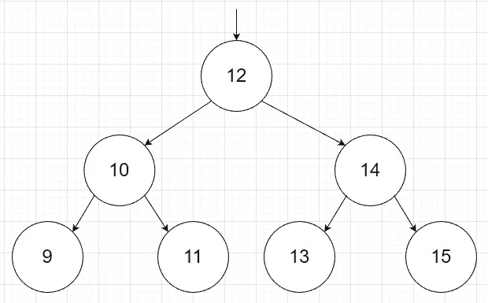

您从 12 开始，因为它是这棵树的根节点。12 是根节点，因此您将转到左侧节点 10。

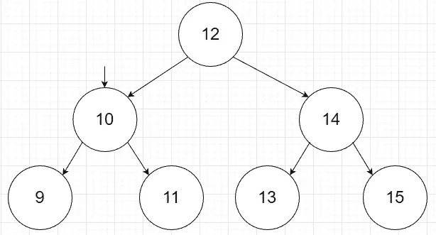

两个孩子，所以你将继续遍历到左边的孩子。

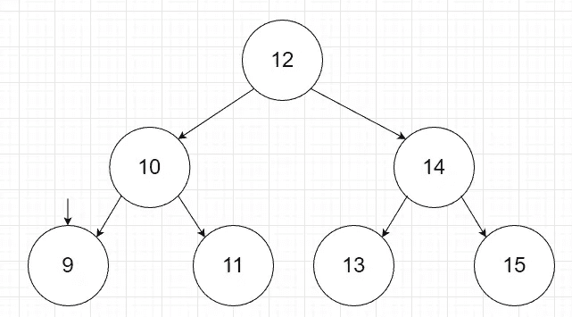

9 没有孩子，所以它将是第一个打印的数字。然后你会回到 10。

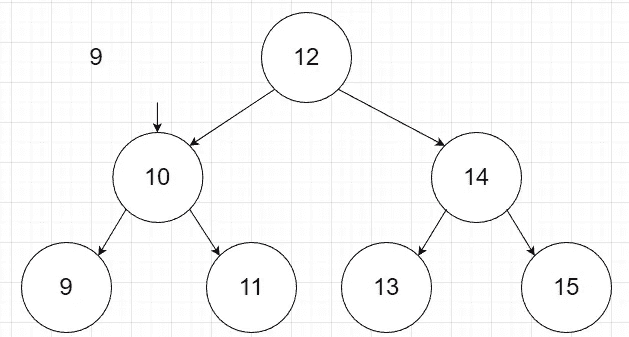

现在我们将打印 10，因为它是 9 和 11 节点的父节点。然后你会去 11。

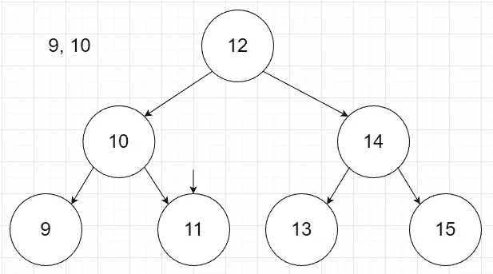

11 没有子节点，是 10 的正确节点，因此接下来将打印它。现在回到 12，因为 12 左边的所有节点都被打印出来了。

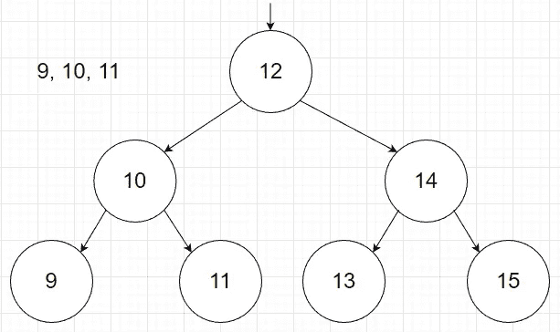

现在，您将打印根节点 12，并遍历到右边的节点 14。

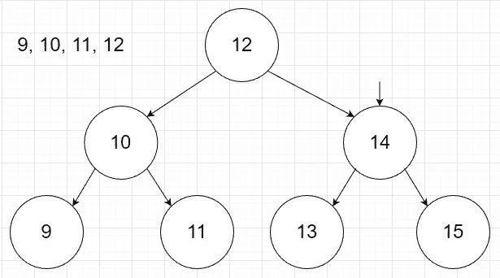

14 有两个孩子，所以你会向左走到 13。

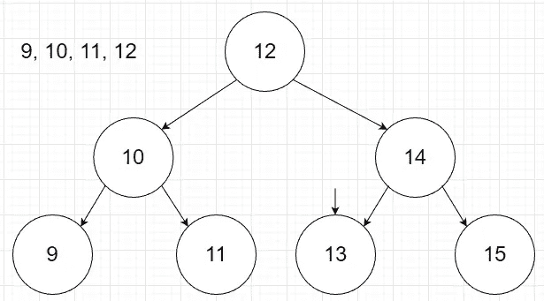

13 没有孩子，因此将被打印。然后你会回到 14 层。

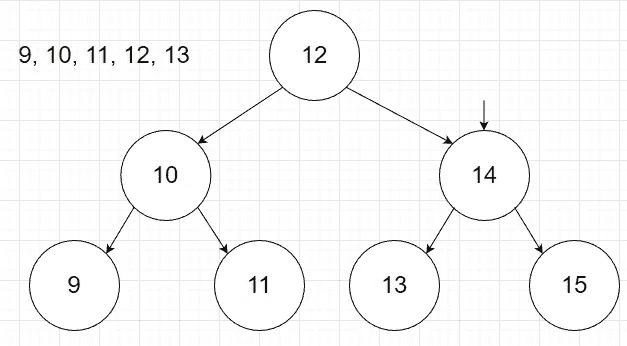

现在您将打印 14，因为它是 13 的父级。然后你会直接到 15。

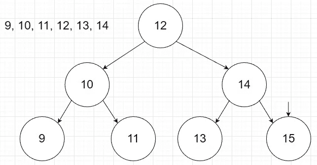

15 没有子级，因此您将打印 15。这是最后一步，因为所有节点都已打印。

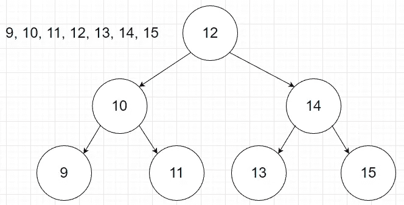

下一种类型的遍历是**前序遍历**。前序是根-左-右的顺序。步骤与 inorder 类似，只是您将首先打印根，然后是左边，最后是右边。对于前面的树，前序树遍历的输出将是 12，10，9，11，14，13，15。

最后一种是**后序遍历**。后序是左-右-根的顺序。您将打印左边的节点，然后是右边的节点，最后是根节点。对于前面的树，后序树遍历的输出将是 9，11，10，13，15，14，12。

**广度优先搜索**

广度优先搜索是一种遍历方法，它使用一个队列来存储当前级别上所有节点的值，然后再向下搜索一个级别。

例子

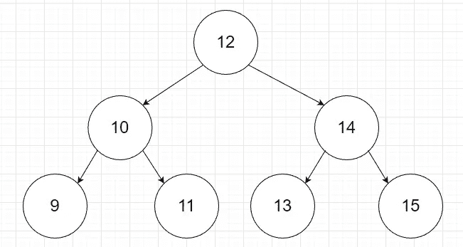

从根开始，我们向队列中添加 12。

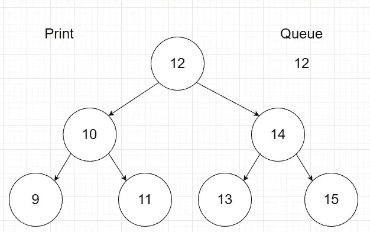

现在您将打印 12 并移动到 12 的子节点。您将在队列中添加 10 和 14。

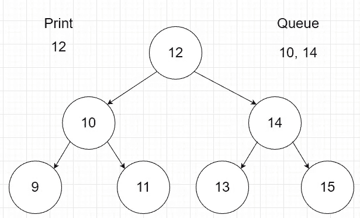

现在打印 10，并将 10 的所有孩子添加到队列中。

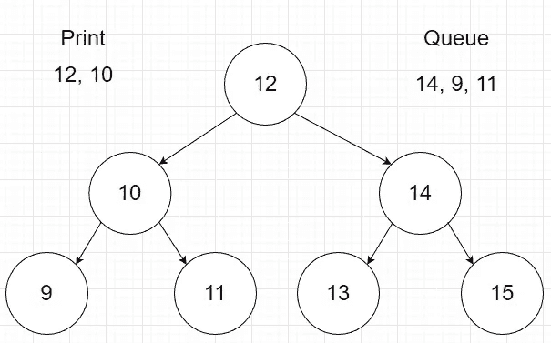

现在我们打印 14，并将 14 的孩子添加到队列中。

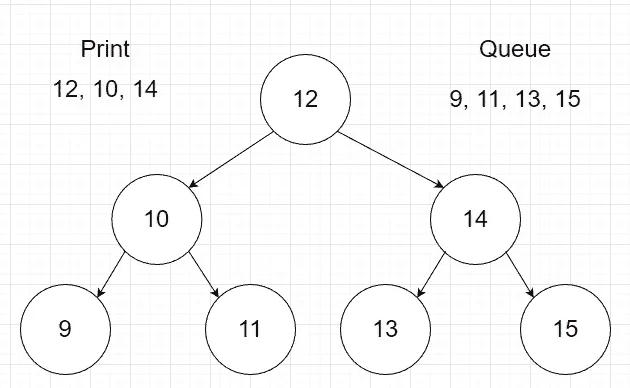

现在，您将继续这种模式，在队列的顶部打印数字，并将它的孩子添加到队列的后面。在这种情况下，没有更多的子节点，所以您将打印队列，直到它为空。当队列是空的并且没有更多的孩子时，你知道你完成了。

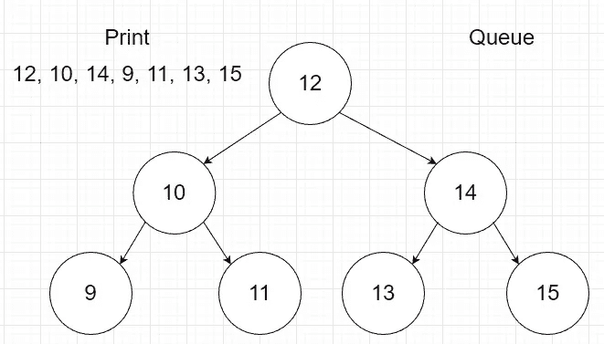