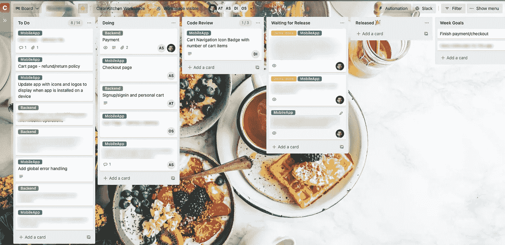

# 为什么 Trello 是完美的任务管理工具

> 原文：<https://medium.com/nerd-for-tech/trello-the-perfect-task-management-tool-4920262134f1?source=collection_archive---------6----------------------->

Clean Kitchen 团队任务板示例

大约四个月前，我们决定使用 Trello 作为我们团队在 [Clean Kitchen](http://cleankitchen.ee) 的任务管理工具。到目前为止，使用它的体验真的很棒。

过去，我使用过不同种类的问题跟踪解决方案。我仍然相信，对于一个协同定位的团队来说，很难打破物理墙和粘性。现实世界的[信息辐射器](https://www.agilealliance.org/glossary/information-radiators)有一些东西是任何虚拟工具都很难模仿的。不幸的是，如今协同定位非常罕见，我不希望遇到太多。也就是说，我认为特雷罗已经尽可能地接近了物理任务墙的感觉。

**吉拉怎么样？**

在过去的 15 年左右，我主要使用吉拉。似乎吉拉已经成为这段时间任务跟踪工具的默认选择。事实上，它的 UX 比大多数企业工具都要好。还有，它有很多特点。这意味着它很可能拥有你能想到的任何功能。此外，由于它的可配置性，当您有许多不同工作实践的团队时，它是一个安全的选择。

这也是大约 7 年前我们决定在 Wise(当时名为 TransferWise)使用吉拉的原因。没有人真正喜欢它。但这似乎是一个不错的选择，而且它有望很好地适应我们不断增长的组织。

不幸的是，无尽的灵活性和错综复杂的功能也是我对吉拉最大的问题。

**吉拉——管理复杂工作流程的复杂工具**

当然，在某些环境下，人们可能需要所有这些电动工具。然而，我怀疑一个需要 20 个领域来定义一项任务的组织的生产率是否很高。

吉拉有所有这些功能来帮助管理大量积压的数百项任务。不管这个工具有多强大，如果我的待办事项清单上有数百个项目，那么很可能我永远也不会完成其中的大部分。花时间过滤或组织所有的库存是一种浪费。

**Trello——管理轻量级工作流程的简单工具**

像 Trello 这样的简单工具不适合长任务列表。这是一件好事。我希望 backlog 只包含团队计划在本周完成的工作，以及他们接下来要做的要点。其他一切都应该被视为一个潜在的想法。点击阅读更多关于这种方法的信息[。](/transferwise-engineering/how-to-keep-team-backlog-short-32d448956433)

据我所知，特雷罗的哲学是:

> “在没有任何干扰的愉快体验中管理您的任务”

Trello 让任务变得非常简单。在看板板上添加或重新定义列轻而易举。当然，这在吉拉是可能的，但这需要付出更多努力，除非我是吉拉政府专家。

**充满创意和乐趣的在线工作空间**

蛋糕上额外的樱桃是定制背景图片的能力。这可能看起来像铃铛和哨子。然而，对我来说这等于用海报和团队照片装饰你团队的办公空间。这是建立有趣和鼓舞人心的工作环境的重要组成部分。鉴于远程工作已成为常态，在虚拟环境中模拟这一点尤为重要。

**当组织变大时会怎样？**

我们目前在 Clean Kitchen 只有一个产品团队。当我们的组织变得更大时，Trello 还适合吗？我想是的。当每个团队都很小并且只有一个焦点时，就不需要更复杂的开发过程工具了。即使在一个更大的组织中，也很难理解为什么拥有一长串任务和复杂的工作描述方式会有什么好处。