# 十年来负载测试 Amazon.com 的考验和磨难

> 原文：<https://medium.com/nerd-for-tech/trials-and-tribulations-of-load-testing-amazon-com-for-a-decade-144f81daaad?source=collection_archive---------2----------------------->

## 我如何学会思考大规模的灾难性失败(第一部分)

在感恩节，大多数美国人和家人一起吃大量的火鸡，在车上打一会儿盹，最终醒来并开始购物。在过去，疯狂的购物者为了在沃尔玛花 19.99 美元买一台 DVD 机，会互相绊倒致死。现在，数百万人同时涌入 Amazon.com，寻找黑色星期五或网络星期一的优惠。

当我在亚马逊工作时，对我来说，那是 ***表演时间*** 。你可以猜到亚马逊有时会每分钟赚一百万美元。这些是*高价值*和*高风险分钟:*你正在把你的系统带到一个前所未有的负荷。最基本的挑战是:*如果有一天你的系统接收到其他任何一天的 x00%的数据量，你如何确保系统能够继续运行？*

我有幸负责 Amazon.com 数百万美元的操作问题(并活着讲述了这个故事！).这让我开始做负载测试，最终[创建并发展成为负载和性能测试平台，成千上万的亚马逊服务使用这个平台](https://carloarg02.medium.com/how-i-grew-an-engineering-productivity-tool-to-impact-thousands-of-engineers-at-amazon-and-how-28a990091207)。

在我从事这项工作的十年中，我为这个平台写了数千行代码；花了数百个小时在世界各地的几十个亚马逊工程办公室讲授负载测试课程，并回答了无数的客户问题。

我想花点时间来阐述一下我在这一路上学到的一些经验。把这当作负载测试 101(我最终会写第 2 部分来介绍更高级的东西，但是让我们先介绍一下基础知识！)

# 每秒事务数与并发连接数

有两种量化负载方式:*每秒事务数*(“TPS”)或*并发连接数*(“CC”)，也称为并发用户*。*

*假设你想测试一个 10 TPS 的系统。这意味着您的测试需要每 1/10 秒或 100 毫秒启动一个新事务。如果您的 RPC 调用需要 60-90 毫秒，那么生活是美好的，在任何给定的时间，您都只有一个连接对被测服务开放(“SUT”)。*

**

*但是如果你的交易超过 100 毫秒会怎么样呢？测试必须每隔 100 毫秒启动一个新的事务，所以在一段时间内，您将有两个 cc，一个用于事务#1 完成，一个用于事务#2 开始。*

*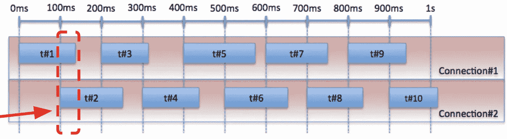*

*这让您顿悟到，如果您控制 TPS，cc 的数量将取决于这些事务的延迟，反之亦然。*

*假设您现在想在 4 CCs 下测试系统。从逻辑上讲，考虑 4 个线程，每个线程在旧事务完成后立即开始一个新事务。*

*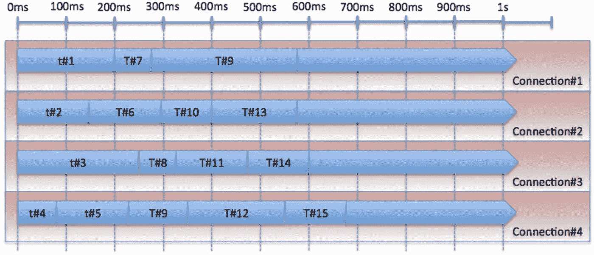*

# *利特尔定律*

*负载测试时发生的很多事情可以用 ***排队论来建模。*** 我在上一节中暗示的 TPS 和 CCs 之间的关系通过[利特尔法则](https://en.wikipedia.org/wiki/Little%27s_law)更精确地阐述:*

> *吞吐量 x 延迟=容量。*

*这里打个比方。你走进一家星巴克。 ***容量*** 是能同时制作饮品的咖啡师数量(你的 CCs)。**吞吐量**是排队的人拿到饮料的速度(你的 TPS)。并且**延迟**是为顾客制作一杯饮料需要多长时间(RPC 调用需要多长时间)。*

**

*利特尔定律给出了理解毁灭场景的蓝图。例如，假设您的负载平衡器可以服务 100 个连接。利特尔定律说:*

*   *如果你的延迟是 0.04s，你可以服务 2500 TPS。*
*   *如果你的延迟是 0.1s，你可以服务 1000 TPS。*

*但是如果你收到一个 2500 TPS 的负载，你的延迟从 0.04s 增加到 0.1s，会发生什么？您将需要 250 个连接来服务该流量，而您只有 100 个。你的系统根本无法承受那样的流量。*

*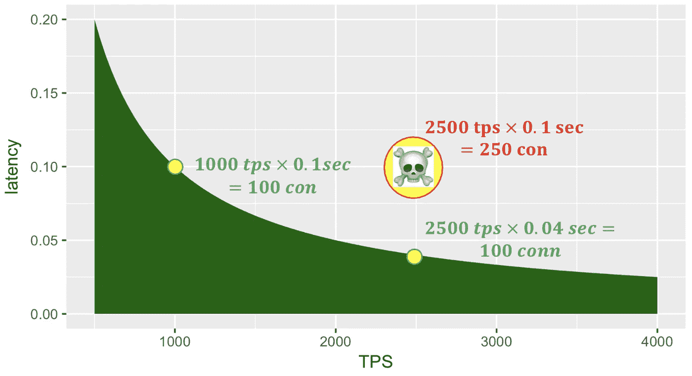*

# ***分期还是生产？***

*在分段(测试)环境中进行负载测试的好处是，您可以安全地将 SUT 带到它的临界点。它能优雅地处理负载吗？它会自动恢复吗？这对于不允许增加依赖项负载的情况也很有帮助:您可以创建模拟依赖项的封闭或半封闭环境。你可以用你的模拟来模拟有趣的失败场景:如果依赖关系 X 关闭了会发生什么？如果依赖 Y 的响应慢了 2 倍，会发生什么？*

*但是**生产中的负载测试**是一个非常有效的工具。这伴随着高风险，因为你可以影响真正的客户。但是，它提供了真实世界的配置、真实世界的规模和真实世界的数据。我看到了很多这样的情况，即登台环境缺乏产品保真度，这给了工程师一种虚假的安全感。有些瓶颈只出现在生产规模上。*

*另一个权衡:如果您有一个可重复的、安全的测试，您可以将它作为您的 [CI/CD](https://en.wikipedia.org/wiki/CI/CD) 流程的一部分，针对每一个变更来运行。生产测试通常是你在高峰前做的一次性事情，涉及到协调和测试期间许多人带着寻呼机(向[网飞的*持续*生产测试](https://launchdarkly.com/blog/testing-in-production-the-netflix-way/)致敬！)*

*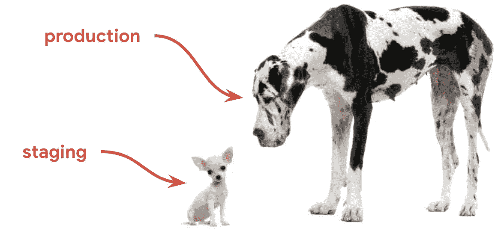*

# ***组件测试与端到端测试***

*通常，您有一个由许多组件(服务)组成的生态系统。孤立地对一个组件进行负载测试是非常好的，因为它非常有针对性(它允许你在一个更小的范围内进行推理)，并且它将风险本地化(也是更小的爆炸半径)。但是您错过了一些更有趣的组件交互，这通常是高负载时失败的地方。生产与登台的许多问题也适用:模仿生态系统的其余部分可能代价高昂，并且这些模仿可能不会像生产中的真实服务那样运行(保真度)。端到端负载测试有着完全相反的优点和缺点。*

*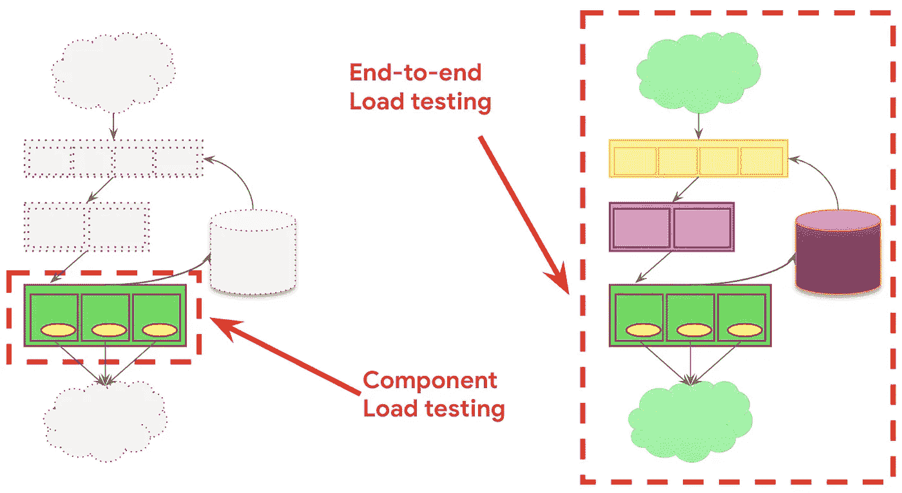*

# ***用什么数据？***

*要加载测试，您需要数据。大量数据。您可以从预先存在的流量中重放，也可以合成流量。我两样都做过。重播旧流量有一些缺点。例如，流量可能包含机密的客户信息。或者您可能正在重放非幂等事务，即改变系统状态的事务。如果您重放一个向客户信用卡收费的交易，会发生什么情况？希望你在现实生活中不要再向那个顾客收费了！通过数据重放，您可以获得生产保真度，但您无法模拟理论流量模式。*

*另一方面，当您根据规则生成合成流量时，您可能会扭曲对数据模式的假设。回到我的星巴克的例子，一些饮料比其他饮料需要更长的时间来制作，并使用更多的系统资源(例如:卡布奇诺与浓缩咖啡)。假设您运行了一个负载测试，模拟每一个订购浓缩咖啡的客户，并证明星巴克每分钟可以处理 10 个订单。但在现实生活中，有一天每个顾客都点了卡布奇诺，而这要花 3 倍的时间来制作。不对不对！花足够的时间了解流量模式，以及你的客户如何使用你的产品，这样你就可以测试你的客户行为。*

# *你的高度是多少？*

*商用飞机在 3 万英尺的高空飞行。当他们着陆时，他们对世界的看法随着接近地面而改变。从不同的高度观察系统会让你感觉到哪里可能会出问题。您需要有能力从全局着眼，看到可能脆弱的连接点(您的 30k 视图)，对某个组件进行推理(您的 10k 视图)，并深入到源代码，了解一行代码是如何产生巨大影响的(您的基本视图)。这些视图中的每一个都揭示了您的负载测试所关注的不同方面。不要只停留在一个高度！*

**

# *编写可伸缩的测试代码*

*这些年来，随着我在负载和性能平台上的成长，我处理了来自公司不同部门的随机工程师的大量 oncall 请求。这种情况经常发生:*

*   *一个工程师会写一些测试代码，由于这样或那样的原因，这些代码不能很好地伸缩*
*   *他们试图在我们的平台上运行它，因为平台执行的代码写得很差，所以它的表现很差。*
*   *工程师们从不责怪他们的代码，他们责怪平台，所以他们申请了支持票*
*   *我，或者我团队的一个成员，会这样回答“嗯，核心引擎已经生产了 5 年，每秒运行数千万次，我们认为这是你的代码”*
*   *他们永远不会相信我们(工程师很固执)*
*   *我必须深入研究他们的代码，指出他们做过的蠢事*

*最终，我拿出了我最喜欢的客户投诉的例子，并把它们结合在一起设计了一个例子，只是为了教育的目的。我们来看看。这段(假的)Java 代码不是我见过的最漂亮的，但是它确实*工作*:它下载一个 url。它也是相当过时的 Java，但是请原谅我——它仍然是一个有趣的剖析例子。*

*这个简单的代码怎么会在高吞吐量下出错呢？*

*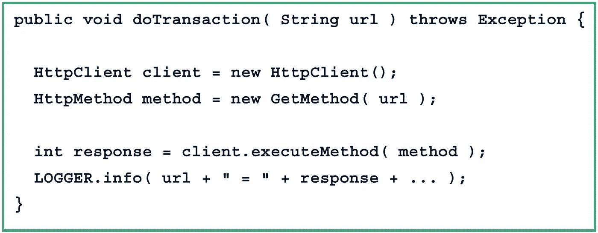*

*我马上想到的一件事是，如果响应不是 200 OK，我们实际上并没有失败… 4xx 或 5xx 错误将被忽略，我们将获得一种错误的安全感，即系统工作正常。验证响应，如果不是预期的就抛出，这样框架就可以跟踪失败并在仪表板中显示它们。*

*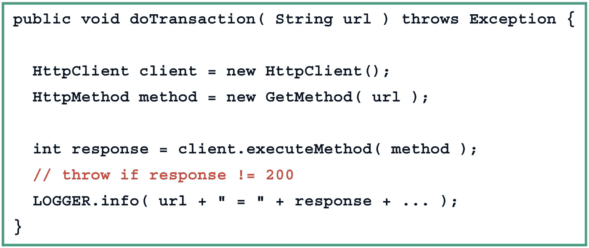*

*好多了。我想到的下一件事是 log4j 语句。如果你运行在数百万的 TPS 上，你真的应该远离输出调试信息*每事务*。这将成为一个瓶颈(特别是当您碰巧将它发送到 stdout 时，但是当您写入慢速磁盘时也是如此)，并且您可能最终会生成数十亿字节的无用日志，这些日志要么被忽略，要么需要通过网络传输到一个集中的位置(因此会与您发送的实际产品负载竞争带宽，并且可能会造成网络瓶颈)。*

*当我评论那一行时，那个日志语句正在连接一个字符串，它有自己的性能问题。一些更现代的编译器在优化字符串连接方面做得更好，但这是一种以高吞吐量聚合的东西。*

*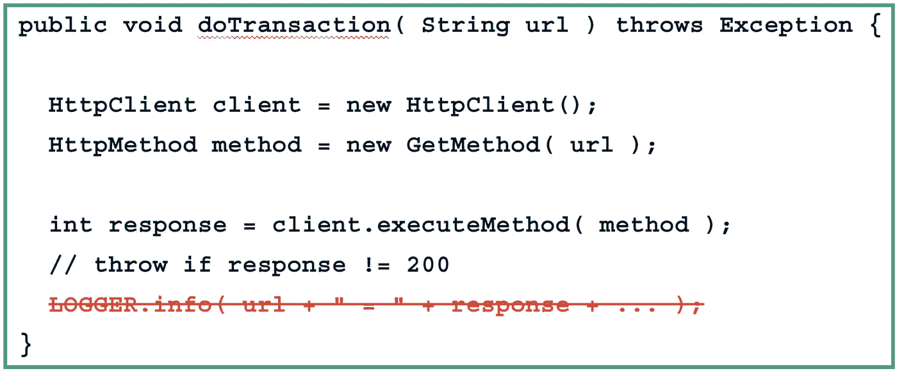*

*好了，现在如果响应不是 200-OK，你的代码抛出，我们移除了不必要的日志瓶颈。你知道我们实际上在泄漏连接吗？我们需要释放他们！*

*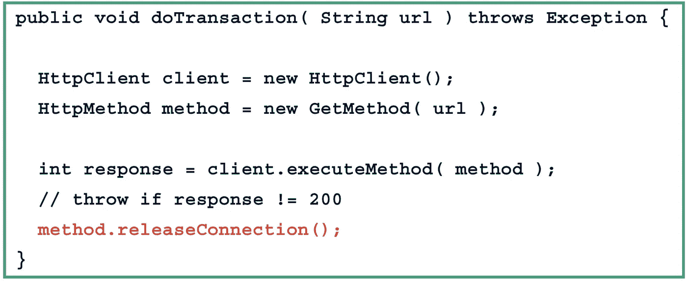*

*但这实际上仍然会泄漏！Try/Finally 永远是你的清理朋友。*

*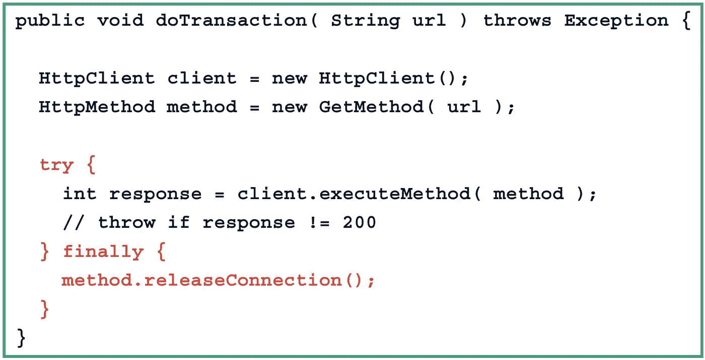*

*更好！但是你知道你实际上需要*消耗*回应体吗？否则你只是在测试*到达第一个字节的时间*，而不是*到达有效载荷最后一个字节的时间*。让我们解决这个问题。*

*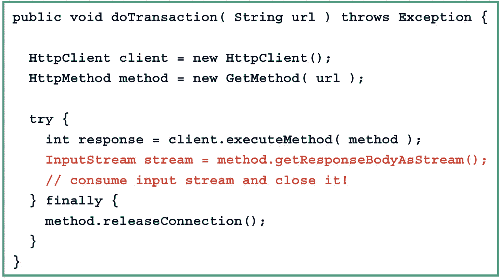*

*越来越好。此时，一位好心的工程师查看了这段代码，并意识到我们正在为每个方法调用创建一个新的 HttpClient 实例。我们将每秒钟打数百万个这样的电话。一般来说，如果您可以避免每个事务的实例化，这对您有好处！让我们创建一个类级别的 HttpClient，而不是函数级别的。我们甚至可以想象一下，使用多线程连接管理器，因为可以从多个线程调用该代码——干得好！*

*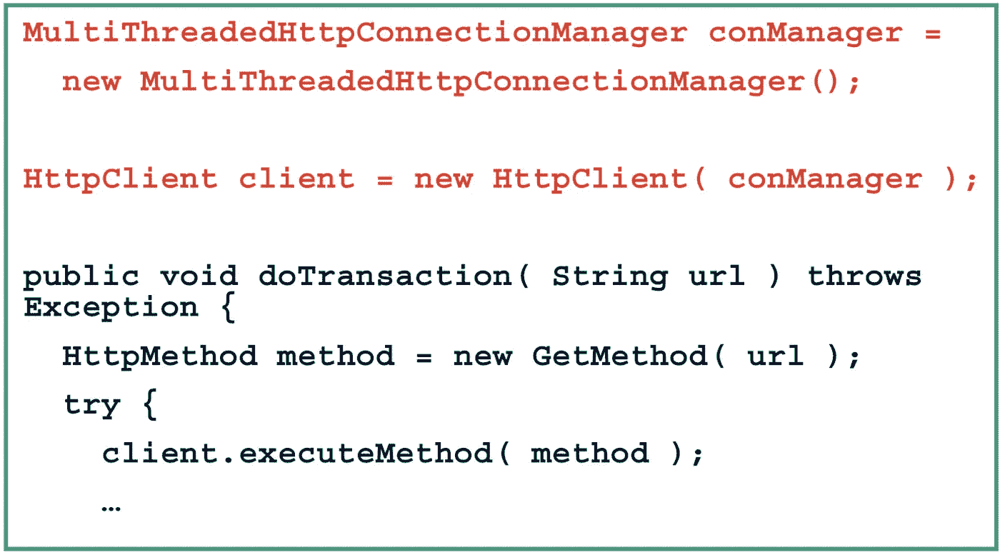*

*但是你会大吃一惊的！默认情况下，HttpClient 配置最多有 20 个并发连接。如果您以高吞吐量运行，您将很快遇到那个限制，事务将开始排队。然后，您会感到困惑，为什么您的负载生成器似乎没有达到您的目标 TPS，尽管机器上的硬件资源似乎没有达到最大限度。这是人为的软件限制！*

*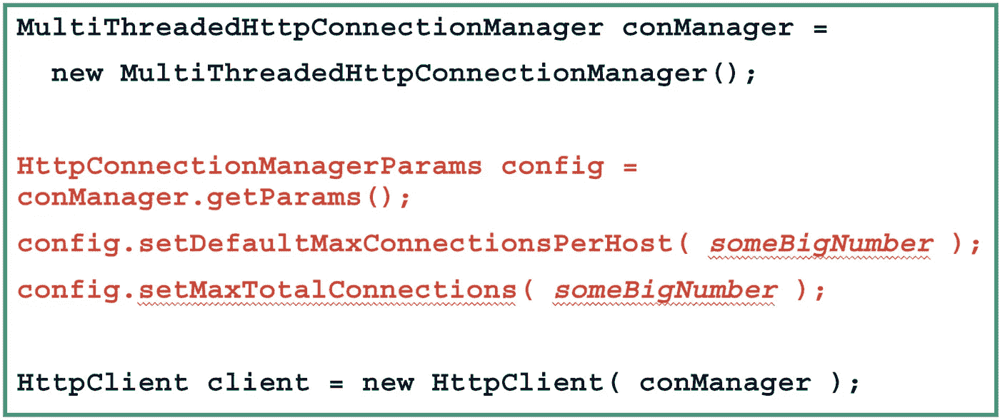*

*到目前为止，您已经开始怀疑有各种各样的配置设置需要仔细考虑。例如，超时是你的朋友。在负载测试中，您希望您的连接像在生产中一样超时。如果不使连接超时，随着负载的增加，测试中的系统越来越慢，越来越多的事务开始无缘无故地占用连接(记住利特尔法则)。*

*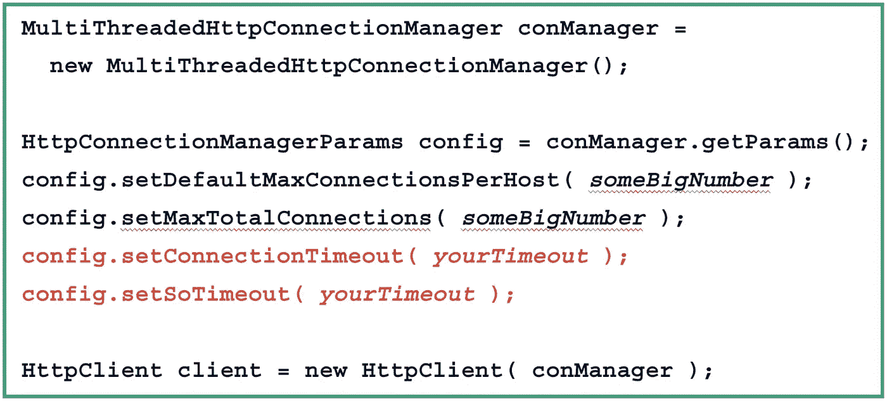*

*这里的要点是，可伸缩的代码很难编写。看起来微不足道的事情(打开一个 http 连接并获得一个 url)有太多地方出错了。这段代码在功能上做了预期的事情，只有在大范围内，您才会注意到它的表现很差。*

# *摘要*

*这里没有放之四海而皆准的答案，而是你需要*做出的一堆**权衡**。当风险很高时，我首先关注组件测试，并找到所有的本地瓶颈。当我转向端到端测试时，我期望发现的唯一问题是组件的交互。我在试运行环境中进行了大量测试，观察了许多失败场景。只有当我觉得不太可能找到问题时，我才转向生产中的测试(并且，我在那里遇到了几个只在大范围内出现的问题)。**

**生活中的一切都归结于风险与收益的计算。**