# 触发完成的过场动画| Unity

> 原文：<https://medium.com/nerd-for-tech/triggering-a-finished-cutscene-unity-42007f1b4ce4?source=collection_archive---------0----------------------->

## 统一指南

## 关于如何在 Unity 中触发和返回已完成的过场动画的快速指南

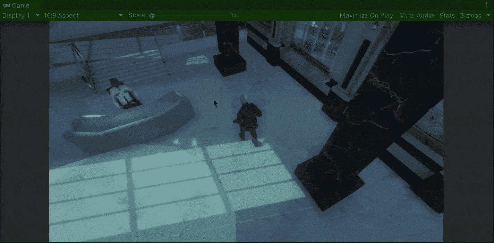

**目标**:在 Unity 游戏中实现一个完成的过场动画。

在上一篇文章中，我介绍了[如何在我们的游戏中用 Unity](/nerd-for-tech/implementing-security-cameras-unity-691fc591b67b) 实现安全摄像头。现在，是时候实现一个系统，在游戏过程中触发一个完成的过场动画，并在 Unity 中返回。

# 过场动画

如果你一直在关注[我最近的帖子](https://fas444.medium.com/)，你会记得我们在下一个帖子中创作的过场动画:

 [## 在 Unity 中合成过场动画

### 关于在 Unity 中构建过场动画的快速指南

medium.com](/nerd-for-tech/composing-a-cutscene-in-unity-330bc8b99d4c) 

好了，过场动画已经完成，相应的动画和激活轨道与 Cinemachine 摄像机同步:

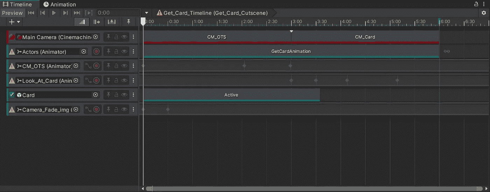

我们的过场动画应该在玩家接近隔壁桌睡着的警卫时触发:

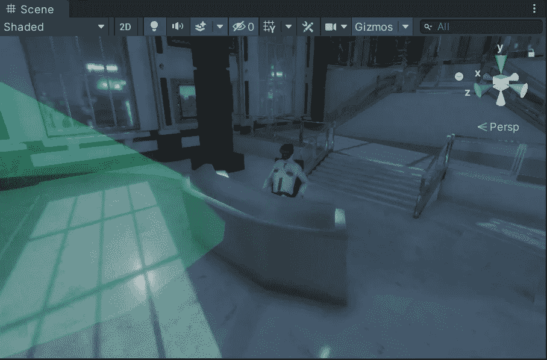

# 触发过场动画

因此，为了触发过场动画，让我们创建一个空的游戏对象，它带有一个可以检测玩家何时进入该区域的碰撞器:

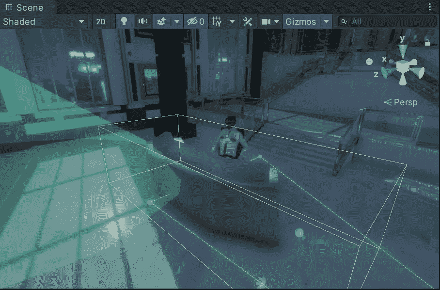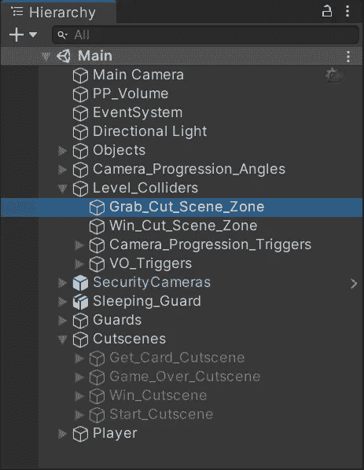

那么，让我们:

*   确保碰撞器的***被触发*** 属性启用。
*   附加一个新的刚体，并确保 ***使用重力*** 属性被禁用。
*   创建并附加一个新的脚本来控制带碰撞器的空游戏对象和玩家之间的触发交互。

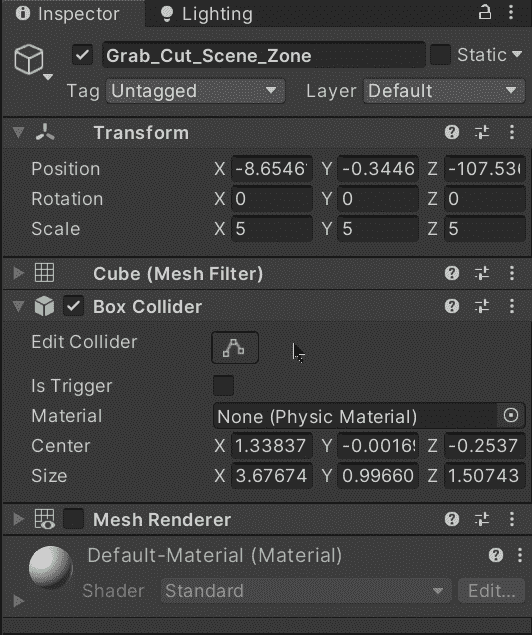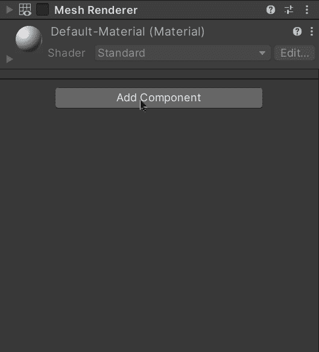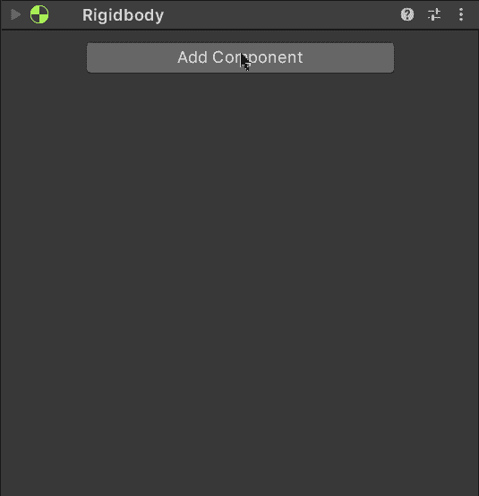

现在，让我们打开新的脚本并创建一个新的私有变量来存储对过场动画游戏对象(包含可播放的 director 组件)的引用。不要忘记使用**【serialize field】**将游戏对象拖到检查器中:

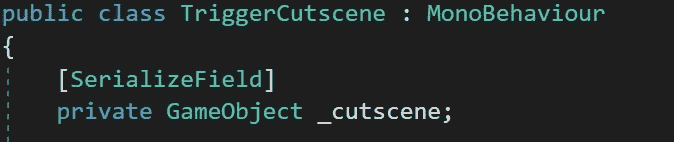

然后，为了检测玩家的碰撞器和空游戏对象之间的碰撞，让我们使用 **OnTriggerEnter** 方法，并使用 **CompareTag** 方法检查来自另一个碰撞器的标签是否属于玩家。如果是这样的话，让我们启用各自的过场动画游戏对象:

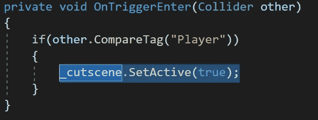

最后，让我们通过检查器将包含过场动画的游戏对象和可播放的导演拖到各自的位置:

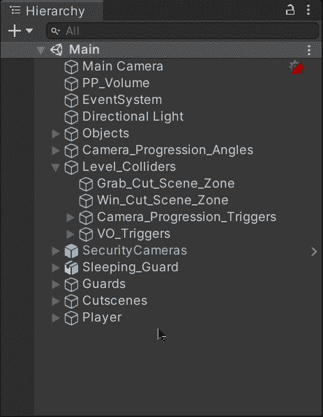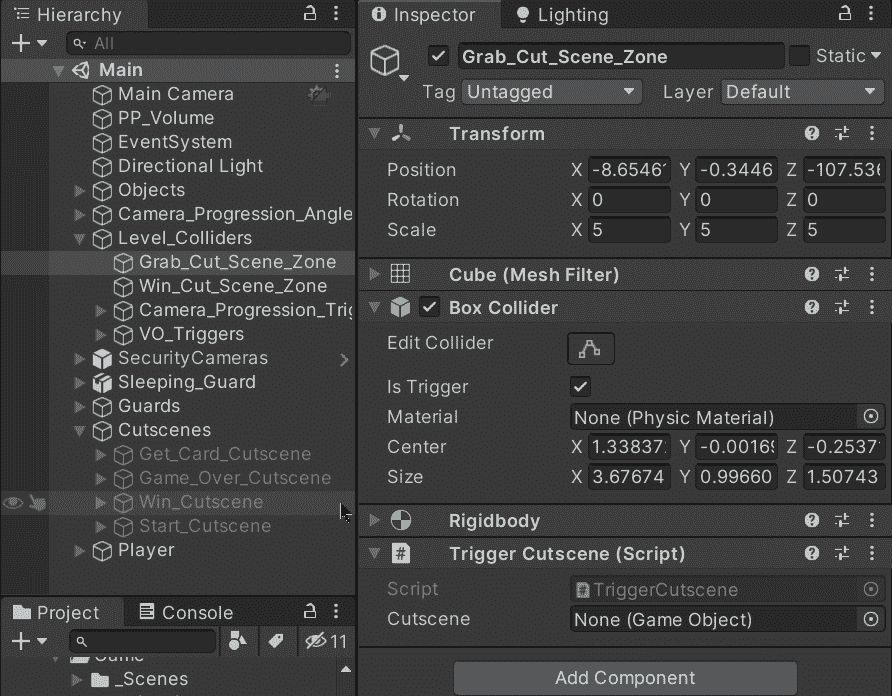

如果我们用 Unity 运行游戏，我们将能够在玩家进入碰撞器定义的区域时触发过场动画。

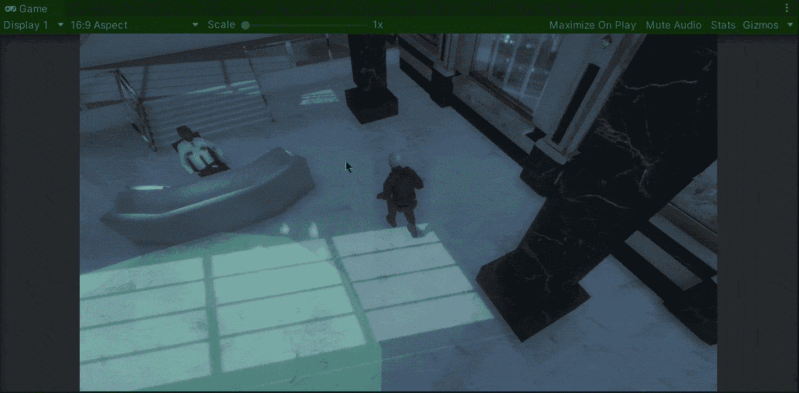

但是还有一个问题，当过场动画结束时，我们仍然在看最后一帧。

# 从过场动画回来

因此，为了在过场动画结束后返回游戏，让我们首先通过将相应的动画和激活轨迹组织到一个跟踪组中来摆脱混乱:

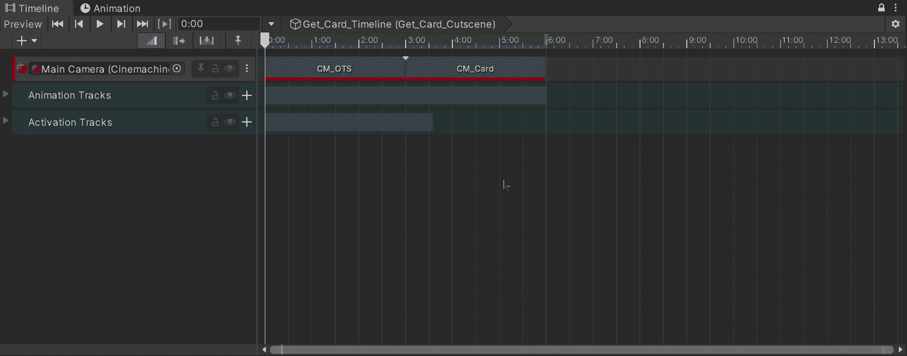

幸运的是，在时间线中有一个选项可以实现我们问题的解决方案:时间线信号。

时间轴信号提供了一种在时间轴和外部系统之间建立通信的方式。当过场动画结束时，我们可以利用时间线信号根据我们的要求做出反应，而不是使用自定义脚本来处理时间线。

因此，要开始使用时间线信号，让我们单击带有标记的按钮来提示时间线标记行。然后，让我们右键单击该行并选择添加一个新的信号发射器。添加后，让我们将信号发射器拖到过场动画的最后一帧(因为过场动画结束时，它将禁用过场动画):

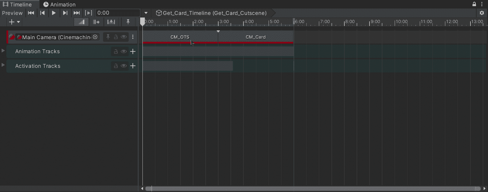

时间轴信号需要三部分才能工作:

*   信号发射器

我们已经在时间线中创建了它，它应该包含对信号资产的引用。

*   信号资产

其将信号发射器和信号接收器相关联，并将作为时间线内的事件工作。

*   信号接收器

它将包含将被链接到信号资产的反应列表。

因此，让我们单击信号发射器，并使用检查器中的“下一步”按钮创建一个新的信号资源:

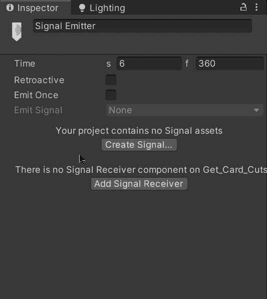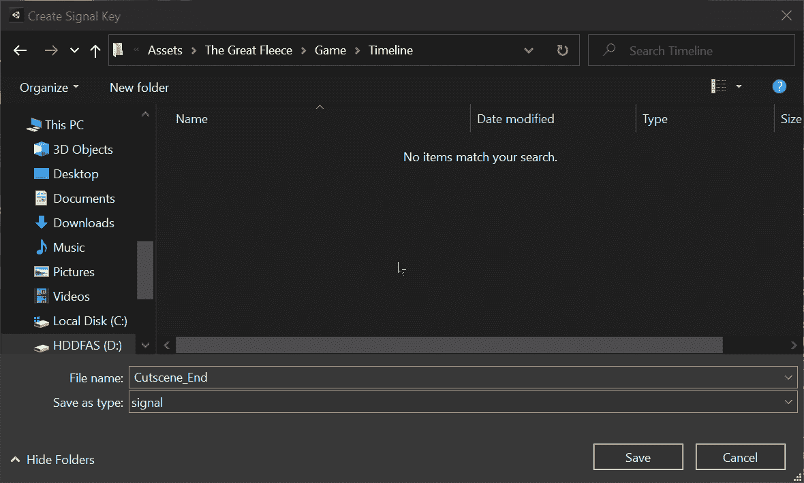

创建信号资产后，让我们使用检查器中的按钮创建相应的信号接收器。信号接收器将在游戏对象中用过场动画导演来创建。

因此，为了在过场动画结束后返回游戏，让我们选择 **SetActive** 方法作为信号接收器的反应，并在信号发出时禁用相应的过场动画游戏对象:

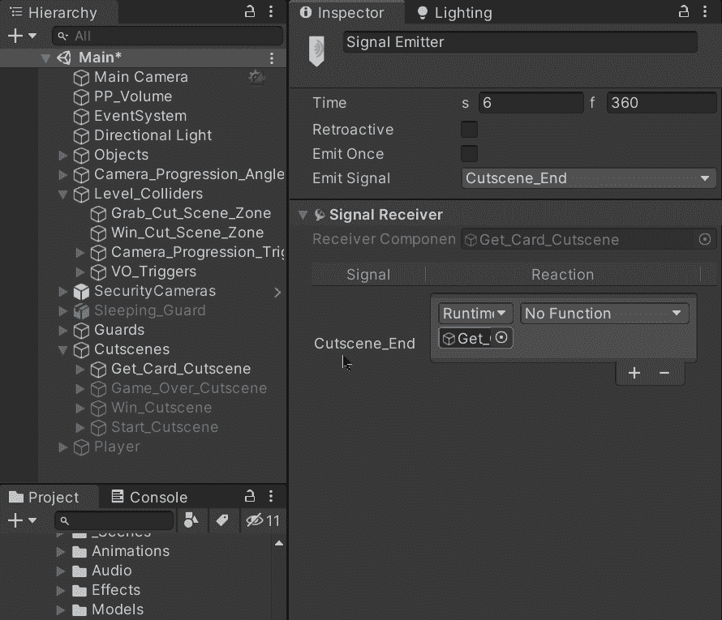

如果我们选择包含过场动画的游戏对象，我们将能够在检查器中看到信号接收器组件:

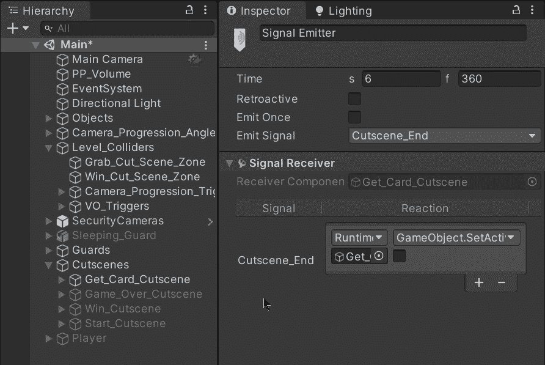

如果您想了解更多关于时间轴信号的信息，您可以访问 Unity 博客:

 [## 如何使用时间轴信号| Unity 博客

### 自 2017 年 Timeline 推出以来，我们知道您一直在耐心地等待一种发送事件的方式。嗯，等等…

blog.unity.com](https://blog.unity.com/technology/how-to-use-timeline-signals) 

现在，如果我们用 Unity 运行游戏并触发过场动画，我们将看到当过场动画结束时，信号被发出，过场动画游戏对象被禁用，我们返回游戏:

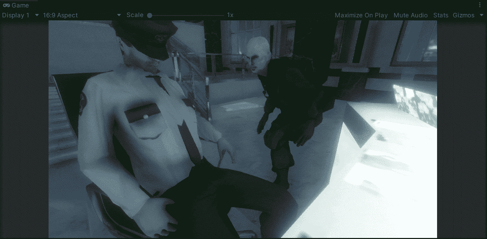

就这样，我们用 Unity 触发并从一个完成的过场动画中返回！:d .下一篇文章再见，我将展示如何用 Unity 创建一个管理器类。

> *如果你想了解我更多，欢迎登陆*[***LinkedIn***](https://www.linkedin.com/in/fas444/)**或访问我的* [***网站***](http://fernandoalcasan.com/) *:D**