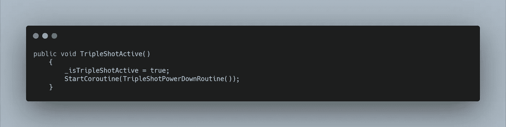
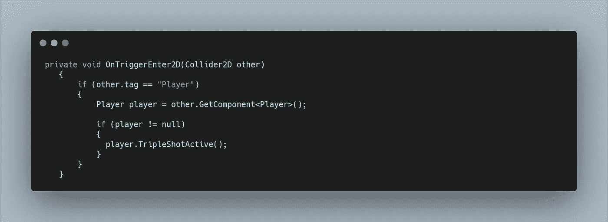
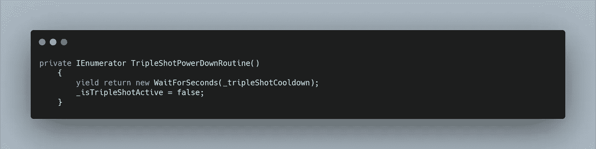
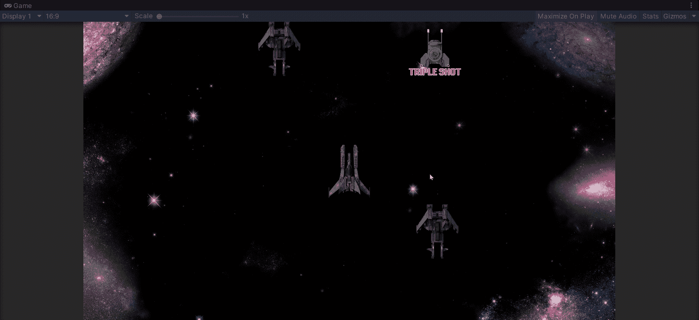

# 三枪！

> 原文：<https://medium.com/nerd-for-tech/triple-shot-e42899b90875?source=collection_archive---------12----------------------->

# 确定开机效果应该持续多长时间

我们有一些简单的**加电**功能，因为我们的动画对象随机产生并在屏幕上向下移动。我们的第一个**加电**被称为**三连发**，巧合的是，它将允许我们同时发射三发。但是当我们收集到**能量时，**我们不想永远有三倍拍摄。我们需要创造另一种冷却方法。在我们运行这个冷却方法之前，我们需要实际创建**三连发。**

为此，我们可以创建一个新的**游戏对象，**使其成为**预设**，并使其包含三个**激光预设对象。**与你的球员一起适当定位。因为我们使用我们的**激光预置**，移动和与敌人的碰撞功能已经就位。

现在我们可以在我们的**玩家脚本**中创建一个**布尔**来检查我们的三重射击是否有效，创建一个**游戏对象** **变量**来存储我们的新预设，然后改变我们的**火激光方法。**

现在我们需要改变我们的行为。当**加电** **与我们的**玩家**碰撞时，我们可以用**脚本通信**来做到这一点。**

为了让我们的**加电**有这个功能，我们需要给它分配一些**物理**。添加一个合适的 **2D 碰撞器**并将其设置为**是触发器**。我们还需要一个 **2D 刚体**(记得将重力比例设置为 0)。

在我们的**加电脚本**中，我们可以使用 **OnTriggerEnter2D** 来检查 **other.tag** 是否等于“Player”。现在我们可以得到**播放器组件**并访问**公共方法**。记住要进行空检查。

我们的**公共方法**在我们的**播放器脚本**中看起来如下:

这将我们的 **bool** 设置为 true，允许我们**实例化**三重镜头预设。然后我们启动一个**协程**作为我们的冷却系统。

在我们看**协程之前，**让我们回到我们的**加电脚本**，当我们与玩家碰撞时调用这个**方法**。

回到我们的**玩家脚本**，我们的**协程**可以调用下面的。

我们可以指定等待的秒数，然后将我们的 **bool** 切换回 false，将我们的**玩家**设置回发射一束激光。但是，确定通电应该持续多长时间需要时间和各种测试。随着更多元素的加入，我们可能会改变这一点。因此，我们可以创建一个私有浮动**来序列化**这样我们就可以在检查器中改变它。****

