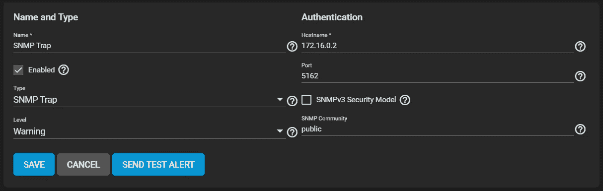

# TrueNAS 定制警报

> 原文：<https://medium.com/nerd-for-tech/truenas-bespoke-alerts-e8f91e3de5c1?source=collection_archive---------12----------------------->

TrueNAS 有几个内置的警报机制，但是我希望能够通过 PushOver 将 NAS 警报推送到我的手机上。为了适应这种情况，我需要滥用一种现有的警报方法来向我的自定义脚本发送警报。

在现有的警报机制中，SNMP 陷阱方法似乎是最容易屈服于我的意志的。我创建了一个名为“Monitoring”的监狱(使用 Basejail)，它将包含我所有的各种监控和实用程序脚本。确保您将此监狱配置为自动启动。在这个监狱里，我安装了 python、pip 和 python 库 pysnmp:

```
# pkg update
# pkg install python3 py37-pip
# pip install pysnmp requests
```

对于起始脚本，我使用了这个很好的例子:[https://bytesofgigabytes . com/SNMP-protocol/python-SNMP-trap-receiver/](https://bytesofgigabytes.com/snmp-protocol/python-snmp-trap-receiver/)

通过修改上面的脚本，我很快就能够将 SNMP 陷阱消息发布到我想要的任何服务。您可以通过本文档(通知部分)了解 MIB 的含义:【https://mibs.observium.org/mib/FREENAS-MIB/

因为我使用了 PushOver，所以我的脚本最终看起来是这样的:

我用“NAT”网络配置了监狱，并记下了 NAT IP。

在 Monitoring jail 中，我创建了一个名为/etc/rc.d/snmpmonitor 的新文件，它将启动上面的监控脚本(适当地更新路径):

现在将下面一行添加到/etc/rc 中:

```
snmpmonitor_enable=YES
```

最后一步是转到 TrueNAS 应用程序->系统->警报服务，然后单击“SNMP 陷阱”上的“编辑”。

现在确保选中“Enabled ”,并且“Hostname”指向您的监控监狱的网络地址。还要更新“端口”以确保准确:



现在点击“保存”。现在，您应该可以通过自定义脚本获得警报。我建议使用“发送测试警报”来确保一切配置正确。