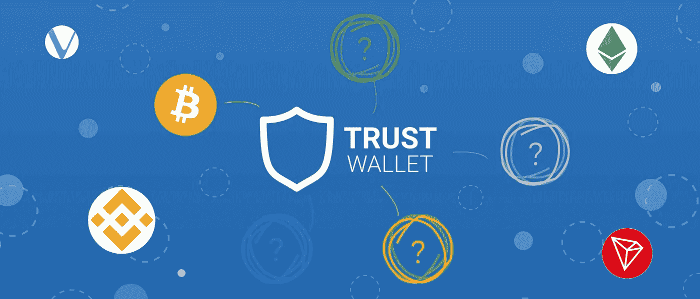
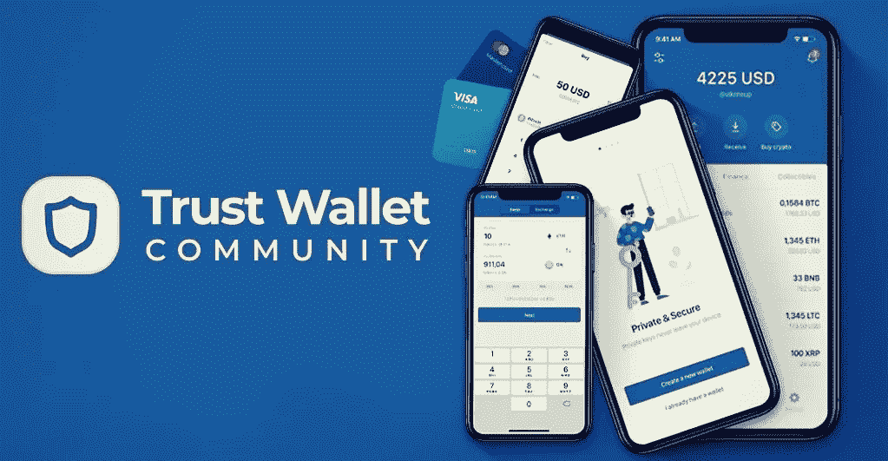
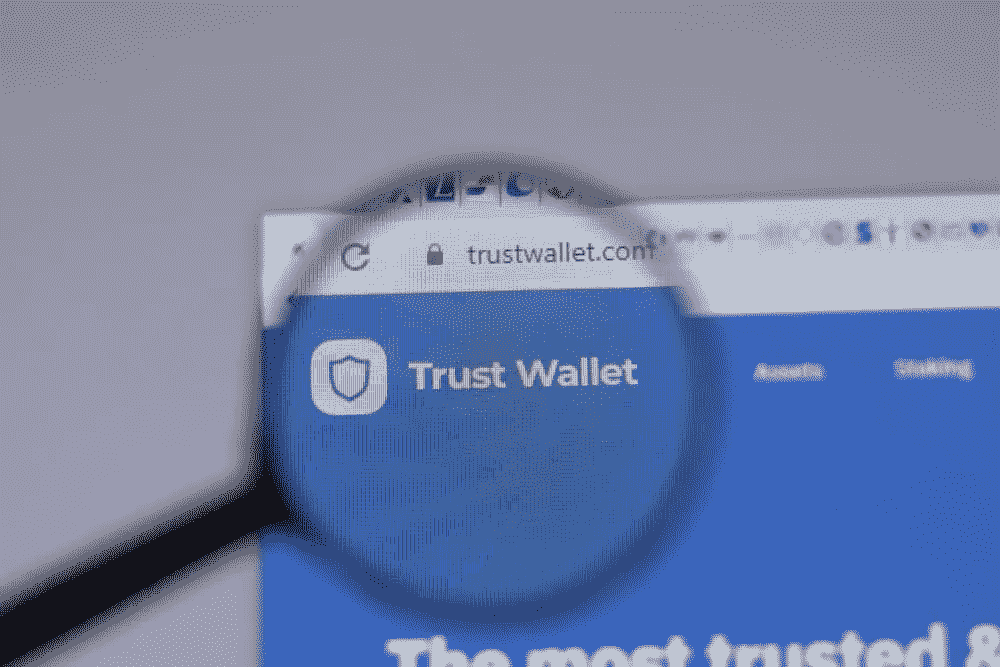

# 信托钱包克隆 App——为什么拥有信托钱包这样的 App 是有益的？

> 原文：<https://medium.com/nerd-for-tech/trust-wallet-clone-app-why-having-an-app-like-trust-wallet-is-beneficial-f9083c67c459?source=collection_archive---------3----------------------->

trust wallet 克隆应用程序是一个开源代码，是其原始版本的复制品，具有所有的特性和功能。该应用程序旨在在移动设备上使用，帮助用户在开源钱包上进行方便的交易，并使他们能够存储超过 20k 个基于以太坊的令牌。克隆应用程序还包含所有重要的安全功能，以保护钱包免受骗子和黑客的攻击。请继续关注我们，向您介绍基本特性和功能以及使用它们的好处。

# 应用程序的功能和规格。

# 透明度

钱包的所有者可以使用与之相关的私钥来获取钱包活动的详细信息。钱包的主人可以通过私钥从另一个账户发送和接收资金。

# 安全性和隐私

该应用程序使用双因素身份验证和其他安全层，因此提供了一个安全的环境。业主也可以设置一个 6 位数的代码恢复阶段，以确保交易者的隐私。

# 支持

钱包克隆应用程序允许用户创建他们的钱包和密码的备份，并随时恢复它。这项功能让钱包用户高枕无忧，并完全控制他们的数字资产。

# 市场概述

Walt 用户可以大致了解各种加密钱包的市场资本总额，并随时方便地计算任何全球加密资本总额。

# 将菲亚特转换为加密

一个 [**信任钱包克隆应用**](https://radindev.com/trust-wallet-clone-app-development/) 与第三方菲亚特加密货币应用很好的集成；所有者可以毫不费力地将他们的法定货币转换成其他加密货币。

# 轻松导入数字资产

克隆应用钱包为用户提供了一个简单的平台来导入他们的关键短语、私钥、地址等数字项目。基于用户网络偏好。

# 推送通知

该功能向钱包所有者发送关于加密存款和取款的即时通知。

# 安全性

这款钱包的克隆应用程序配备了 touch id、密码和备份安装等安全功能。用户还可以使用私钥来保护他们有价值的资产和信息。

# 设置价格预警

它允许钱包所有者为他们喜欢的加密货币如比特币、以太坊、Cardano 等设置价格警报。一旦他们最喜欢的硬币达到特定的设定值，店主就会收到价格提醒。

# 多语言支持

这个功能可以帮助用户翻译任何他们想要的语言，并给他们改变语言的选择。

# DApp 浏览器

使用 DApps 立即与以太坊、ERC20 和 ERC223 令牌进行交易，管理加密货币，如 crypto kitties 等。

如果你正在考虑克隆这个应用和上面提到的功能，你可以要求加密货币钱包开发公司添加一个自动转账机器人。该功能实际上是一个可信的钱包自动转账脚本，允许钱包的所有者自动化最复杂的工作流程，并简化团队内或跨团队协作。

# 使用 wallet 克隆应用程序的好处

-这款钱包包含一个吸引人的用户友好界面

-所有者可以使用私钥和公钥快速、轻松、安全地转移密码或令牌

-几天之内，您就可以轻松克隆一个像 trust wallet 这样的超级加密钱包应用程序脚本。

-您可以根据自己的业务需求，定制自己喜欢的功能、设计、主题和其他附件。

-所有者可以轻松跟踪加密硬币和代币价格。

-这款钱包克隆应用可以安装在 android 和 iOS 设备上。

-用户可以使用信用卡购买加密令牌和硬币。

-这款钱包的克隆应用包含最先进的功能和高端安全结节。因此，网络攻击和欺诈活动的可能性几乎为零。

-这样的钱包 app 帮助你提升品牌身份。

-它拥有出色的用户界面和更快的响应速度。所以，你可以方便地吸引更多的加密用户。

trust wallet clone 应用程序可帮助您实现快速业务增长并提高投资回报率。

-使用这样一款支持多种数字货币的钱包应用，可以摆脱拥有多个钱包的困扰。

# 此钱包支持的密码

钱包应用程序支持多种货币。然而，每个克隆钱包应用程序的加密货币钱包开发公司都支持其中的一些应用程序。例如，RadinDev company 提供的 wallet 应用程序支持这个列表的最后八种货币。

-波尔卡多

-达什

表示“亚原子粒子”: positron

-泰佐斯

宇宙

-卡瓦

永恒之塔

纳米

-币安硬币

-比特币(BTC)

-波纹

以太坊

-卡尔达诺

莱特币

-恒星

- Dogecoin

-系绳

# 如何才能用信托钱包克隆 app 创收？

这个钱包应用程序，像 Metamask wallet clone 一样，是一个高收入的企业，根据你的商业模式，你可以通过 trust wallet clone 应用程序获得高额利润。下面列出了一些从这个加密钱包中赚钱的方法:

# 交易费用

这是所有加密钱包(例如，信任钱包或元掩码钱包)的常见创收策略。在这种商业模式中，钱包应用程序通过对每笔交易收取固定的交易费来提供更多的钱。

# 交换费用

使用这种钱包赚钱的第二种方式是通过交换费用。通过这种方式，钱包管理员对通过平台进行的交易收取交换费。

# DeFi 集成

钱包应用程序管理员可以将加密钱包与多分散的金融应用程序集成在一起。整合后，他们可以从各个平台收取固定的费用。

# 交易费用

钱包管理员可以在订单生效后向交易者收取一定金额的费用，就像限价订单一样。

根据哪种业务模式适合您的业务需求，您可以选择钱包应用程序的创收模式。

# 在交换平台中使用这种钱包克隆的重要性

最有利可图的商业工具之一是建立一个加密货币钱包，最好的解决方案之一是制作一个类似于 [trust wallet](https://trustwallet.com/) 应用程序的加密钱包。这种钱包是加密经济的重要接口之一。钱包的三个关键因素是其安全性、接受加密货币的便利性以及为 Android 和 iOS 平台设计。

# 如何在钱包应用中添加加密货币？循序渐进的指南

1.通过提供所需的详细信息，在 wallet clone 应用程序中创建一个帐户。之后，通过添加您的凭据登录您的钱包。

2.登录后，屏幕上将显示加密货币和不同加密令牌的列表。

3.单击您要添加到钱包应用程序中的加密令牌或硬币。

4.选择加密硬币或代币后，单击接收按钮。

5.该应用程序希望您扫描二维码来接收数字资产。

6.使用加密钱包地址(QR 码)，您可以将加密货币的数量转移到您的钱包中。

7.收到密码后，您可以通过单击交易历史按钮来确认您的交易历史。

# 如何将加密货币从一个信任钱包应用程序发送到另一个应用程序？循序渐进的指南

1.通过输入您的凭据登录到您的加密钱包。

2.登录后，您的钱包会显示您拥有的加密货币列表。因此，选择你想从钱包发送到另一个钱包的加密货币

3.选择加密后，单击屏幕末端的发送按钮。

4.在这一步中，您应该输入接收者的钱包地址，并声明您要发送的密码量。

5.点击“下一步”按钮，查看交易详情和费用。

6.如果一切正常，你可以点击发送按钮。

7.最终，接收者会收到你从钱包里发来的密码。

# 使用 wallet 克隆脚本应用程序

-所有者可以通过输入电子邮件地址、创建密码和输入种子短语，使用常规程序轻松设置他们的钱包。所有者应该保护种子短语的安全。

-电子钱包应用程序采用感知设计，用户可以使用一个地址访问空投、ICO 令牌和以太坊。

-此钱包为其用户提供统一的钱包地址，以便他们可以从钱包内的集成令牌列表中添加他们喜欢的令牌列表。

-使用 trust wallet DApp 浏览器访问 DApps 非常方便，即使是加密领域的新手也可以轻松使用它。

-钱包用户可以通过这个钱包访问顶级加密货币，而不是使用多个钱包。像 ICON，POA network，TRON，VeChain，TomoChain，GoChain 和 Wanchain 区块链这样的顶级硬币就是其中的一些。

# 为什么你需要一个像信任钱包一样的加密钱包？

加密钱包为其所有者提供了很大程度的可访问性。它们易于使用，便于加密货币交易。这种钱包的一个突出特点是它们的自主性，以交换和互换的形式提供两种选择。这个钱包是一个著名的和安全的加密钱包应用程序脚本来存储和接收虚拟资产。它在币安加密交易所的控制之下，这就是为什么许多交易者更喜欢这个钱包应用程序。这个钱包也因加密领域的测试程序而闻名。因此，当您创建信任钱包克隆应用程序时，您可以告诉提供商公司集成“测试版”测试程序，以预先测试其特性和功能。你雇佣来克隆钱包应用程序(或克隆比特币钱包，像其他类型的加密钱包一样)的开发团队可以用它来制作钱包和去中心化应用程序，而不用担心低级的颁布细节。克隆这种钱包的另一个原因是，它旨在兼容 iOS 和 android 平台。因此，使用它你可以在世界范围内抓住更多的加密用户，并通过他们获得更多的钱。

由于上述原因，超过 500 万的加密用户，包括创业公司和商业巨头，现在都在利用这个钱包应用程序进行加密交易。这些统计数据表明，这种钱包在加密领域非常突出，这也是为什么许多企业希望通过克隆 trust wallet 应用程序来开发他们的钱包。

在克隆钱包应用程序之前，信任钱包源代码是您应该知道的最后一件事。更准确地说，trust wallet 克隆版 GitHub 是获得其免费代码的一个来源。然而，尽管成本较低，但它不太可靠，因为它可能容易受到黑客攻击。这意味着 GitHub 上的这个钱包克隆可能不是你完美的开发方式。