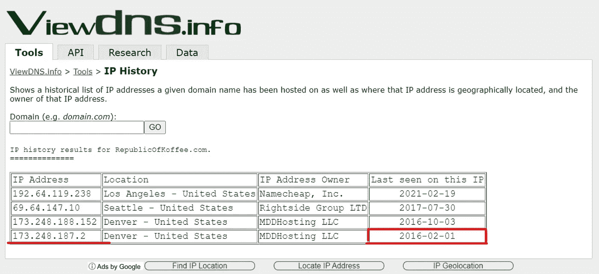
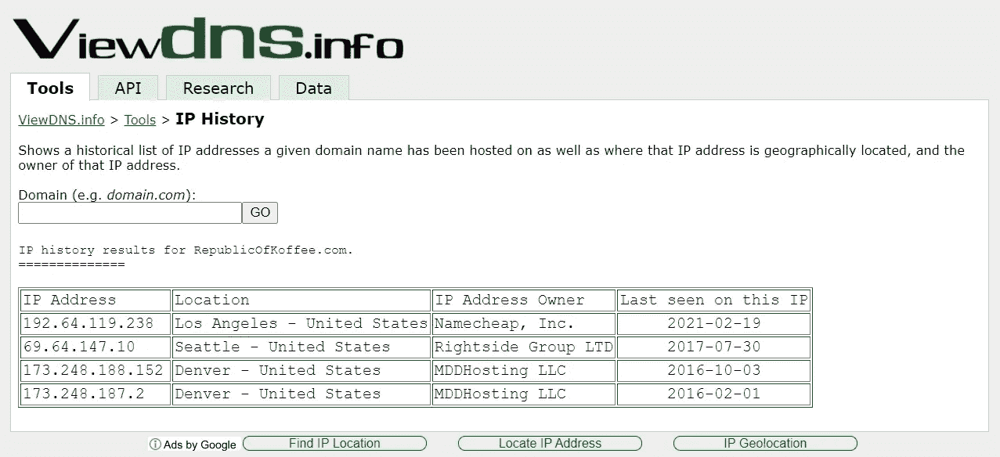
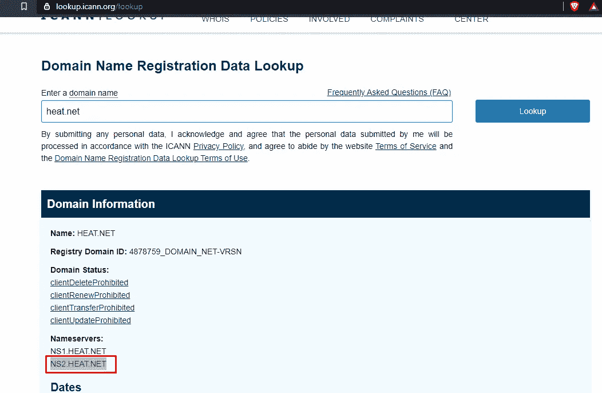
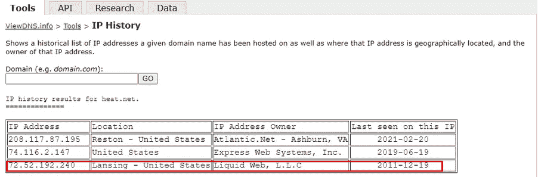
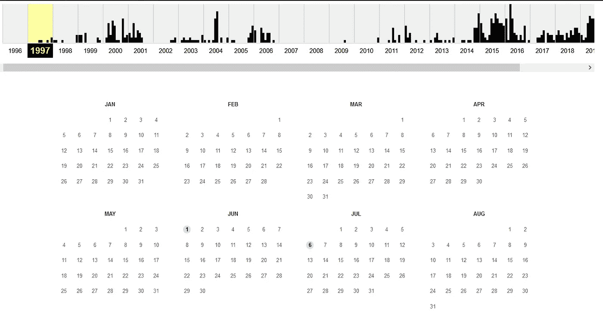
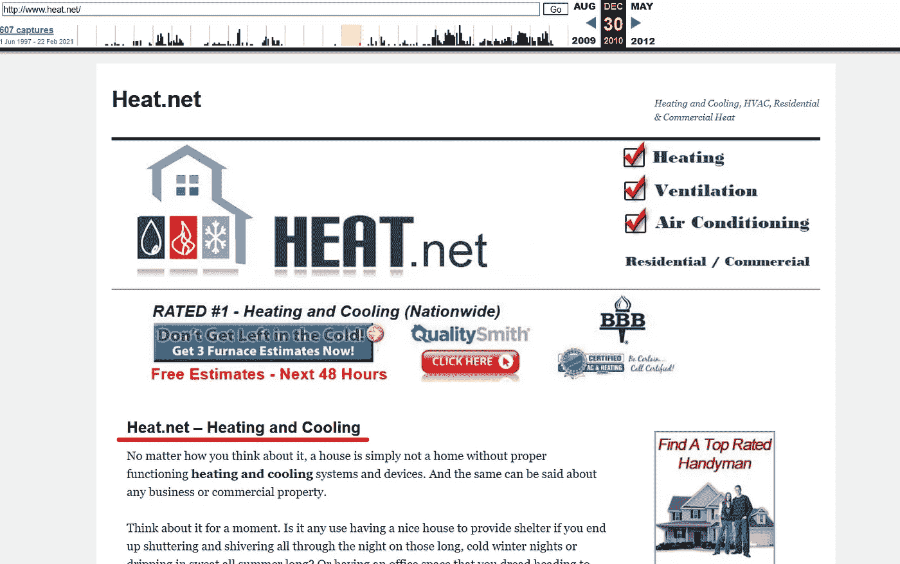
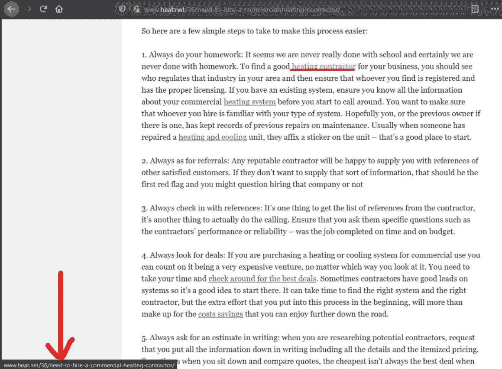
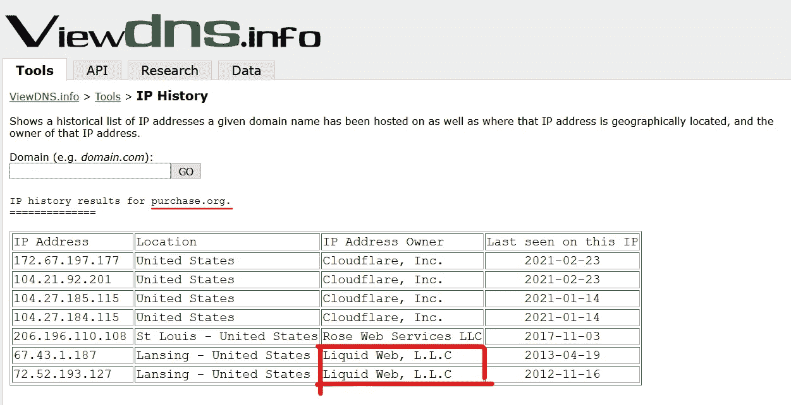

# TryHackMe: WebOSINT

> 原文：<https://medium.com/nerd-for-tech/tryhackme-webosint-2efa4032dec3?source=collection_archive---------1----------------------->

在网站上进行基本的开源情报研究

您可以通过此链接进入房间:[https://tryhackme.com/room/webosint](https://tryhackme.com/room/webosint)

> T **提问 1:当一个网站不存在的时候**

当你得到一个要检查的企业名称时，你做的第一件事是什么？打开网络浏览器，找到网站并查看，对吗？

如果网站，甚至整个企业都不复存在了呢？

这并不意味着这是路的尽头。

OSINT 的研究人员可能仍然能够将这些点联系起来，找到关于这些组织的有用信息。

你的工作是尽可能多地找到关于 RepublicofKoffee.com 网站的信息。

<spoiler alert="">这个网站并不存在，如果在你读到这封信的时候它存在，那么这个网站目前的形式不是我们的目标。</spoiler>

收集网站信息而不直接访问它的一种方法是简单地搜索它。

**注意:**有时候把一个网站插到搜索栏会直接把你送到那个网站。为了避免这种情况，请将网站用引号括起来。还要注意的是，这只会返回网站上写有完整域名的结果。

继续用谷歌搜索“RepublicOfKoffee.com ”,不管有没有引号，看看会发生什么。

1.  **点击完成** 无需回答

> ***任务 2 : Whois 注册***

谁是[网站，](https://lookup.icann.org/lookup)1)**【lookup.icann.org】。2) [Whois 数据](https://www.whois.com/)**

**这应该告诉你当前使用的托管公司和名称服务器。查看原始数据选项将显示进一步的详细信息。**

****

1.  **域名注册公司的名称是什么？答案:廉价公司**
2.  ****登记公司的电话号码是多少？(不包括国家代码或特殊字符/空格)** Ans : 6613102107**
3.  ****该站点列出的第一个名称服务器是什么？** Ans : DNS1。注册服务器。计算机输出缩微胶片**
4.  ****登记人的姓名是什么？** 答:为保护隐私而编辑**
5.  ****注册人在哪个国家注册？** 巴拿马**

> *****任务三:网站过去的幽灵*****

1.  **博客作者的名字是什么？
    答:史蒂夫**
2.  **作者来自哪个城市和国家？
    Ans:韩国光州**
3.  ****【研究】作者经常去的国家公园内的寺庙叫什么名字(英文)？
    Ans:韩国光州****

> *****任务四:挖掘 DNS*****

**到目前为止，我们已经收集了一些关于目标网站内容的有用信息，尽管它已经有几年没有上线了。**

**但是技术细节呢？**

**这就是 ViewDNS.info 的用武之地。**

**ViewDNS.info 为在目标网站上查找注册信息提供了一个方便的 UI。使用这些信息，可能会得出某些没有明确说明的结论，例如网站是托管在共享的还是专用的 IP 地址上。这个问题的答案暗示了网站的预算和流量。**

**看看可用的搜索选项，看看你能否回答这些问题。**

1.  ****republicofkoffee . com 截至 2016 年 10 月的 IP 地址是多少？
    173.248.188.152****

****

**2.**根据托管在同一 IP 地址上的其他域，我们可以安全地假设我们的目标使用哪种托管服务**？**

**答案:共享**

****3。在域的历史中，IP 地址改变了多少次？** 答:4**

****

> *****任务五:摘下训练轮*****

**恭喜你走到这一步。**

**对于这项任务，你需要用到你目前为止学到的所有技能。**

**我给你的，是一个域名:**heat.net****

1.  ****该域名的第二个域名服务器是什么？
    Ans:NS2。HEAT.NET****

****

**heat.net 的域名服务器**

****2。截至 2011 年 12 月，该域名位于哪个 IP 地址？** 答:72.52.192.240**

****

**知识产权历史**

****3。基于共享相同 IP 的域名，域名所有者使用的是哪种托管服务？** Ans:共享**

****4。互联网档案馆首次捕获该网站是在哪一天？(年月日/YY 格式)** Ans : 06/01/97**

****

****5。从 2001 年的最终捕获的第一个主体段落的第一句话是什么？答:在经历了多年伟大的在线游戏后，是时候说再见了。****

****

****6。运用你的搜索引擎技能，负责网站原始版本的公司叫什么名字？** 答案:SegaSoft**

****7。2010 年最后一张照片的第一个标题是什么？** 答:Heat.net——供暖和制冷**

****

> *****任务六:偷窥网站*****

**去这个网站:[http://www . heat . net/36/need-to-hire-a-commercial-heating-contractor/](http://www.heat.net/36/need-to-hire-a-commercial-heating-contractor/)**

**指出链接上的光标。它会告诉你这个网站属于这个领域或其他。**

****

1.  ****文章正文中有多少个内部链接？** 答:5**
2.  ****文章正文中有多少个外部链接？** 答:1**
3.  ****网站文章中唯一的外部链接(那不是广告)** Ans:purchase.org**
4.  ****尝试找到链接到该网站的谷歌分析代码** 转到 [URL](http://www.heat.net/36/need-to-hire-a-commercial-heating-contractor/) - >页面来源- >查找- >分析Ans:UA-251372–24**
5.  ****Google Analytics 代码是否正在其他网站上使用？是或否** 答:否**
6.  **该网站的链接是否嵌入了任何明显的会员代码？是或否
    答:否**

> *****任务 7:期末考试:将点点滴滴*****

**在此任务中，我们需要找到目标站点(即 heat.net)和外部链接之间的连接。**

**我们发现的外部联系是 purchase.org**

1.  ****使用任务 4 中的工具确认两个站点之间的链接。不用提示** Ans:灵动网，L.L.C**

****

> *****任务八:述职*****

**点击完成无需回答。**

> *****任务 9:总结*****

**一点网络知识对在线调查大有帮助。它发挥作用的几个例子包括任何种类的商业信息，在线诈骗，甚至政治新闻。如果你想看到这种研究被付诸实践的最好例子，我强烈推荐去看看 NixIntel 的揭露[把 antifa.com 和俄国](https://nixintel.info/osint/website-osint-whats-the-link-between-antifa-com-and-russia/)联系起来，这是一个惊人的案例研究。**

**请务必查看其他信息框，例如:**

*   **[探照灯 IMINT 室](https://tryhackme.com/room/searchlightosint)和[地理定位](https://tryhackme.com/room/geolocatingimages)用于地理定位和图像分析**
*   **高级搜索引擎运营商的谷歌书呆子空间**
*   **额外做一点即时练习的房间**

**还有两个精彩的播客，每个 OSINT 从业者都应该经常听。[新好奇](https://osintcurio.us/)播客和[隐私安全&新节目](https://inteltechniques.com/podcast.html)。**

**最后，不会让你倾家荡产的在线培训的一个可靠的付费选择是选择。如果你喜欢这个房间的内容，你会喜欢他们提供的商业课程。除了成为一名满意的顾客之外，我与这门课程没有任何关系。**

****感谢阅读… *😊😊*****

**@ webo Sint[TryHackMe](https://medium.com/u/dc49a0a3cb16?source=post_page-----2efa4032dec3--------------------------------)@ osint**