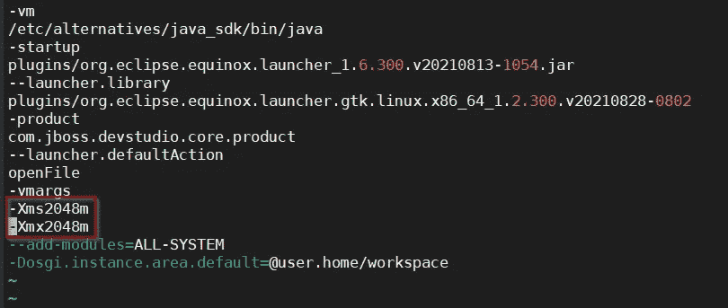
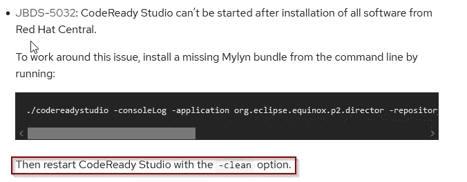
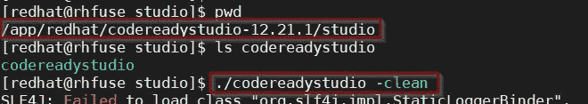

# 调整升级的 Red Hat CodeReady Studio

> 原文：<https://medium.com/nerd-for-tech/tune-up-an-upgraded-red-hat-codeready-studio-473d66ce0e32?source=collection_archive---------7----------------------->

# TLDR；

升级后运行缓慢时，尝试使用 *-clean* 选项启动 codereadystudio。

# 说明

我在 Red Hat Code Ready Studio 版本 12.19.1 工作了一段时间。几个月前版本 12.21.0 已经发布了。12 月中旬 12.21.1 来到 GA。

早些时候我已经尝试过 12.21.0，但它慢得令人难以置信。这是不可行的。于是，我把它放在一边，回到 12.19.1 版本。今天我决定再试 12.21.1。但是，同样的结果是:不可行的缓慢。

我试图给它更多的堆空间。你可以通过编辑文件*$ CRS _ HOME/studio/codereadystudio . ini:*来实现

其中$ *CRS_HOME* 指向我的 Code Ready studio HOME(*/app/red hat/codeready studio-12 . 21 . 1*)。

然后我用 *$JDK11_HOME/bin/jconsole* 监控了一段时间。但是，无济于事。

到了山穷水尽的地步，我决定浏览一下发行说明中的[已知问题部分。我的眼睛捕捉到以下内容:](https://access.redhat.com/documentation/en-us/red_hat_codeready_studio/12.21/html/release_notes/sect_known_issues)

使用-clean 选项重新启动 codereadystudio

因此，我简单地用-clean 选项重启了我的 codereadystudio:

Code Ready Studio 的全新开始

之后，Code Ready Studio 运行良好！