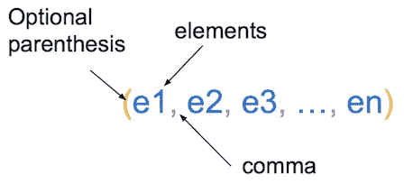
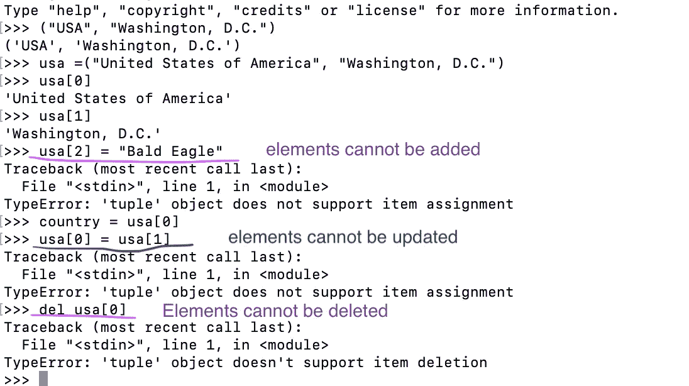
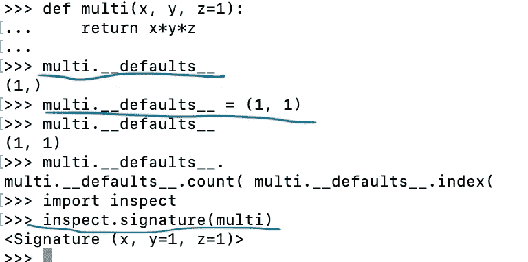

# 元组和命名元组 Python

> 原文：<https://medium.com/nerd-for-tech/tuples-and-namedtuple-in-python-8df24bda15f2?source=collection_archive---------6----------------------->


照片由[宝琳·伯恩菲尔德](https://unsplash.com/@pizbern?utm_source=unsplash&utm_medium=referral&utm_content=creditCopyText)在 [Unsplash](https://unsplash.com/s/photos/brackets-animal?utm_source=unsplash&utm_medium=referral&utm_content=creditCopyText) 上拍摄

我不知道元组不仅仅是一个通常在 return 语句中使用的带括号的数据结构。元组是一种非常强大的数据结构。我们将研究来自`collections`库的元组和 Python 的`namedtuple()`工厂函数，并举例说明。

元组的语法是



元组的语法

元素可以是任何类型—整数、字符串、列表等。

现在，让我们看看元组特定的属性，然后把它看作一个数据记录。

元组是**不可变的**，这意味着一旦元组被创建，它上面的元素就不能被添加或删除。元素的**顺序**也是**固定**。



元组中的元素不能更改、添加、删除，并且顺序是固定的

我们还看到，元组变量`usa`的位置有意义——`0`代表一个国家的名称，`1`代表一个首都城市的名称。

鉴于元组这些不可变属性，它是包含数据的完美数据结构——没有副作用。

让我们看一个例子:

这里你可以看到元组包含了关于国家的数据。我们可以使用变量来包含元组的值。我们使用`*<variable-name>`来命名一个变量，以收集多个值，例如代码中的`*rest`和`*prev_info`。这个过程也被称为**元组解包**。

运行该文件时，我们得到:

```
north america: [('United States of America', 'Washington, D.C.', 'Bald Eagle'), ('Canada', 'Otaawa', 'Canada Jay')]country: Swaziland, capital: Mbabane, Lobamba, national bird: Purple-crested turacoUSA's national bird: Bald EagleGuyana's capital: Georgetownusa: United States of America, rest info: ['Washington, D.C.', 'Bald Eagle']
```

现在让我们看看 Python 的`collections`库中的`namedtuple`工厂函数。

`namedtuple`结合了**类**和**元组**方法，这样我们就可以给**的**位置**赋予有意义的名称**。

让我们看一个例子:

这里我们创建了一个名为`Rectangle`的元组，它有两个字段— `length`和`breadth`。我们可以使用索引或通过属性来访问`Rectangle`元组的值。我们也可以用正常的拆包方式拆包。

我们可以使用`_asdict()`获得元组的字典表示。我们可以使用现有实例的值创建一个新的`Rectangle`实例。这里我们用**解包字典**和**解包位置论证**的方式来做。

运行该文件时，我们得到:

```
calculating area using indexing: 18calculating area using attribute: 18length: 9, breadth: 2dict representation: {'length': 9, 'breadth': 2}r2's initial id: 140454374705088r2's  length: 9, breadth: 3r2's id after replacing breadth value: 140454374705280r3's lenght: 9, breadth: 2
```

如果我们想让`namedtuple`中的字段有默认值呢？我们有两种方法可以做到——原型和使用 tuple 的`__defaults__`属性。

首先，让我们看看原型方式:

运行该文件时，我们得到:

```
prototype circle's id: 140367016505888
area: 12.57, id: 140367016746416
```

这里，当创建一个名为`circle_zer`的`Circle`实例时，我们向字段传递默认值。请记住，一旦我们开始传递默认值，它应该对它后面的所有剩余字段都这样做。这是为了帮助 Python 编译器消除变量赋值的歧义。如果你没有给出默认值，你会得到`positional argument`错误。

因此带有默认值的实例将成为我们的原型。我们可以使用`_replace`方法基于原型创建一个实例。因为元组是不可变的序列类型，所以原型对象和原型之外的新实例具有不同的 id。

第二种方法是使用`__defaults__`属性。

这里我们使用`__defaults__`属性将默认值传递给`Circle`元组中的字段。默认值从左到右传递，所以如果我们只传递 2 个值，它们将被设置为`origin_x`和`origin_y`字段。

它在功能上也是类似的:



现在让我们看一个场景，我们想要扩展我们现有的 tuple，`Circle`。我们希望将`origin_z`字段添加到圆中，以便此圆在 3D 环境中成为球体。我们可以通过使用元组的`_fields`属性从 2D `Circle`中获取字段并添加一个新的`origin_z`字段来实现。然后按照通常的`namedtuple`方式设置和访问元组的值。

让我们看一个例子:

运行该文件时，我们得到:

```
circle area: 28.27 at coordinate (1, 1)
sphere area: 113.10 at coordinate (1, 1, 1)
```

总之，

*   元组是不可变的数据结构
*   元组可以作为数据记录工作
*   我们有`namedtuple`工厂函数来创建带有命名字段的元组。

我希望这篇文章对您有所帮助，并让您更好地了解元组。

祝贺完成，感谢您的阅读！💐我的下一篇文章将讨论 Python 数据结构的可变性和不变性。到时候见。

**灵感:**

*   [Python 3:深潜(功能性)](https://www.udemy.com/course/python-3-deep-dive-part-1/)

你可以在 [Patreon](https://www.patreon.com/dkhambu) 上支持我！