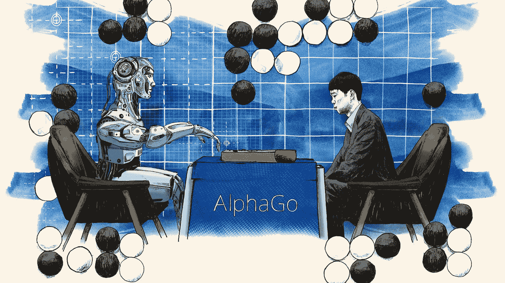

# 没有被标记的数据，就没有人工智能

> 原文：<https://medium.com/nerd-for-tech/turing-award-winner-yang-likun-is-ai-smarter-than-you-9cc287b9df31?source=collection_archive---------10----------------------->

## 图灵奖得主杨丽坤:人工智能比你聪明吗？

照片来自[金融时报](http://prod-upp-image-read.ft.com/4bb1cd86-0a48-11e7-ac5a-903b21361b43)。

人工智能通常被认为是一种将颠覆世界的技术。这个概念出现到现在已经 65 年了。无数的电影和小说塑造了各种经典的人工智能角色，AI(人工智能)也很快成为未来世界蓝图的重要组成部分。然而，在 Ai 不断拓宽我们对未来的想象的同时，也出现了一些“Ai 主宰世界”、“AI 监控隐私”等负面论调。

在李世石被 AlphaGo 击败的失败之后，人类对 AI 的恐惧和想象正在无限蔓延。

**那么，人工智能真的比我们聪明吗？**

在 AlphaGo 击败韩国棋手李世石之后，一名比利时程序员基于 deep mind 发表的最新论文推出了一个开源的围棋 AI 项目——LeelaZero。有些人试图玩它。结果是 Leela 在 19 路围棋中获得压倒性胜利，在 25 路中彻底落败，无一例外。这说明 Leela 这个只接受过 19 路围棋训练的 AI，只会下 19 路棋。即使这些数据已经存储在其数据库中，它也不知道如何将训练“经验”从 19 路移植到 25 路。

# 那么问题来了。人工智能不聪明吗？

图灵奖得主、脸书首席人工智能科学家 Yann Lecun 在他的新书*中告诉我们，人工智能真的不是你想象的那样。*

## 哎，真的不是你想的那样。

人工智能正在改变人类的看法，不断冲击着人类的傲慢。在文学作品中，AI 是危险的，也是美好的，但它是全方位为人类服务的，比人类更强大，更有创造力。但现实中，AI 落地应用往往不懂常识，动作缓慢，耗费大量精力。

**当你盯着 AI 看的时候，AI 不一定盯着你看，因为它不知道你为什么盯着他看(至少现在不知道)。**

原因是 AI 缺乏常识、感知，甚至无法灵活地学习和使用存储的知识，面对场景转换。

**更多信息:** [**为什么数据标注对机器学习如此重要？**](https://tinyurl.com/3vuk78dv)

Deepmind 训练了一个可以玩经典雅达利视频游戏的系统。该系统包括总共 80 个游戏。对于每一场比赛，至少需要 80 个小时来训练系统达到合格的水平，而一个人只需要 15 分钟就可以做到这一点。但实际上，这 80 个小时是花在 AI 身上的训练时间。经过训练后，它可以以更快的速度(比人类快得多)玩游戏，甚至可以同时玩多个游戏。换句话说，如果系统运行的时间更长，就会达到人类无法达到的超效率。

但并不是所有的 AI 系统都有足够的时间在更长的时间里接受更多的训练，比如自动驾驶领域。自动驾驶系统中的 AI 必须跟随汽车，才能在路上获得更多的训练数据。在学会如何避免撞车之前，它必须驾驶数百万小时。如果汽车掉下悬崖，系统会说“哦，我一定是错了”，但这只会稍微纠正它的策略。第二次，车可能会以不同的方式掉下悬崖，然后系统会再次修正。以此类推，在系统完全知道如何避免掉下悬崖之前，汽车必须像这样掉下悬崖数千次。

以上“极端”的例子足以说明一点:AI 不是天才，不能轻易获得“智慧”。它需要大量的训练数据来支持，才能在特定事件上达到人们所说的“智能”。然而，时间成本、计算能力等等远远超过了人们的普遍预期。

# 人工智能和数据注释服务

数据标注技术用于使机器学习模型的对象可识别和可理解。对于人脸识别、自动驾驶、空中无人机等机器学习应用行业的发展至关重要。

简单来说，数据标注应用多种工具来处理数据。标记的数据是人工智能系统的基本元素，因为它“教”人工智能像人类一样识别、判断和行动。如果标注的数据充当 AI 的汽油，那么数据标注就是**将原油提炼为汽油。**

目前，数据标签已经在为各个行业提供动力，如[自动驾驶](https://tinyurl.com/3uhuu546)、[农业](https://tinyurl.com/u4bnunb3)、[医疗](https://tinyurl.com/5eehr37e)、[零售](https://tinyurl.com/3tzeywkm)等。

随着 AI 商业化进程的加快，以及辅助驾驶、客服聊天机器人等 AI 技术在各行各业的应用，人们对特殊场景下的数据质量的期望越来越高。高质量的标签数据将是人工智能公司的核心竞争力之一。

如果说之前算法模型使用的一般数据集是粗粮，那么算法模型目前需要的是定制化的营养餐。如果公司想要进一步提高某个模型的商业化，他们必须逐步从通用数据集向前发展，创建自己独特的数据集。

# 结束

将你的数据标注任务外包给 [ByteBridge](https://tinyurl.com/2p8p72bu) ，你可以更便宜更快的获得高质量的 ML 训练数据集！

*   无需信用卡的免费试用:您可以快速获得样品结果，检查输出，并直接向我们的项目经理反馈。
*   100%人工验证
*   透明标准定价:[有明确的定价](https://www.bytebridge.io/#/?module=price)(含人工成本)

**为什么不试一试？**

来源:北京青年报