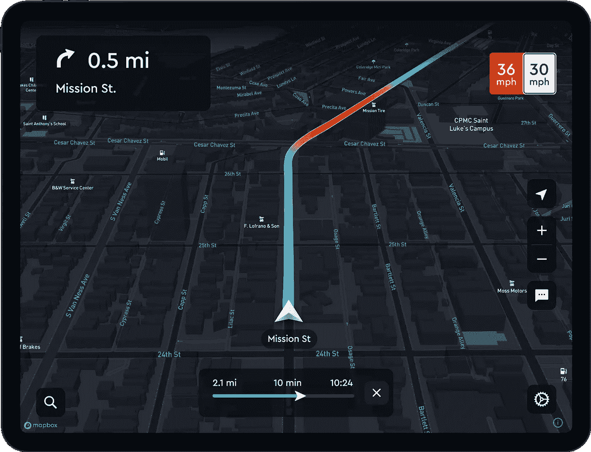
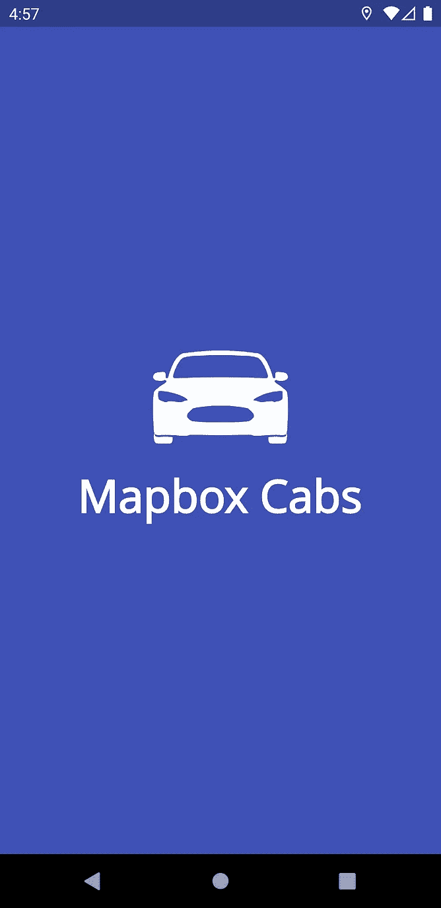
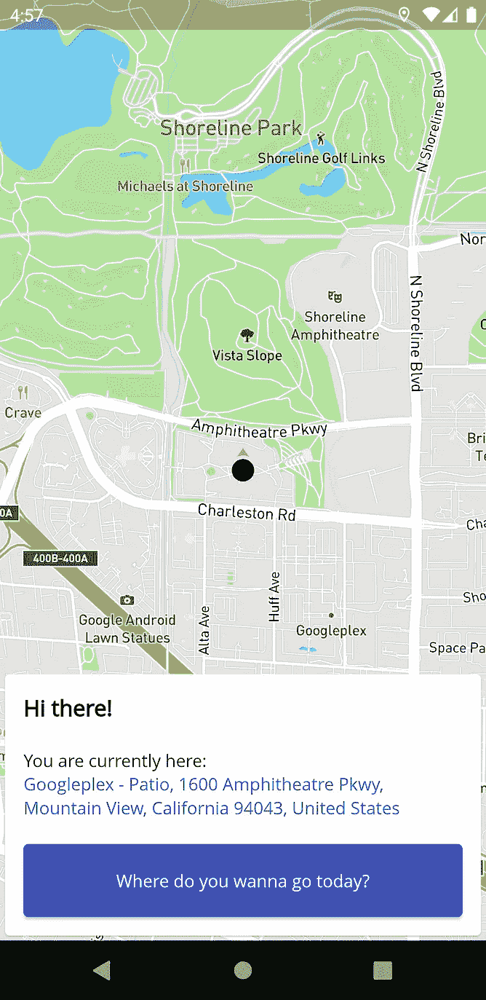
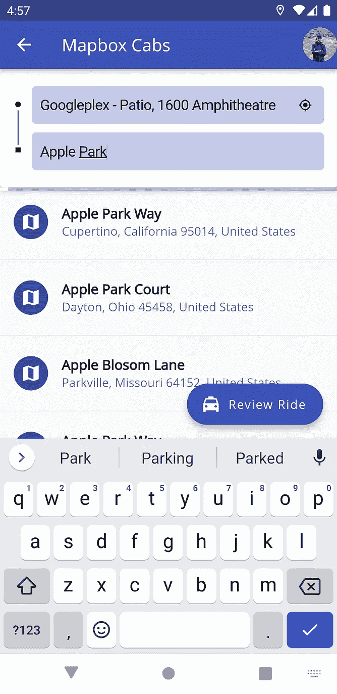
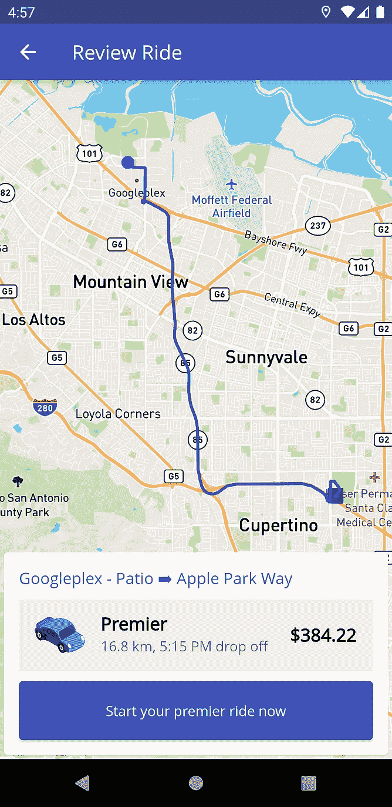
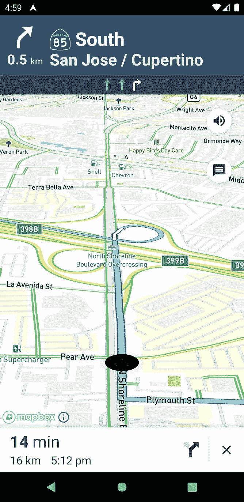
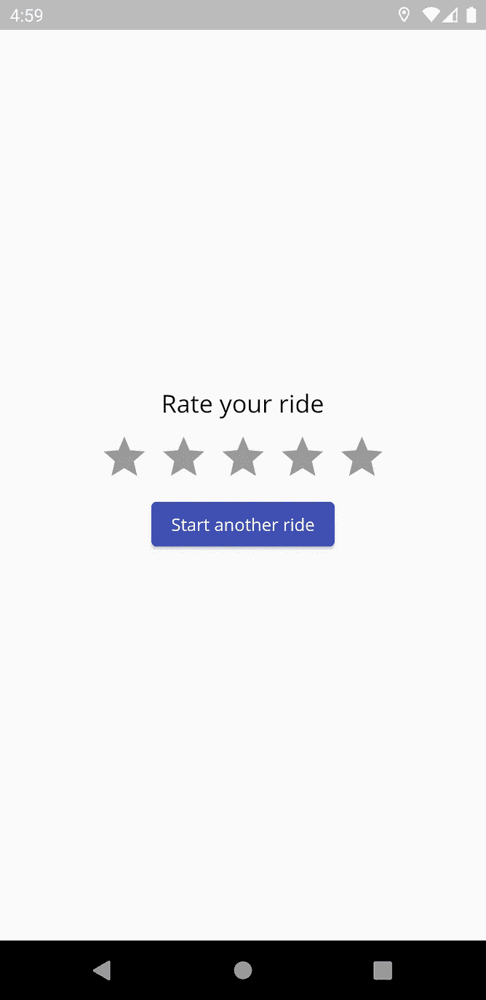

# 使用地图框的即时路线导航

> 原文：<https://medium.com/nerd-for-tech/turn-by-turn-navigation-with-mapbox-16f874567b3c?source=collection_archive---------1----------------------->

## 让我们来探索一下 Mapbox 强大的导航 SDK

在本文中，我们将关注**地图框搜索 API**、**导航 SDK** 和**地理编码 API**，同时创建一个完整的优步应用程序式体验。

*喜欢视频，觉得文章更难读？我掩护你。😇观看下面的完整教程视频。*

在我的上一篇博客中，我们讨论了 Mapbox 作为谷歌地图平台的替代品，并使用 Directions API 构建了一个 Flutter 应用程序。我强烈建议你读一读。

[](/nerd-for-tech/navigation-with-mapbox-for-flutter-apps-313687778686) [## 针对 Flutter 应用程序的地图框导航

### Mapbox 是谷歌地图平台的强大替代品

medium.com](/nerd-for-tech/navigation-with-mapbox-for-flutter-apps-313687778686) 

# 项目描述

从外行的角度来看，优步应用程序有四个重要的屏幕。我们还有许多其他特性，但我们不会在演示中考虑所有这些特性。

1.  **主屏幕** —在这里您可以看到您的位置和以前的旅行
2.  **准备游乐设备屏幕**——在这里您可以选择出发地和目的地
3.  **查看乘车屏幕** —在这里您可以选择出租车并查看行程
4.  **开始骑行**——你会看到一个逐圈导航



从官方网站上截取的地图框导航图

要将此翻译成 Mapbox 术语，我们需要在这些屏幕中使用 Maps SDK、搜索和地理编码 API、方向 API 和导航 SDK。这是应用程序的最后几个屏幕。我们还推出了飞溅和率骑屏幕。😇



让我们在每个屏幕上工作，看看如何构建它们。你会在这个博客的末尾找到源代码，但是请确保你已经阅读并理解了我们是如何实现每个屏幕的。

# 主屏幕

主屏幕看起来非常简单。我们需要使用 **Maps SDK** 和**反向地理编码 API** 来生成当前地址并在地图上显示位置。既然我们在 Flutter，我们可以用 [Mapbox GL](https://pub.dev/packages/mapbox_gl) 的神奇包来换 maps SDK。对于反向地理编码，您可以使用 [Dio](https://pub.dev/packages/dio) 并请求 mapbox.places 端点。一个典型的请求 URL 看起来像这样—

```
https://api.mapbox.com/geocoding/v5/mapbox.places/-73.989,40.733.json?access_token=YOUR_PUBLIC_ACCESS_TOKEN
```

# 准备游乐设备屏幕

这就是乐趣的开始。Mapbox 提供了可用作搜索 API 的正向地理编码 API，非常强大。第一步是去看看地理编码 API 运动场。使用可选参数如`proximity`、`language`和`country`调整您的搜索设置，以获得更好的结果。使用`types`参数，我们可以过滤以将返回的特征限制为所需的地点类型，如地点、邮政编码、地址等。

[](https://docs.mapbox.com/playground/geocoding/) [## 地理编码 API |游乐场

### 地理编码 API 允许您按名称或坐标搜索地址和地点。要生成地理编码 API…

docs.mapbox.com](https://docs.mapbox.com/playground/geocoding/) 

再次使用 Dio 发出请求，在从响应中提取特性并使用您喜欢的工具进行一点点状态管理之后，您应该能够完成您的第二个屏幕。

# **查看游乐设备屏幕**

在这个屏幕中，我们可以使用 Directions API 并在两个端点、取货点和目的地之间生成一条折线。在我之前的博客中，我们已经详细讨论过了，所以如果你需要指导，你可以重温一下。考虑到交通状况，我们还可以获得最短路线的距离和下车时间。

请注意，方向 API 的响应为您提供了所需的时间。要将其转换为下车时间，在导入 [intl](https://pub.dev/packages/intl) 包后使用以下函数。

```
import 'package:intl/intl.dart';

String getDropOffTime(num duration) {
  int minutes = (duration / 60).round();
  int seconds = (duration % 60).round();
  DateTime tripEndDateTime =
      DateTime.now().add(Duration(minutes: minutes, seconds: seconds));
  String dropOffTime = DateFormat.jm().format(tripEndDateTime);
  return dropOffTime;
}
```

# **开始乘坐**

该应用程序最重要的部分是转弯导航，它使用了以下软件包—

[](https://pub.dev/packages/flutter_mapbox_navigation) [## Flutter _ mapbox _ navigation | Flutter 包

### 使用 MapBox 将逐圈导航添加到您的 Flutter 应用程序中。当您需要导航时，请不要离开您的应用程序…

公共开发](https://pub.dev/packages/flutter_mapbox_navigation) 

简而言之，我们要定义`instructions`、`directions`、`options`、`distanceRemaining`等一堆变量。以及一堆布尔标志，如`isMultiStop`、`hasArrived`、`isNavigating`来管理 trip 事件。你将有语音和横幅指示，路线模拟，实时交通和更多的功能。

# 其他页面

对于闪屏和评级来说，它们主要是用 Flutter 编写的 UI 页面，尽管`SplashScreen`会进行一系列异步 API 调用，并将重要数据存储到`SharedPreferences`。

# 结论

逐路段导航是 Mapbox 中一个很棒的功能。我们可以在几分钟内构建完整的产品系列，从完全定制的解决方案到带有智能默认设置的应用内导航。我们已经介绍了 Mapbox 的大部分基本功能，并通过这个博客的实例看到了它的作用。

您可以在这个 Github 资源库中找到博客(和视频)的完整源代码。

[](https://github.com/Imperial-lord/mapbox-flutter) [## GitHub-Imperial-Lord/mapbox-flutter:一个展示 map box 使用的库——它的地图…

### 一个展示 Mapbox 使用的库——它的地图和导航 SDK 在一个 Flutter 应用程序中——GitHub…

github.com](https://github.com/Imperial-lord/mapbox-flutter) 

另外，你可以在 LinkedIn 上联系我

[](https://www.linkedin.com/in/ab-satyaprakash/) [## AB Satyaprakash -应用开发主管-IITG 学生网络委员会| LinkedIn

### 我是数学和计算机专业的毕业生，IIT·古瓦哈蒂。作为一名热情的程序员，我喜欢解决问题和…

www.linkedin.com](https://www.linkedin.com/in/ab-satyaprakash/) 

**一如既往，祝你黑客生涯愉快！！！😄**