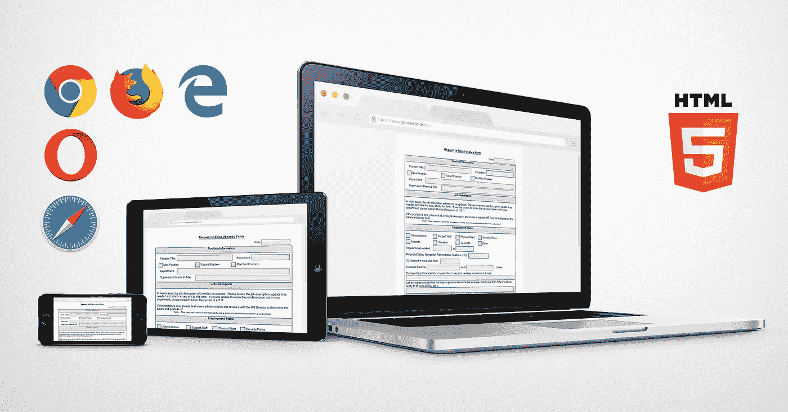

# 在现代浏览器中关闭自动完成功能

> 原文：<https://medium.com/nerd-for-tech/turn-off-autocomplete-in-modern-browsers-e7829bdfa0a3?source=collection_archive---------5----------------------->

浏览器、表单和 HTML 自动完成

几乎每个人都熟悉一个叫做 ***自动填充*** 的功能，每当我们坐下来填写那些冗长的表格时，我们的浏览器都会提供这个功能。这真是一个救命恩人。尤其是对于像我这样的人来说，输入所有这些长地址和电子邮件 id 根本不是什么特别的感觉。我是自动填充功能的忠实用户。但是几天前，我在设计一个 HTML 表单时遇到了一个非常奇怪的问题。

> 自动完成功能无法轻易关闭…

坦率地说，我认为所要做的只是在 ***表单*** 标签上添加一个 ***自动完成*** 属性。但是当我试图实现它时，结果却令我不满意。经过几轮反复试验后，我选择接受一些提示，在 StackOverflow 线程中走了很长一段路。但是我所有的努力都白费了。然后在大量试图挖掘真相和真相背后的逻辑之后，我撞见了一个事实，即像 chrome，edge，firefox 这样的现代浏览器有点忽略了属性 ***自动完成*** 。那时我已经完全迷失了。

然后我去了 MDN(Mozilla 开发者网络)HTML 指南，它引用了

> 如果一个站点为一个`[<form>](https://developer.mozilla.org/en-US/docs/Web/HTML/Element/form)`设置了`autocomplete="off"`，并且表单包含用户名和密码输入字段，那么浏览器仍然会记住这次登录，如果用户同意，浏览器会在用户下次访问页面时自动填充这些字段。
> 
> 如果一个网站为用户名和密码字段设置了`autocomplete="off"`，那么浏览器仍然会记住这次登录，如果用户同意，浏览器会在用户下次访问页面时自动填充这些字段。

现在下一步该做什么？

光只来自 MDN。这篇文章中只写道

> [防止使用 autocomplete = " new-password "](https://developer.mozilla.org/en-US/docs/Web/Security/Securing_your_site/Turning_off_form_autocompletion#preventing_autofilling_with_autocompletenew-password)
> 
> 如果您正在定义一个用户管理页面，用户可以在其中为另一个人指定新密码，因此您希望防止密码字段自动填充，您可以使用`autocomplete="new-password"`。

它像魔法一样起作用。🎉

但是还有一个问题。其他输入字段没有解决方案。

所以当我继续的时候，我在一个 StackOverflow 线程中发现了一些有趣的东西，其中一个答案声明将 ***自动完成*** 属性的值设置为*“否”。我试过了，效果不错。所以我用*autocomplete =“no”填充了所有必需的输入字段。**

浏览器会立即恢复到之前的行为，即开始自动填充表单。

StackOverflow 后续解决方案的复杂性似乎也不必要地增加了，JavaScript、jQuery 接过了解决问题的接力棒，我开始了我的简单之旅。

然后我注意到，对于密码字段，有一个惟一的字符串被指定为属性值，我尝试对所有输入字段应用相同的逻辑。

这个东西工作起来像魔术一样，自动完成功能被立即关闭。🎉🎊虽然它仍然有效，但这并不是真正的解决方案。希望你喜欢这本书，它为你节省了一点时间和安宁…

> 注意安全，祝您愉快！