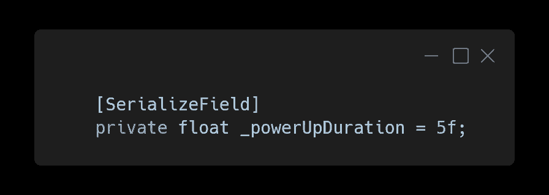
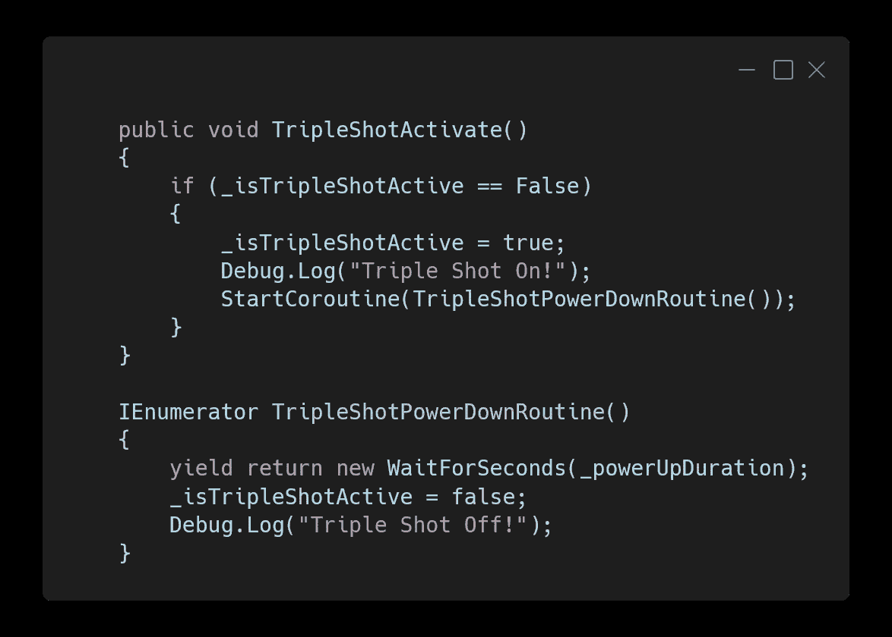
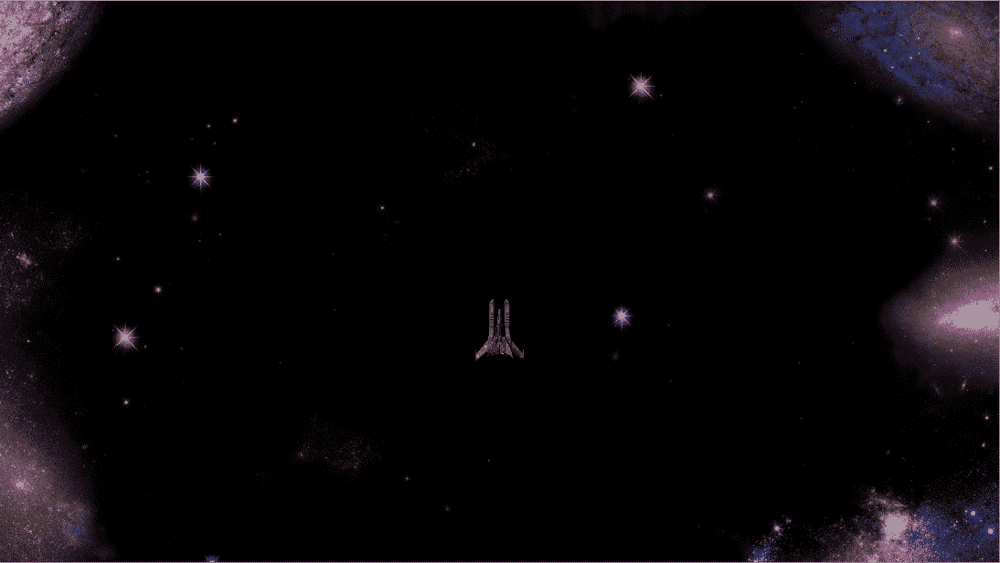
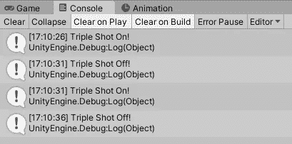
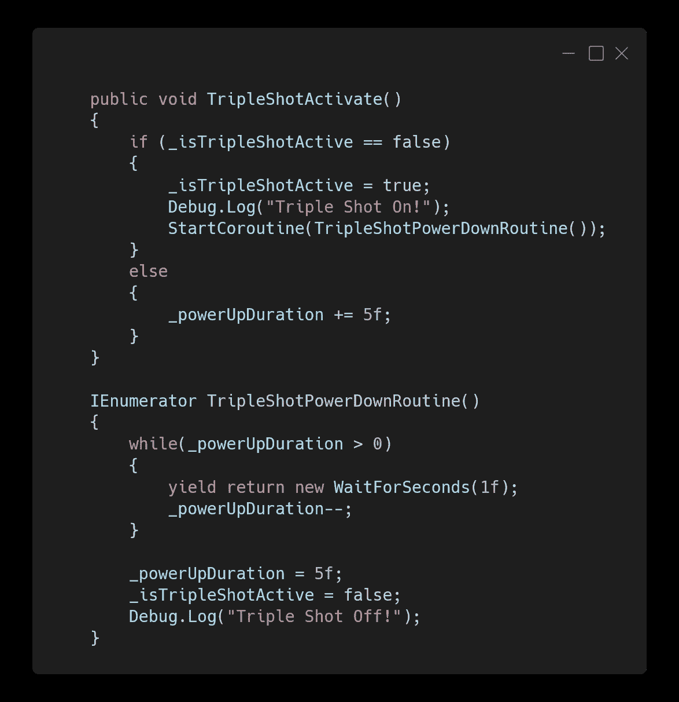
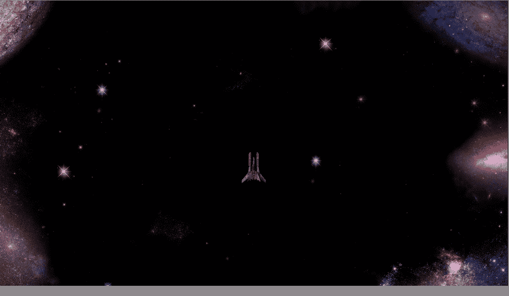
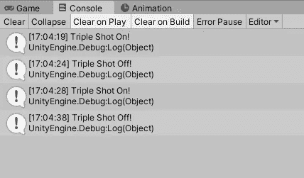

# 关闭电源

> 原文：<https://medium.com/nerd-for-tech/turning-the-powerup-off-cbf89280da1e?source=collection_archive---------22----------------------->

由于在这个游戏中，玩家不应该无限期地启动三重射击，我们将使用一个协程在 5 秒钟后关闭或关闭三重射击效果。

首先，在播放器脚本中，为加电持续时间添加一个值为 5 的私有 float。这将控制通电持续的时间。

通电持续时间的浮动

然后创建一个名为“TripleShotPowerDownRoutine”的新协程，让它为 _powerUpDuration 生成，并在生成后将 _isTripleShotActive 设置为 false。这将让玩家拥有持续 5 秒的三连击效果。在将 _isTripleShotActive 设置为 true 后，在 TripleShotActive 中启动协程。

掉电程序

现在通电持续 5 秒钟，然后关闭。唯一的问题是，如果球员拿起另一个三连击，而三连击是活跃的，计时器不会延长，因为你可以从控制台的时间戳看到。它只能持续设定的 5 秒钟。

三枪断电

如果玩家在激活状态下捡起另一个三连击，要延长计时器，协程让步的方式需要改变。

时间戳

在播放器脚本中，在增加时间的 TripleShotPowerDownRoutine 中，创建一个 while 循环，只要 _powerUpDuration 大于 0，该循环就会运行，并让它产生 1 秒钟，然后将 _powerUpDuration 减 1。在 while 循环完成后，将 _powerUpDuration 重置回 5。然后，在 TripleShotActivate 方法中，添加一个 else 语句，以便在 Triple Shot 处于活动状态时，将 _powerUpDuration 增加 5。这将延长协程的运行时间。

扩展协同程序

正如您在控制台时间戳中看到的那样，延长的时间现在正在起作用。

时间戳

既然第一次加电已经开始工作，我们就有了一个基础来完成模块化，我们将在下面的文章中看到这一点。