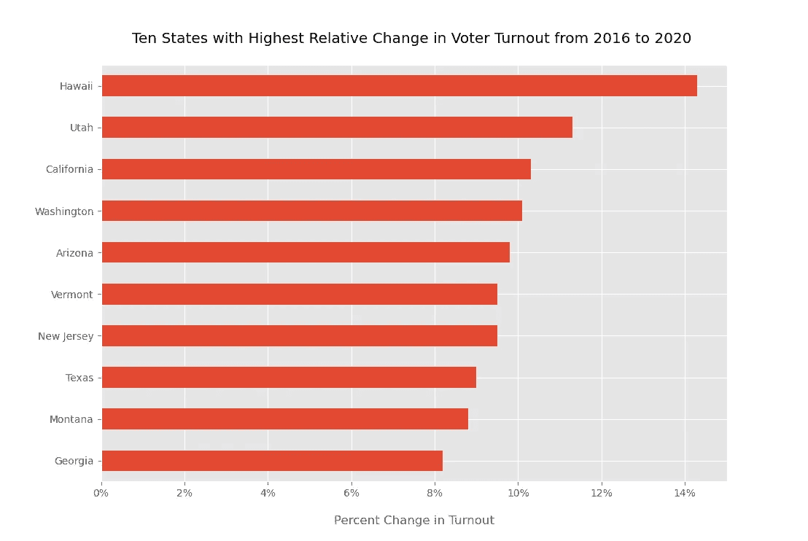
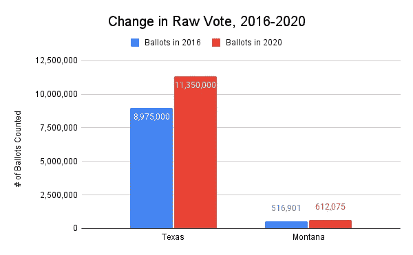
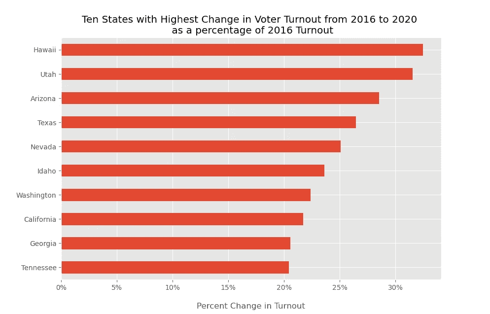

# 橘子和苹果的投票率

> 原文：<https://medium.com/nerd-for-tech/turnout-in-oranges-and-apples-c1f9cd69bb1?source=collection_archive---------10----------------------->


由[ksen ia Samoylenko](https://unsplash.com/@kssamoylenko?utm_source=unsplash&utm_medium=referral&utm_content=creditCopyText)在 [Unsplash](https://unsplash.com/s/photos/comparison?utm_source=unsplash&utm_medium=referral&utm_content=creditCopyText) 上拍摄的照片

前几天我开始了一个新项目。我想回答这个问题，*从 2016 年到 2020 年，美国大选的投票率有什么变化？我的计划是在网上找到一些数据集作为 CSV，将它们加载到 Pandas 中，然后在几分钟内完成。然而，一旦我进入其中，我注意到一些让我吃惊的事情。*

我发现的[数据集](http://www.electproject.org/home/voter-turnout/voter-turnout-data)有一些格式问题。它们在 Google Sheets 中是可读的，因为它们是为用户设计的，但是关于它们对标题的使用使得将它们放入 dataframe 对于这个初学者来说很烦人。我就此询问了一位更有经验的数据人士，他安慰地告诉我使用任何最有意义的工具:没人会瞧不起谷歌工作表。(我试着让我的新好朋友`IMPORTRANGE()`将两个独立的工作表[中的数据放到一个主工作表](https://docs.google.com/spreadsheets/d/10LcY24AICa8cVuNBuvyVfNGUgJ6Gd5LMuKiaTG7AaYU/edit?usp=sharing)中，不需要复制和粘贴。)

CSV 文件格式化后，我把它们转储到 Pandas 中，并做了一些可视化处理。(在这里找到我的 [Github 回购](https://github.com/mpechter/turnout)。)我将我的问题提炼为*从 2016 年到 2020 年，哪十个州的投票率变化最大？*



(图片由作者提供)

为了得到投票率的变化，我从 2020 年开始计算某个州的投票率，然后减去 2016 年的投票率。以夏威夷为例，那就是:

```
57.5% — 43.2% = 14.3%
```

每年的投票率是通过将投票总数除以*有投票资格的人口、*或 VEP 计算出来的。(总的*投票年龄人口*包括非公民和被监禁或假释的人，因此没有资格投票)。

知道我走在一条熟悉的道路上，我快速浏览了一些文章([这里](https://www.nbcnews.com/politics/2020-election/turnout-map-2020-election-n1249620)和[这里](https://www.pewresearch.org/fact-tank/2021/01/28/turnout-soared-in-2020-as-nearly-two-thirds-of-eligible-u-s-voters-cast-ballots-for-president/))，它们都使用了类似的方法。然而，仔细观察这些数字，我注意到这个计算掩盖了各州人口的巨大差异。

想想德克萨斯州和蒙大纳州。在上图中，你可以看到他们投票率的变化非常相似(德克萨斯州是 9%，蒙大拿州是 8.8%)。像我一样，你可能会觉得德克萨斯州的人口比蒙大拿州多。但是大多少呢？



原始投票总数变化在各州之间差异很大。(图片由作者提供)

显然，把这两种状态的变化等同起来，我们会失去一些东西。我想找到一种更好的方法来计算和比较这些变化。

**一种另类的方法**

为了解释这些差异，我尝试了一种不同的方法。下面是我接下来尝试的等式:

```
(2020 Raw Votes - 2016 Raw Votes) / 2016 Raw Votes
```

用这种方法可以捕捉到 2016 年投票率的变化，从而根据实际投票数，而不是相对于一个州的人口(或者更准确地说，是 VEP)的投票数来处理事情。如果以这种方式进行计算，您最终会得到以下结果:



这一次，这些数字让我们对变化的幅度有了更好的认识。(图片由作者提供)

所以这有点动摇了。如果就投票而言，这种计算更诚实一点，为什么记者倾向于相对计算？

我们到底在衡量什么？

投票率是参与度的一个指标。对于 2016 年和 2020 年这样的选举，我们都有一种公众参与的直观感觉，但我们希望客观地衡量这一点。

尽管牢记州的大小很重要，但将计算结果与原始选票捆绑在一起也有其误导因素，即人口增长。如果一个州只是增长了(并因此产生了更多的选票),这将扭曲我们的数据，给我们一个虚假的参与印象。对于像德克萨斯州这样的州来说，其增长速度超过了美国其他州，这可能意味着任何数量的扭曲。

所以这两种方法似乎都不完整。怎么办？

**未完待续:混合方法**

许多图表在简单的外表下隐藏着复杂性。将政治数据和地图混在一起，加上各自的扭曲，使问题更加严重。我认为最好的解决方案是使用标量元素(就像这个 [FiveThirtyEight 图表](https://fivethirtyeight.com/wp-content/uploads/2020/11/rakich-mejia.REDISTRICTING-RESULT.1118.png?w=575))，显示州与州之间的差异，但是仍然计算相对百分比的变化。

因为我的目标是向观众传达这些多维度，这似乎是正确的方向。*现在我只需要深化我的视觉化技能来创造它！*