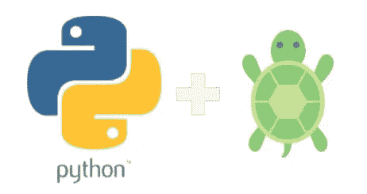
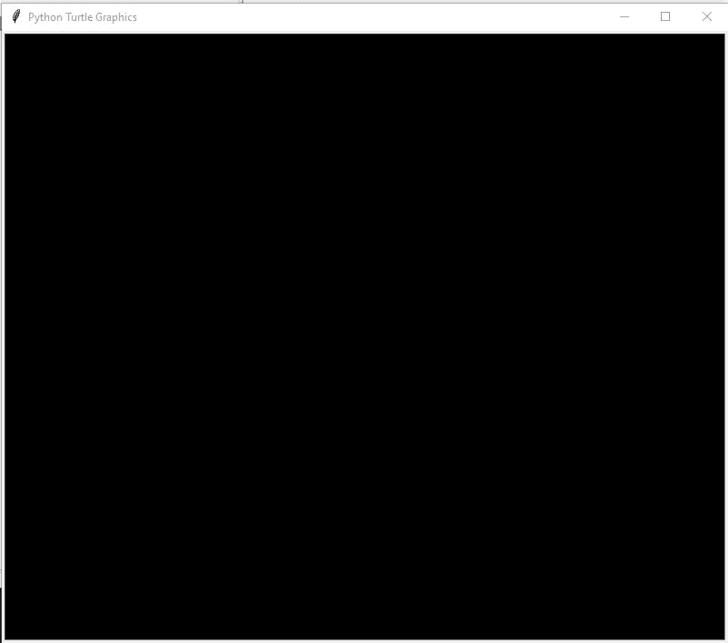
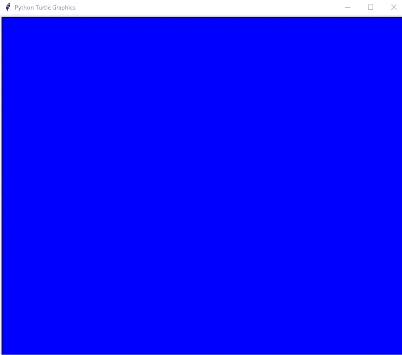
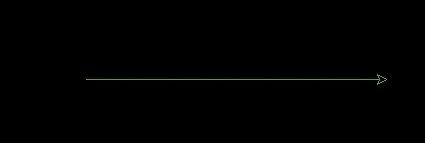
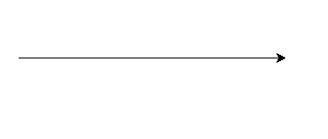
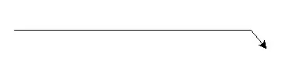
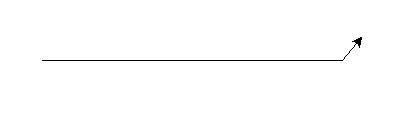
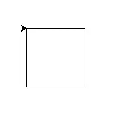

# 龟蟒

> 原文：<https://medium.com/nerd-for-tech/turtle-python-1f2d6c9ef91?source=collection_archive---------3----------------------->



[来源](https://www.qut.edu.au/study/career-advisers-and-teachers/young-accelerators/stem-learning-hub/stem-online-teaching-resources/fundamentals-of-python-online-workshop)

# 介绍

python 中的 Turtle 就像一个画板，让我们在乌龟的帮助下在画板上画画。我们可以借助某些功能来控制乌龟的移动。

它可以用来向孩子们介绍编程，并且是最初的 Logo 编程语言的一部分。

# 导入包

为了使用 turtle 方法和功能，我们需要导入 turtle。“turtle”自带标准 Python 包，不需要外部安装。

```
from turtle import *
```

或者

```
import turtle
```

让我们来看看一些函数:

# `**bgcolor**`

`turtle.**bgcolor**` ( **args* )

参数:一个颜色字符串(“红色”、“绿色”等)。)或(r，g，b)色码。

它设置海龟屏幕的背景颜色。

```
turtle.bgcolor("black")
```



```
turtle.bgcolor("blue")
```



# **钢笔颜色**

`turtle.**pencolor**`(**参数*)

args:r、g、b 或 RGB 颜色的颜色字符串或元组。

```
import turtleturtle.bgcolor("black")
turtle.pencolor("Cyan")turtle.forward(300)
```


```
import turtleturtle.bgcolor("black")
turtle.pencolor("#709A41")
turtle.forward(300)
```



# 向前

`turtle.**forward**` (* *args*

`turtle.**fd**` (* *args*

参数:海龟前进的整数距离。该功能有助于将海龟向其前进的方向移动指定的距离。

```
import turtle
turtle.forward(300)
```



```
import turtle
turtle.fd(300)
```


# **向后**

`turtle.**back**` (* *args* )

`turtle.**bk**` (* *args*

`turtle.**backward**`(*args*)

参数:海龟必须移动的整数距离。它使海龟向后移动，与它移动的方向相反。

```
import turtle
turtle.fd(300)
turtle.backward(200)
```


# 对吧

`turtle.**right**` ( *角度*)

`turtle.**rt**` ( *角度*)

角度:整数它浮动。

这个函数将乌龟向右旋转指定的角度。

```
import turtle
turtle.fd(300)
turtle.right(50)
turtle.fd(30)
```



# 左边的

`turtle.**left**` ( *角度*)

`turtle.**lt**` ( *角度*)

这个函数将乌龟向左旋转指定的角度。

```
import turtle
turtle.fd(300)
turtle.left(50)
turtle.fd(30)
```



现在，做一个正方形一定很容易。

```
import turtlefor _ in range(4):
    turtle.fd(100)
    turtle.rt(90)
```



更多海龟功能请访问:

 [## 龟龟图形- Python 3.9.7 文档

### 画图状态移动时向下拉笔-画图。把笔拉起来——移动时不要画画。设置线条粗细…

docs.python.org](https://docs.python.org/3/library/turtle.html#module-turtle) [](https://linktr.ee/SRKeshav) [## @SRKeshav | Linktree

### 19 岁的男孩，喜欢学习、创造、发展和写作。

linktr.ee](https://linktr.ee/SRKeshav)