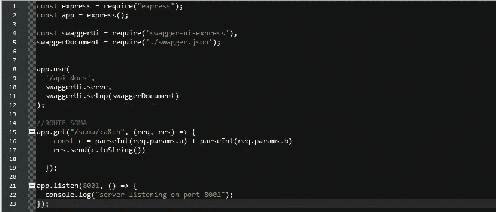
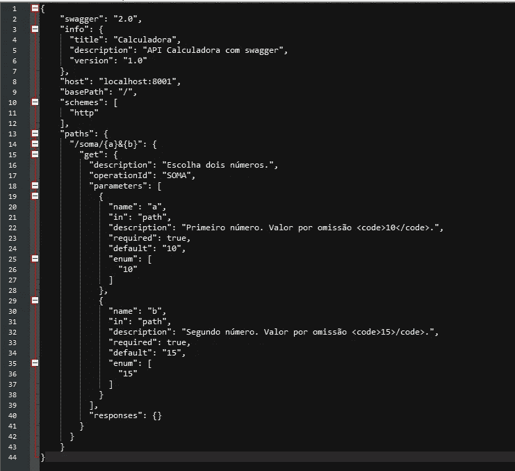
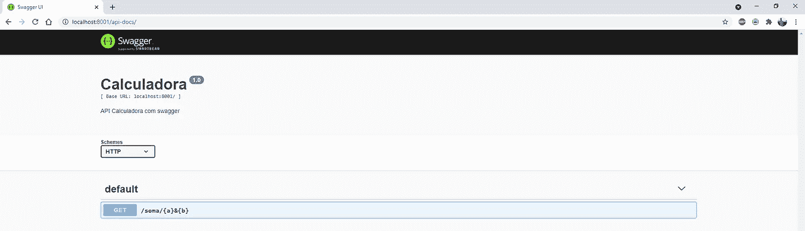
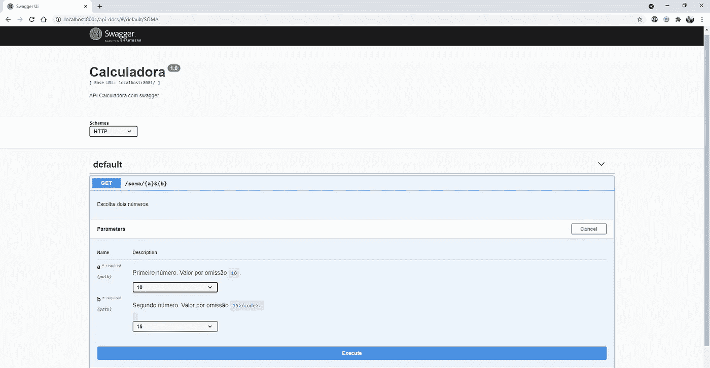
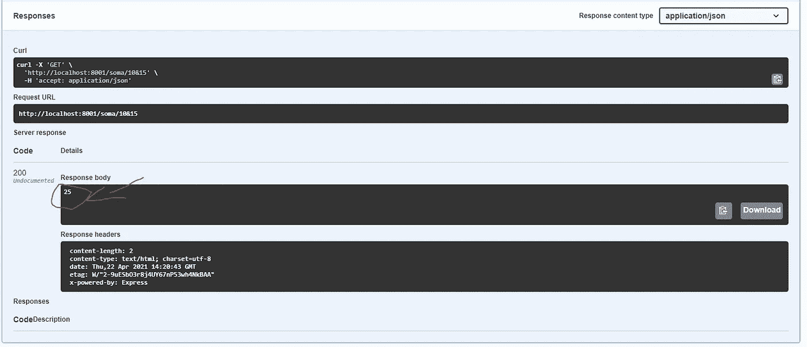

# 教程:带有 swagger 的 API 计算器

> 原文：<https://medium.com/nerd-for-tech/tutorial-api-calculator-with-swagger-1b18512888b?source=collection_archive---------6----------------------->

> **Swagger** 是一种[接口描述语言](https://en.wikipedia.org/wiki/Interface_Description_Language)，用于描述使用 [JSON](https://en.wikipedia.org/wiki/JSON) 表达的[RESTful](https://en.wikipedia.org/wiki/Representational_state_transfer)API。Swagger 与一组[开源软件](https://en.wikipedia.org/wiki/Open-source_software)工具一起用于设计、构建、记录和使用 RESTful [web 服务](https://en.wikipedia.org/wiki/Web_API)。Swagger 包括自动化文档、代码生成(许多编程语言)和测试用例生成。

要开始这个教程，你必须有一些 nodejs 知识，如果没有检查我以前的教程。

首先创建一个创建 api 的文件夹，然后在 nojs cpromps 上将目录切换到该文件夹，并键入以下命令:

> npm 初始化
> 
> npm 快速安装
> 
> npm i swagger-ui-express -S

之后，创建 index.js 文件，并编写以下代码:

(该文件已有路由部分)

之后，创建一个名为 swagger.json 的文件，并编写以下代码:

要启动我们的服务器，请键入:

> 节点索引. js

如果在您的浏览器上打开[http://localhost:8001/API-docs/](http://localhost:8001/api-docs/)，输出应该如下所示:

要测试我们的 api，单击**尝试**，输出应该如下所示:

点击**执行**，结果应该出现在**字段响应体上。**

这个教程在我的 github 上:

[https://github.com/Pedro2494/Swagger-Calculator](https://github.com/Pedro2494/Swagger-Calculator)