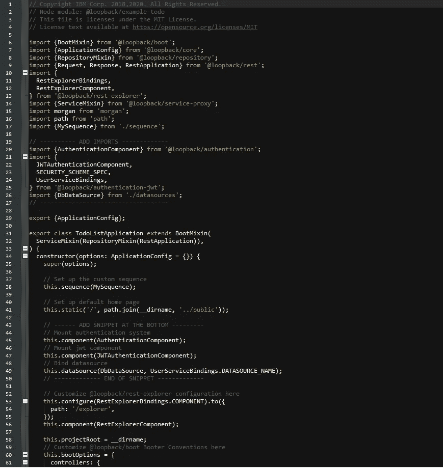
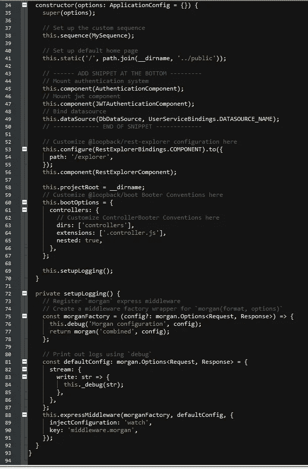
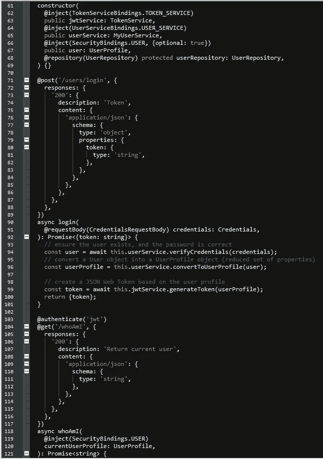
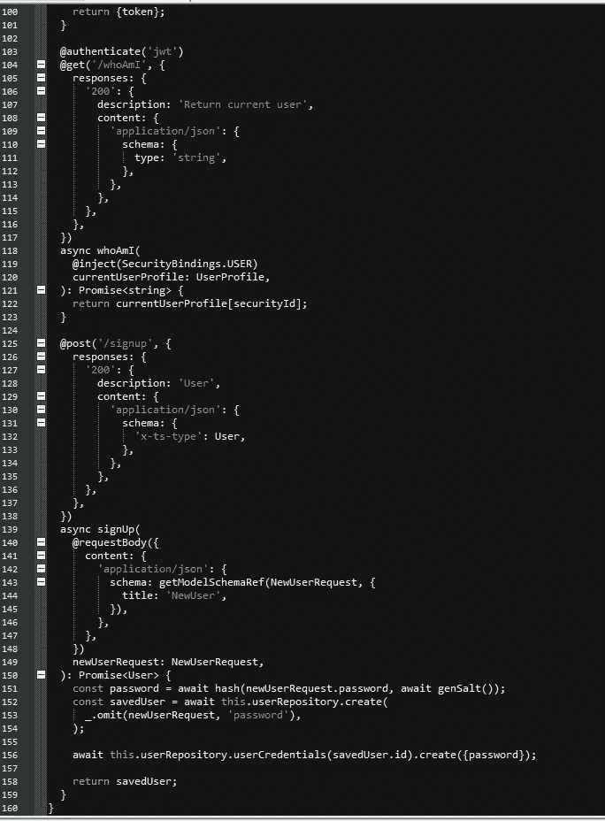
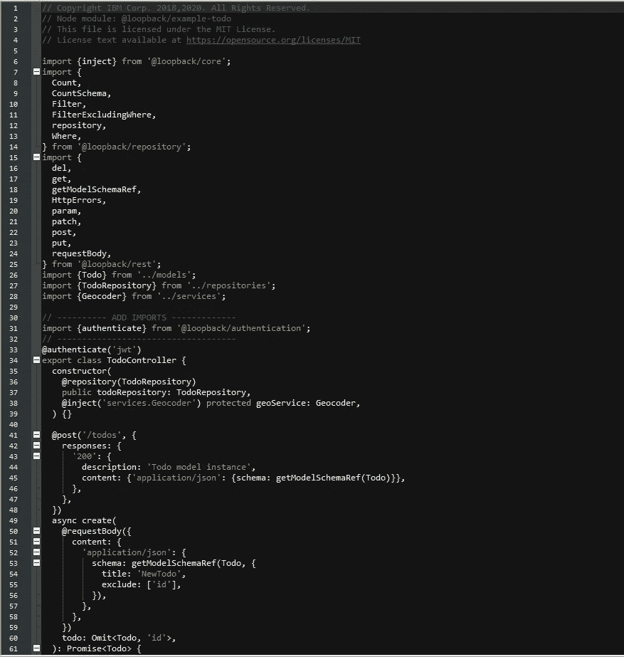
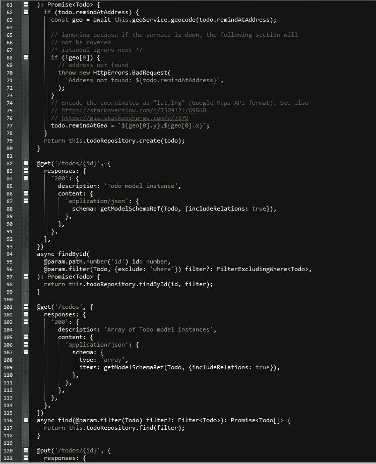
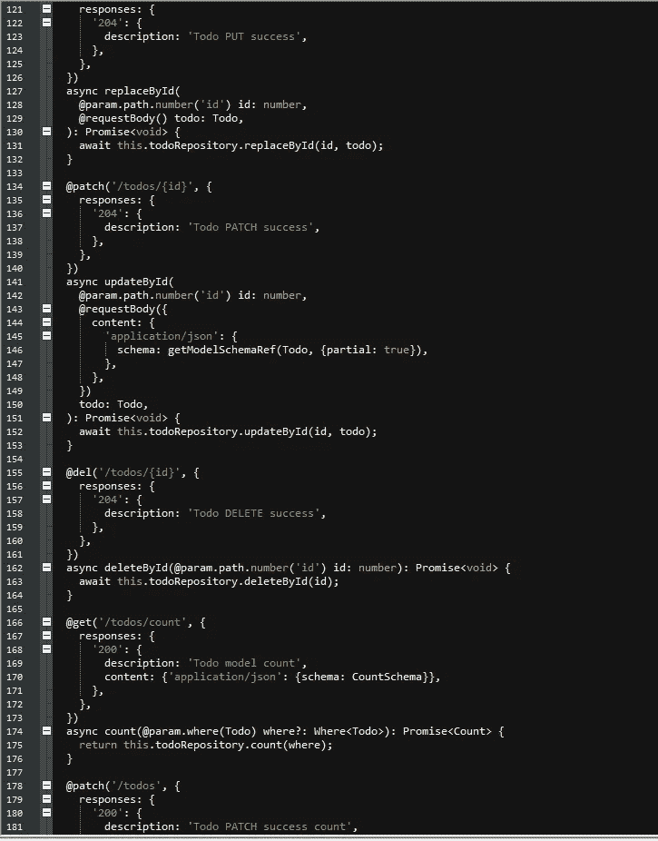
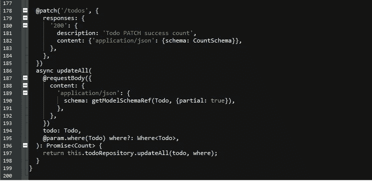
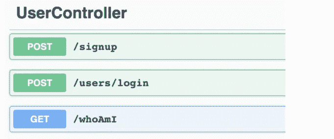

# 教程:使用回送 IBM 创建带身份验证的 api

> 原文：<https://medium.com/nerd-for-tech/tutorial-create-api-with-authentication-using-loopback-ibm-5fb8d396cb6b?source=collection_archive---------14----------------------->


第一步是复制我们以前的项目或创建一个新的项目，你可以访问我以前的教程[这里](/nerd-for-tech/tutorial-create-api-with-loopback-ibm-ef06234f8635)。

让我们从打开 Noddejs 命令提示符开始，键入以下命令:

> `lb4 example todo`
> 
> `cd loopback4-example-todo`

并安装身份验证扩展:

> `npm i --save @loopback/authentication @loopback/authentication-jwt`

安装完成后，进入我们项目的**根**文件夹，打开 **src** 文件夹，用 notepad++打开 **application.ts** 文件。

注意这一步，文件必须有下面的代码，修改它，使它看起来像这样:



下一步是创建一个控制器，在 nodejs 提示符下输入命令:

> lb4 控制器

控制器的名称是:

> 用户

然后选择选项:

> 空控制器

下一步是向 UserController 添加端点。

转到我们项目的**根**文件夹，打开 **src** 文件夹、**控制器**文件夹，打开文件 **user.controller.ts** ，编辑成这样:



下一步是保护我们的 api，打开 src 文件夹和 controllers 文件夹，编辑 todo.controller.ts，如下所示:



最后，去测试我们的 API:

在 nodejs 提示符下键入:

> npm 开始

以及前往:

[http://localhost:3000/explorer。](http://localhost:3000/explorer.)

我们用户控制器的输出应该是这样的:



要测试 POST/signup，请使用以下命令并检查其是否有效:

```
{
  "email": "testuser2@abc.com",
  "password": "testuser2"
}
```

要测试我们的 POST/users/login，请复制以下令牌并转到 API Explorer 的顶部，单击“Authorize”按钮。

```
{
  "token": "aaaaaaaaa.aaaaaaaaaaaaaaaaa"
}
```

将您之前复制的令牌粘贴到“值”字段，然后单击授权。