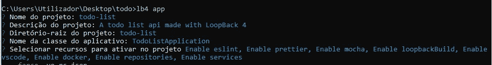
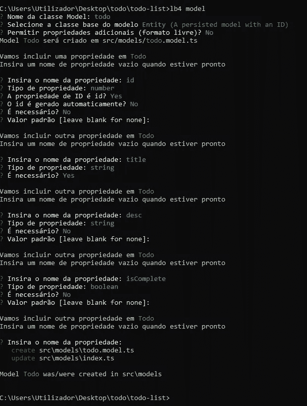
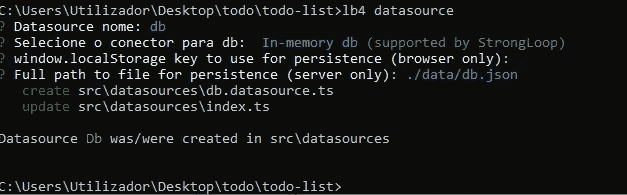
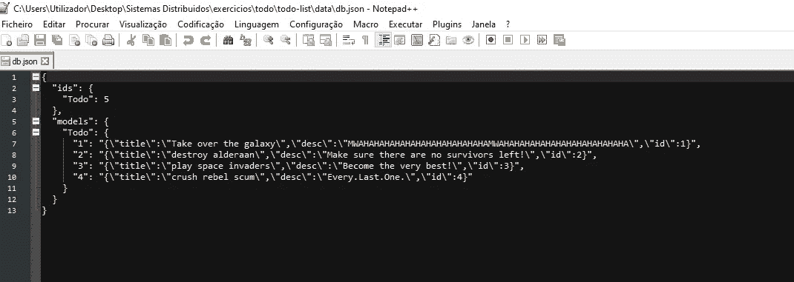
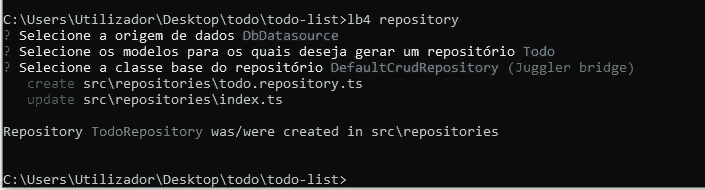
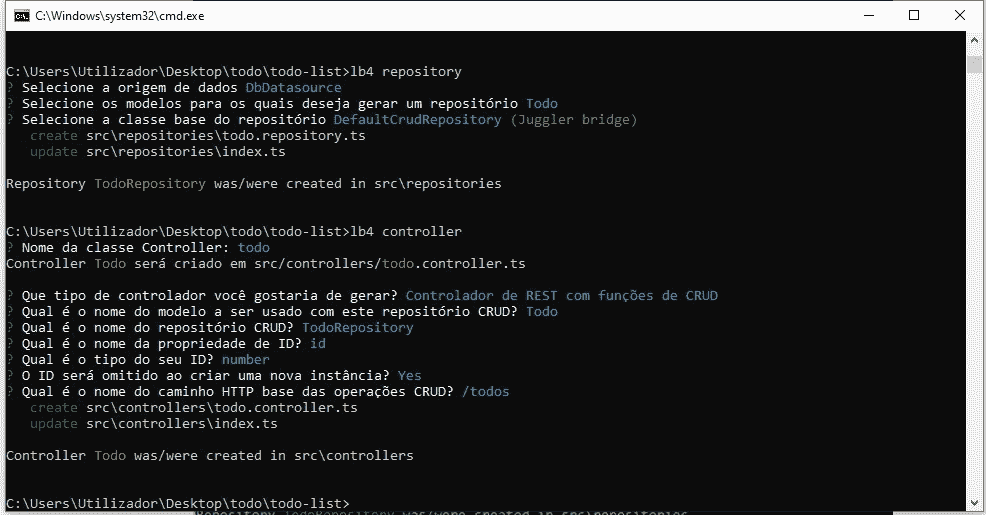
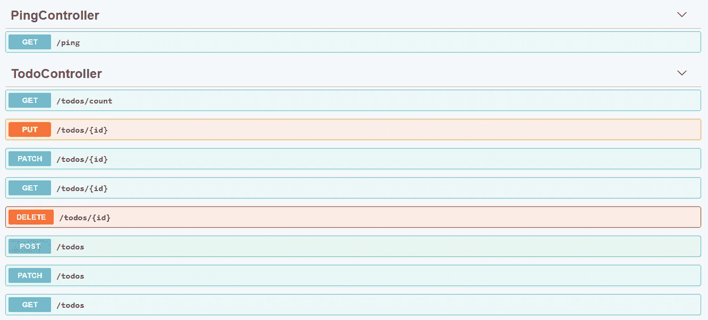
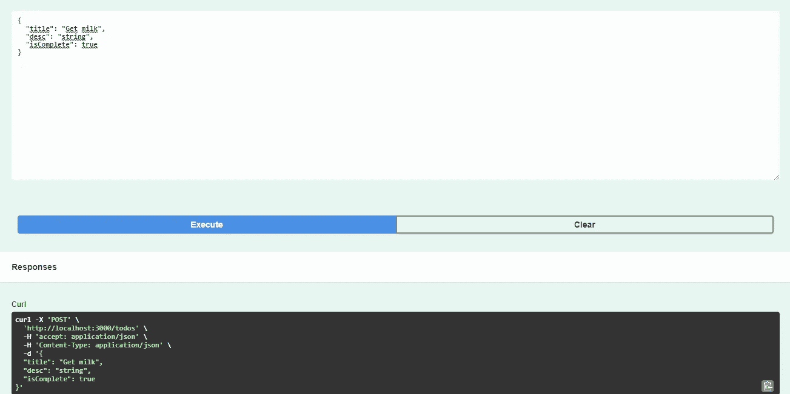

# 教程:用回送 IBM 创建 API

> 原文：<https://medium.com/nerd-for-tech/tutorial-create-api-with-loopback-ibm-ef06234f8635?source=collection_archive---------7----------------------->

在本教程中，我们将使用 Node.js 和一些概念

第一步是打开 Node.js 命令提示符，更改目录并键入以下命令来安装 LoopBack 4 CLI:

> `*npm i -g @loopback/cli*`

然后运行命令选择并克隆 todo 存储库:

> `lb4 example todo`

切换到目录。

> `cd loopback4-example-todo`

最后测试应用程序:

> npm 开始

下一步是创建我们的应用程序脚手架，开始编写命令:

> lb4 应用程序

用以下答案完成问题:

下一步是添加一个模型。

为此，只需键入:

> lb4 模型

然后回答以下问题并按回车键:

下一步是添加数据源。

开始键入以下命令:

> lb4 数据源

然后回答以下问题并按回车键:

之后，使用以下代码创建一个. json 文件:

下一步是创建存储库。

只需键入以下命令:

> lb4 存储库

然后回答以下问题并按回车键:

是时候添加控制器了。

开始键入:

> lb4 控制器

然后回答以下问题并按回车键:

最后键入以下代码:

npm 开始

并在浏览器上测试您的 API，输出应该如下所示:

您可以像这样测试 post 方法:

