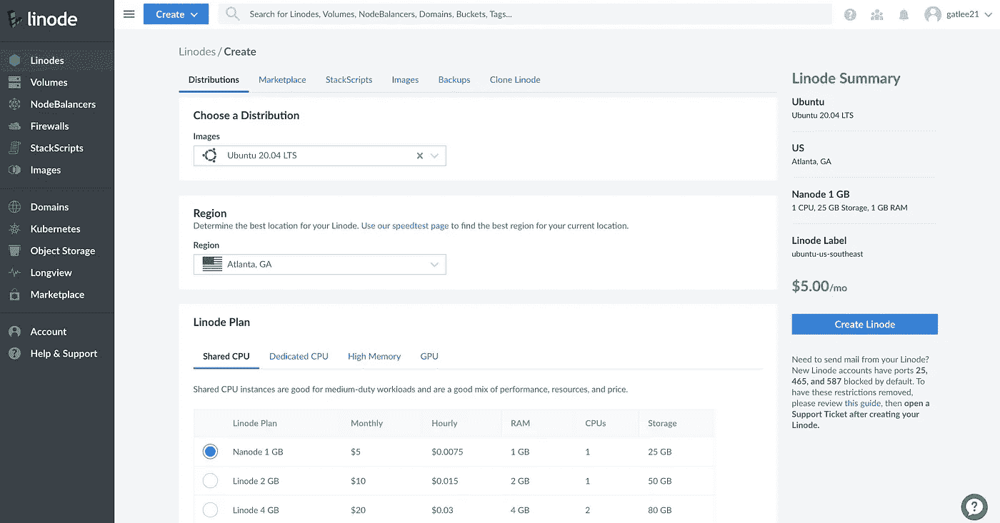
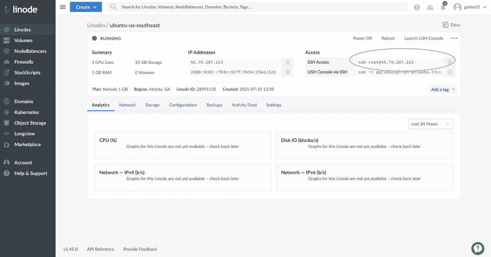
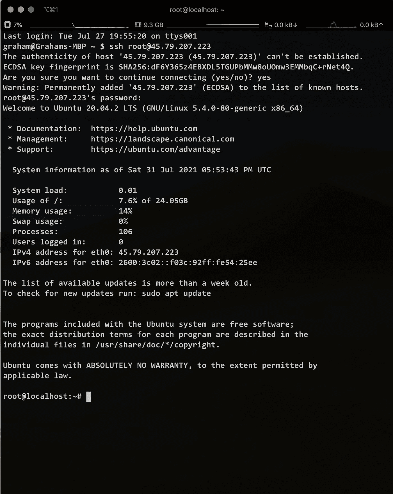
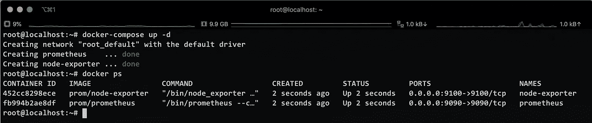
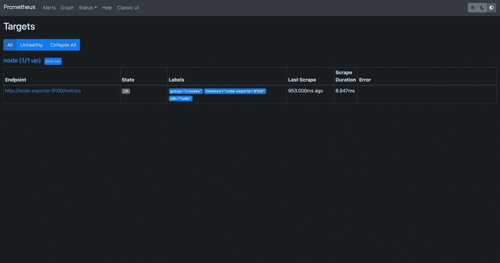
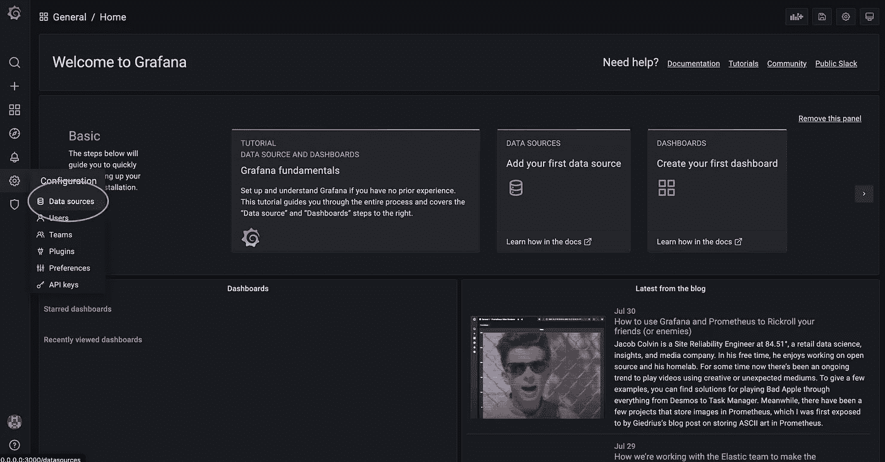
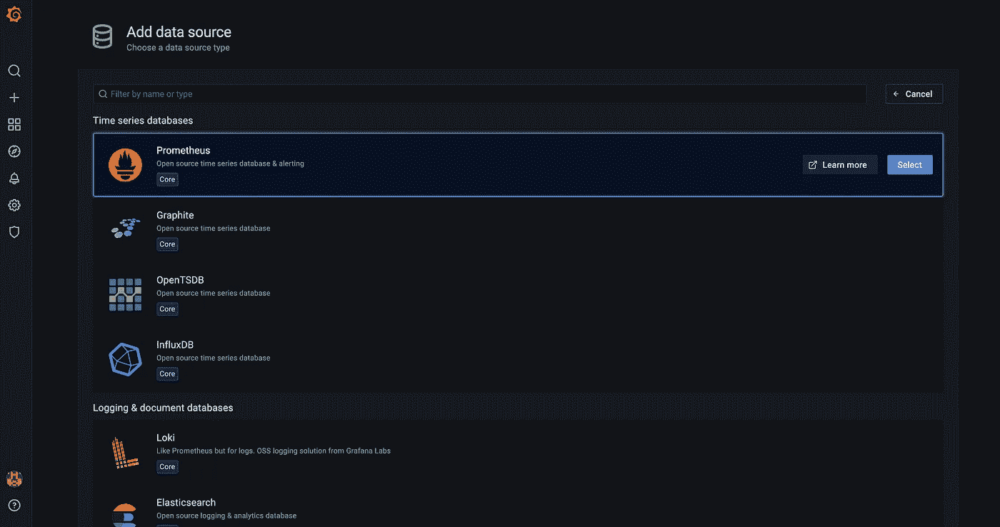
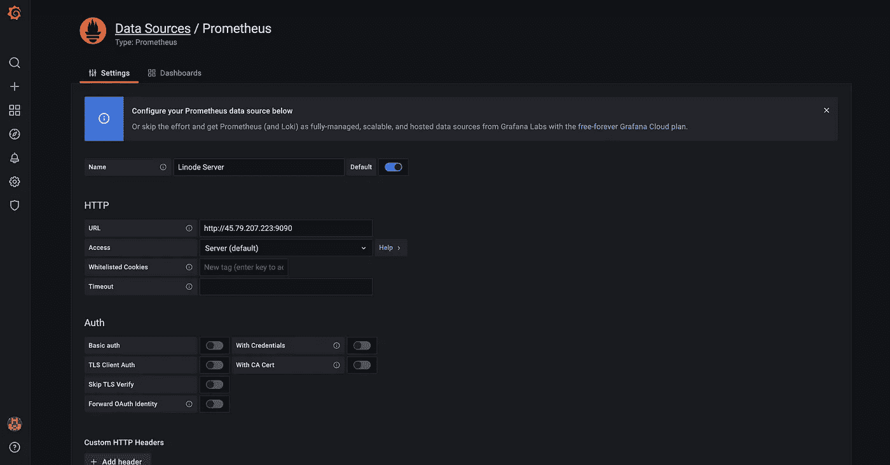
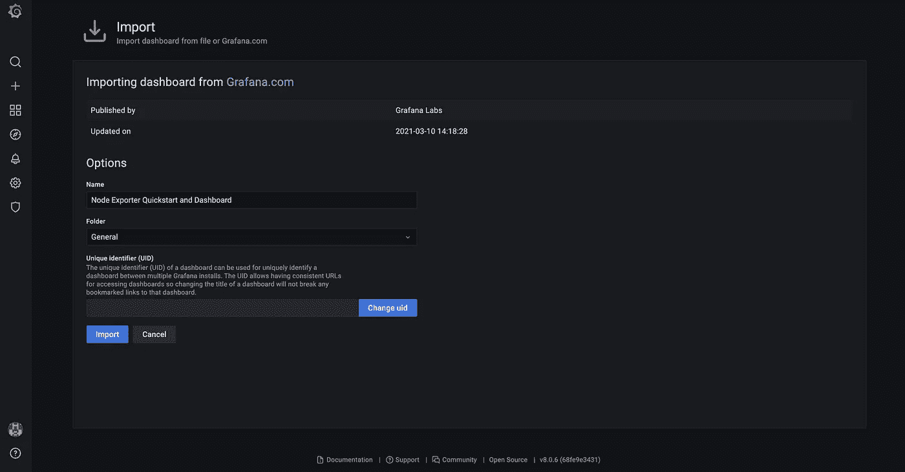
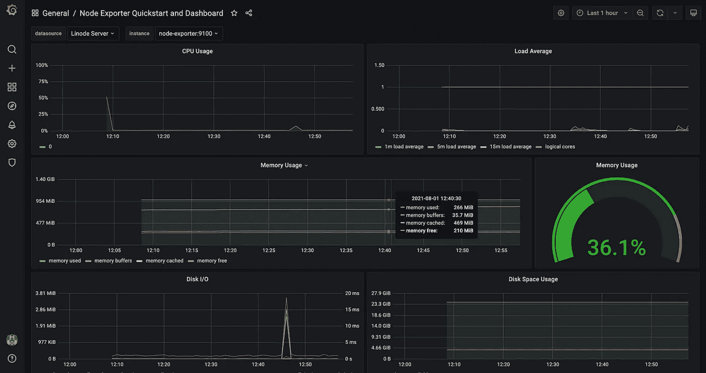

# 教程:如何将 Prometheus 和 Node Exporter 作为容器部署在远程服务器上(5 美元)

> 原文：<https://medium.com/nerd-for-tech/tutorial-how-to-deploy-prometheus-and-node-exporter-as-containers-on-a-remote-server-with-5-af5b449be49b?source=collection_archive---------1----------------------->

# 介绍

本教程的目的是向您展示如何在远程服务器上设置 Prometheus 监控。不是笔记本电脑上的本地主机，而是实际的远程服务器。您仍然需要您的笔记本电脑，但我们将通过在不同的计算机上放置节点导出器来收集硬件/操作系统指标。然后将使用本地机器上的 Grafana 仪表板可视化我们收集的数据。


代表我们将要做的事情的图表

# 先决条件

*   你已经在电脑上安装了 Docker，并且知道如何使用命令行界面
*   对什么是[普罗米修斯](https://prometheus.io/docs/introduction/overview/)和底层架构的高度理解
*   你知道什么是 [Grafana](https://grafana.com/docs/) 并且知道它被用来可视化来自数据源的分析
*   您之前已经编写了一个 [docker-compose](https://docs.docker.com/compose/gettingstarted/) 文件
*   您知道如何使用 Linux 命令行

这不是一个初学者友好的教程。我假设你正在阅读这篇文章，因为你有上述所有的经验。

# 花 5 美元买一台 Linode 服务器

我们将使用托管公司 Linode 来设置我们的远程服务器。去[Linode.com](https://www.linode.com/)注册一个账户(你不会马上收到账单)。点击 Linodes >创建一个 Linode，并如下配置您的设置:



向下滚动，输入服务器的名称和 root 密码(保持简单)。然后选择一个离你最近的地区(对我来说是佐治亚州亚特兰大)。请确保您选择最便宜的选项，因为我们不需要任何强大的本教程。

# SSH 进入我们的服务器并安装 Docker

你可以通过点击你的节点找到你的服务器的 IP 地址。



现在启动您的终端并通过 ssh 连接到服务器。请确保输入您在创建服务器时输入的密码。



注意:通常您会创建一个拥有 sudo 特权的新用户，但是为了节省本文的篇幅，您现在可以作为 root 用户登录。

```
apt-get update && apt install docker.io
```

现在在服务器上安装 Docker。

# 使用 Docker compose 安装 Prometheus 和节点导出器

现在，对于下一部分，我们可以使用以下 docker 运行命令单独创建容器:

```
#start node-exporter container
docker run -d \
  --net="host" \
  --pid="host" \
  -v "/:/host:ro,rslave" \
  prom/node-exporter:latest \
  --path.rootfs=/host# start promethues container 
docker run \
    -p 9090:9090 \
    -v /path/to/prometheus.yml:/etc/prometheus/prometheus.yml \
    prom/prometheus
```

然而，由于这是一个**多容器应用程序**并且有许多运行时参数，使用 docker-compose 配置会更聪明。

```
apt install docker-compose
```

所以让我们安装 docker-compose 并创建一个 YAML 文件来处理我们的容器运行时。

```
vi docker-compose.yml
```

让我们将以下内容添加到配置文件中，以设置多容器应用程序:

如果你想知道更多关于每一个字段实际上是做什么的，我推荐阅读普罗米修斯和 T2 节点导出器的文档。

# 创建 Prometheus 配置文件，然后运行容器

现在我们必须配置 Prometheus 来收集我们的节点导出器的指标。

```
vi prometheus.yml
```

创建一个 prometheus.yml 文件，并将以下内容添加到其中:

非常重要的一点是，你的目标是你的集装箱的名称，后跟它将监听的港口:<container_name: port=""></container_name:>

```
docker-compose up -d
```

在运行时，Compose 会将单个 prometheus.yml 文件复制到我们的容器中。接下来，运行 docker ps 以确保容器正在运行。您应该得到以下输出:



Compose 还将为我们的应用程序设置默认网络。每个容器都加入该网络，并且可以被该网络上的其他容器访问，并且可以通过与该容器名称相同的主机名被它们发现。

# 使用 Prometheus 作为数据源，将指标引入 Grafana

现在，如果您的主要目标是将 Prometheus 和 Node Exporter 设置为容器，那么您可以到此为止。你可以在浏览器中输入你的服务器的 IP 地址，然后输入端口 9090([http://45.79.207.223:9090](http://45.79.207.223:9090/graph?g0.expr=&g0.tab=1&g0.stacked=0&g0.show_exemplars=0&g0.range_input=1h)/)。这将把您带到 Prometheus 的默认 React 仪表板，在那里您可以使用 PromQL 查询指标。



然而，这些服务通常与 Grafana 等工具结合使用，以更好地阐明我们收到的指标。

让我们在您的**本地机器**上运行 Grafana 作为 Docker 映像，并为信息存储指定一个卷。

```
# create a persistent volume for your data in /var/lib/grafana 
docker volume create grafana-storage# start grafana
docker run -d -p 3000:3000 --name=grafana -v grafana-storage:/var/lib/grafana grafana/grafana
```

转到您机器上的 localhost:3000，使用“admin”作为用户名和密码登录。


然后导航到数据源，并单击添加新数据源。



选择 Prometheus，您将看到一个配置数据源的页面。你需要得到你的服务器的公共 IP 地址。重新登录到您的服务器，并输入以下命令:

```
hostname -I
# 45.79.207.223 172.17.0.1 172.20.0.1 2600:3c02::f03c:92ff:fe54:25ee
```

复制第一个 IP 地址 45.79.207.223，因为这是一个将被 Grafana 用来针对普罗米修斯。



输入完整的 URL 作为[http://45.79.207.223](http://45.79.207.223):9090，并确保访问设置为服务器。向下滚动并将您的 HTTP 方法设置为 post。然后单击 save & test，您应该会看到一个横幅，说明数据源正在工作。

最后一步是配置我们实际的仪表板。为此，我们将使用专门设计的[预构建仪表板](https://grafana.com/grafana/dashboards/13978)来显示节点导出器指标。

导航至仪表板>管理并选择导入。


13978 是节点导出器快速启动仪表板的 ID。



在这里填写你想要的任何信息。我将坚持使用生成的默认值。



我们做到了！我们正在查看佐治亚州亚特兰大的一台计算机的硬件指标。

我希望这个简短的指南对你有所帮助。在我自己的搜索过程中，我发现在将这两个服务部署为容器而不是守护进程时，缺乏有见地的文档。

也许在未来的教程中，我会向您展示如何使用 Ansible playbook 在多个服务器上部署这些容器。