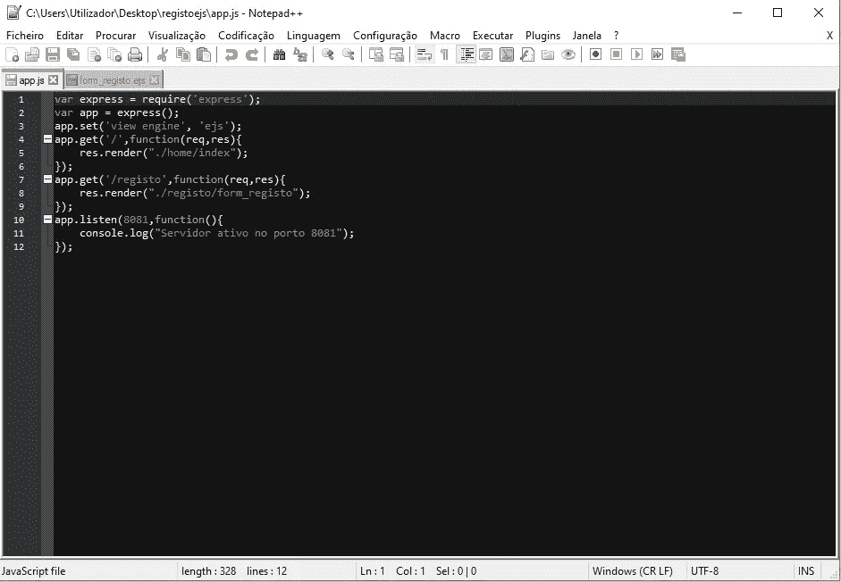
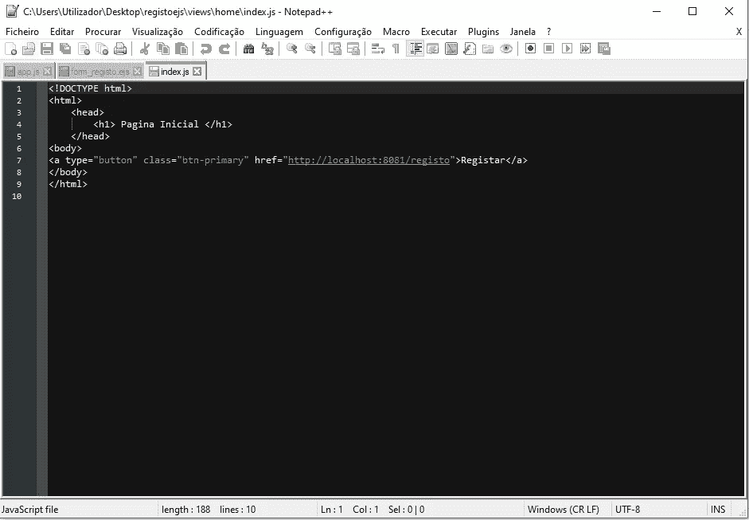
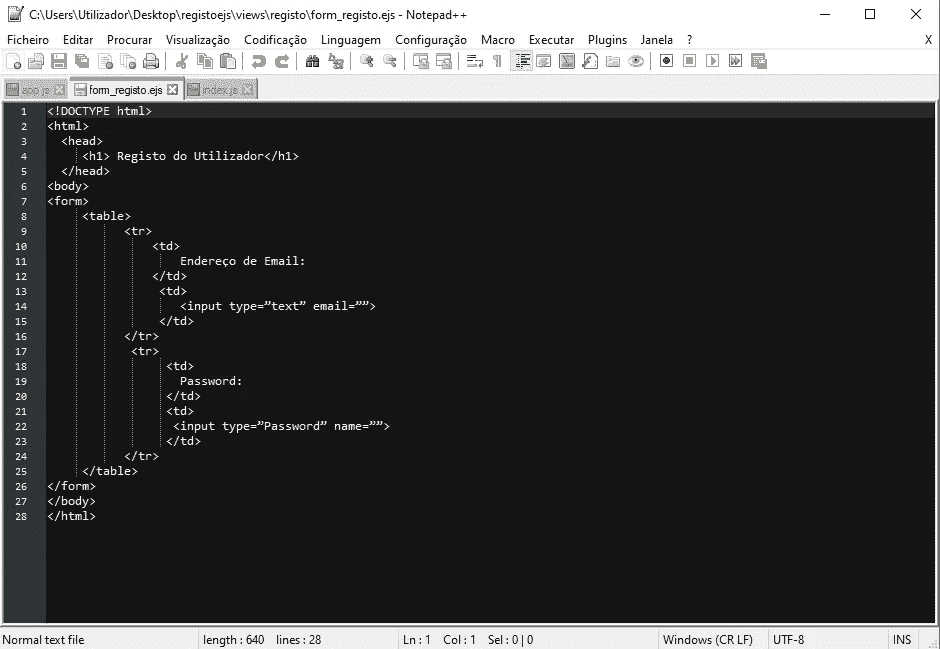
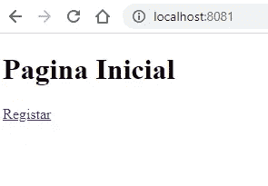
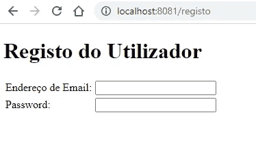

# 如何使用 EJS 引擎？

> 原文：<https://medium.com/nerd-for-tech/tuturial-node-js-how-to-use-engine-ejs-10b9323ab49a?source=collection_archive---------13----------------------->

# 什么是 EJS 发动机？

它被称为嵌入式 JavaScript 模板(EJS ),是一种简单建模语言，允许使用简单的 JavaScript 生成标记 HTML，具有以下特征:

>使用 JavaScript
>简单开发应用程序/服务
>非常容易调试
>简单语法
>帮助开发和使用 EJS 的庞大社区

如何在 node.js 中使用引擎 EJS？

第一步是安装 EJS 软件包，为此，我们将在 node.js 命令提示符下键入以下命令:

> npm 安装 ejs-保存

现在让我们创建一个结构操作系统文件夹的主文件夹，我们将命名为**“注册”**

然后在这个文件夹中，我们将创建另一个名为**“views”**的文件夹

在 **"Regist"** 文件夹中创建名为 **"app.js "、**的 JavaScript 文件，然后在 node.js 提示符下执行命令:

> npm 初始化

然后是代码:

> npm 快速安装-保存

在 app.js 文件上，我们将键入以下代码:

app.js 代码

一旦我们已经在代码中定义了，我们就不需要指明扩展名。

在 **"viwes"** 文件夹中，我们将创建另一个名为 **"home"** 的文件夹，其中我们将创建一个名为 **"index.js":** 的 JavaScrip 文件

index.js 文件

在 **"viwes"** 文件夹中，我们将创建另一个名为 **"regist"** 的文件夹，在 **"regist"** 文件夹中，我们将使用以下代码创建 html 文件:

表单 html 文件

然后，在 node.js 提示符下，我们将键入(在放置 app.js 的目录下):

> node app.js

并将以下 url 放入您的浏览器中:

> [http://localhost:8081](http://localhost:8081)

输出应该是这样的:

产出 1

产出 2