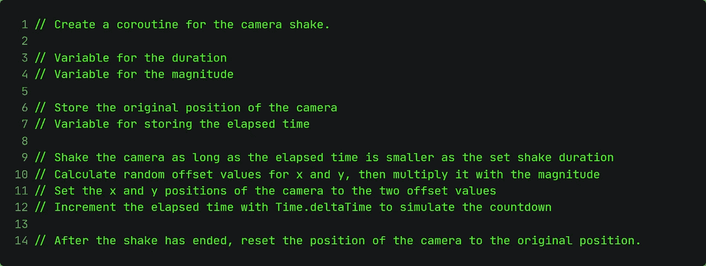
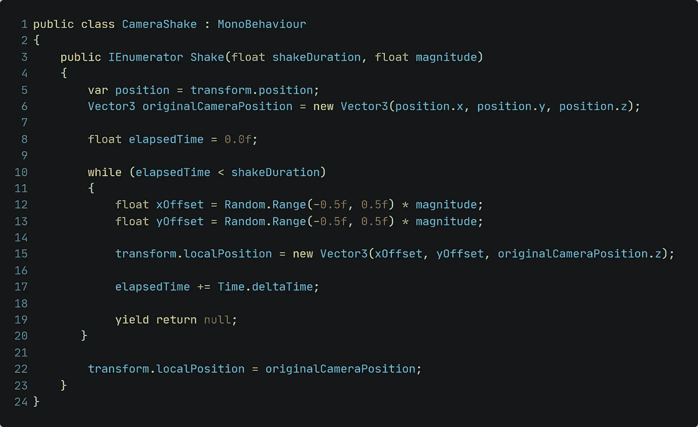
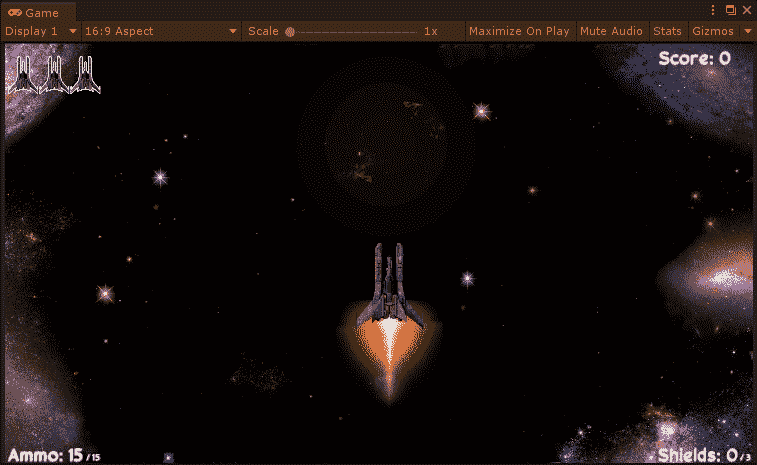

# 调整-添加相机抖动

> 原文：<https://medium.com/nerd-for-tech/tweaking-adding-a-camera-shake-7db72081ed5a?source=collection_archive---------19----------------------->

## 为游戏增添更多的沉浸感！

为了进一步增加玩家对游戏的沉浸感，我们还可以增加一些除了音效和音乐之外的东西。以损坏为例，相机会抖动。

只使用 Cinemachine 是有可能实现的，但这不是我这次要做的，因为我缺乏这方面的知识。因此，我们只需创建一个小脚本来实现相机抖动行为！

让我们来看看我们必须做些什么:

下面是脚本最终的样子:

因为这个方法是公共的，所以我们可以在需要的时候很容易地调用它。

下面是游戏中相机抖动的样子，幅度和持续时间为 0.5:

这就是今天的文章！享受创造新东西的乐趣，保重！