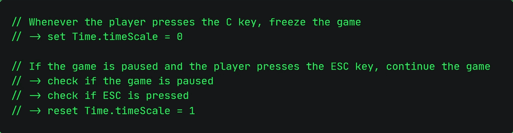
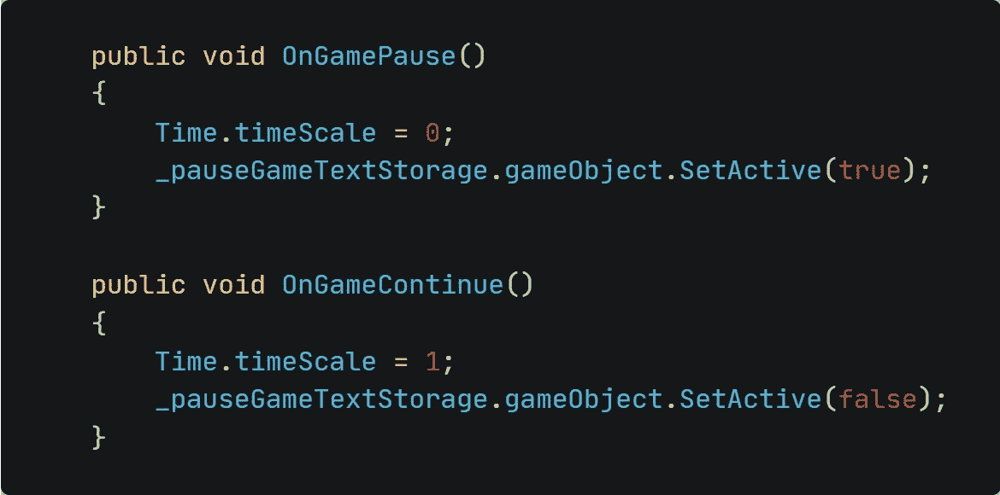
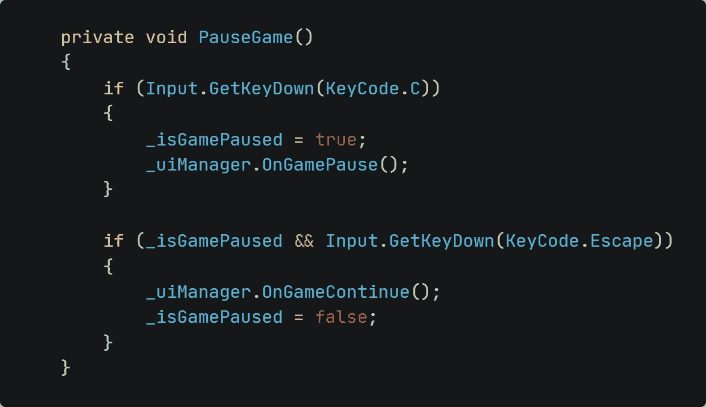
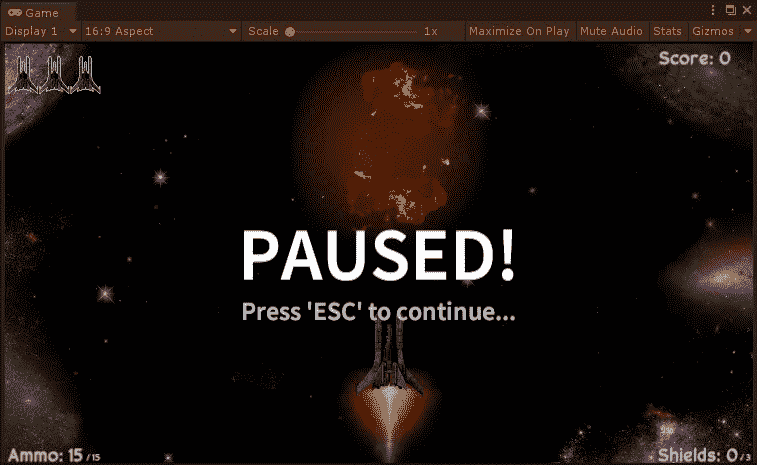

# 调整-添加一个“暂停”菜单

> 原文：<https://medium.com/nerd-for-tech/tweaking-adding-a-pause-menu-cea97436935d?source=collection_archive---------25----------------------->

## 非要去 afk？那就暂停游戏！

我们都知道这种情况:你正在玩游戏，但突然我们的电话响了，你必须接电话。或者，更常见的是，你必须去厕所。如果让我猜的话，你会在这种情况下暂停游戏——如果你不是在玩在线游戏的话。让我们在 Space Shooter 中也实现这样一个功能，让你在这种情况下也能得到保护！

为了控制游戏过程中事情发生的速度，Unity 有一个叫做*time . scale*的方法。

让我们来看看到底要用伪代码做什么:

我们只需要在这里添加四个小东西:

*   一个 bool 变量，用于检查游戏是否暂停
*   触发暂停功能的方法
*   继续游戏的方法
*   一个检查按钮按下的方法，然后调用其他方法

对于变量，我只是把它命名为*_ isgamepathensed。*

对于第二点和第三点，我创建了一个新方法来处理 *UIManager.cs* 脚本中的单个任务。由于暂停系统的文本元素应该只在游戏暂停时可见，所以我也添加了对它们的引用，并相应地启用和禁用它们。

对于最后一个任务，我在 *GameManager.cs* 脚本中创建了另一个方法。

当游戏暂停时，不要忘记将 bool 设置为 true！

要做到这一点，请确保调用 *void Update()* 中的方法。否则，暂停系统将完全不起作用，因为它不会检查 C 键是否被按下。

这是它在游戏中的样子:

这就是今天的帖子。如果你曾经不得不离开你的键盘，不想让游戏继续运行，你现在可以这样做。