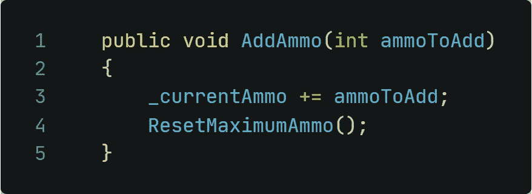
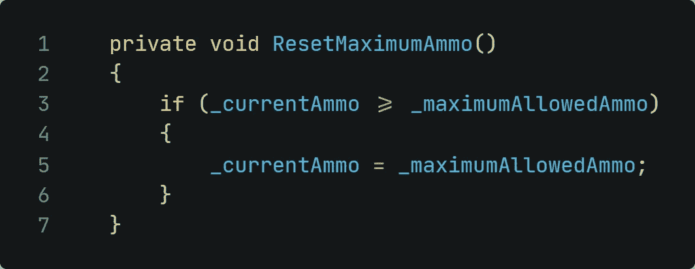
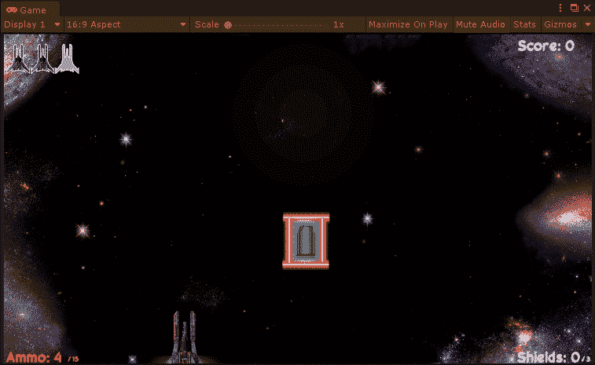
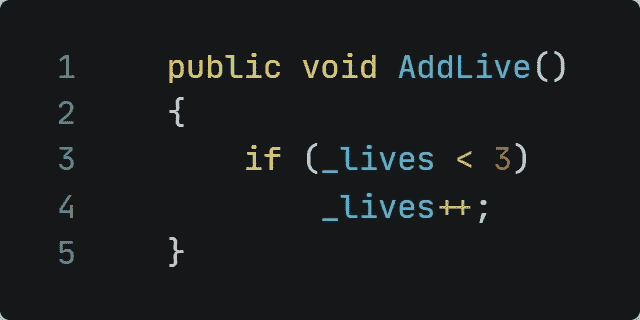
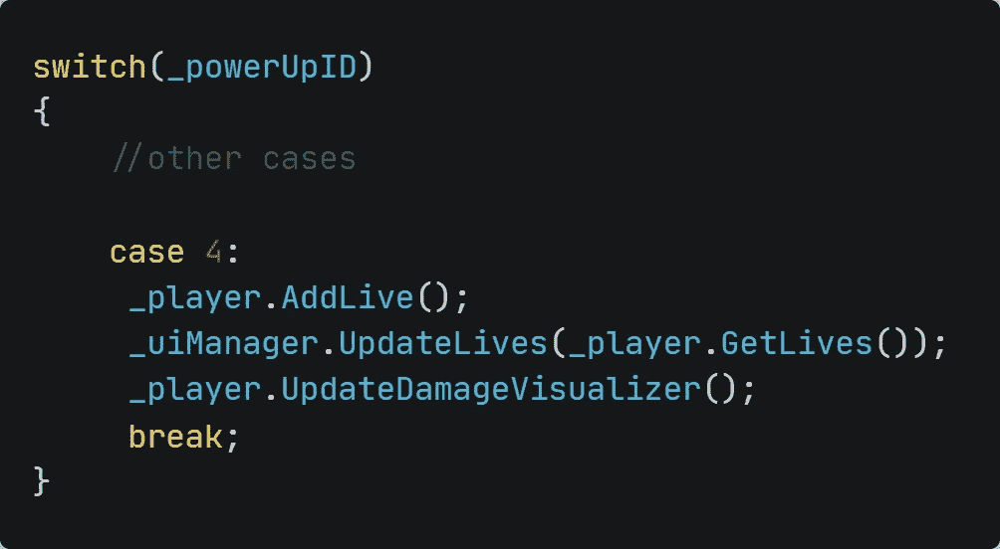
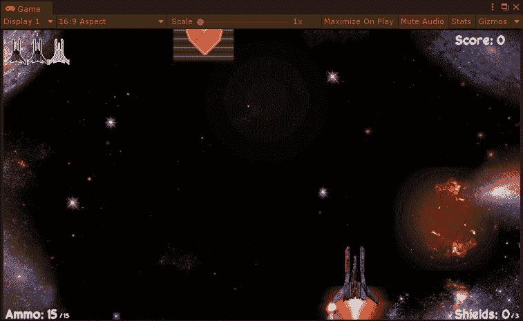

# 调整-添加充电电源

> 原文：<https://medium.com/nerd-for-tech/tweaking-adding-refilling-powerups-e8d0118a0744?source=collection_archive---------20----------------------->

## 没子弹了还是命不久矣？买一个这个！

在本帖中，我们将回顾太空射击游戏的一些改进和调整。

一、增加“弹药+”的能量
就在最近，我们限制了玩家可用弹药的数量。然而，没有能力补充弹药。因此，这个游戏将被限制在 15 次射击，之后将是一个简单的生存和躲闪…直到现在。玩家现在可以借助新的能量补充来补充弹药。

因为这个没有预建的随时可用的 powerup sprite，所以我只是使用提供的资源创建了一个，并对它们进行了处理。

逻辑实现非常简单快捷:

*   我们需要添加一个函数来重新分配当前的弹药变量。然而，我们想把这种方法模块化，因为可能会有另一种能量(或情况)会增加或减少弹药。
*   如果重新分配的弹药值超过了最大允许弹药值，我们应该重置它以避免任何问题或错误。

第一个函数只用两行代码就完成了:

当我们调用这个方法时，我们决定在这个调用中将添加多少弹药。然后，我们简单地将我们选择的数量添加到当前可用的弹药计数器中。

为了防止当前弹药超过最大允许弹药，我们需要另一个小方法:

最后，我们只需要在 *PowerUp.cs* 脚本中调用 *AddAmmo()* 方法。这是游戏中完全有效的实现:

**二。添加一个“HP+”power up** 这个的实现与来自 *Ammo+* powerup 的实现非常相似:

*   如果玩家剩余的生命少于三条，加一条
*   更新屏幕上显示的实时可视化工具以显示当前生活
*   确保同时更新损坏可视化工具

第一个方法将在 *Player.cs* 脚本中创建。powerup ID switch 语句中的 *PowerUp.cs* 脚本中的后两个方法。

给玩家增加生命的第一个方法

更新用户界面元素的方法

以下是收集能量时发生的情况:

*   玩家将获得另一次生命
*   表示当前生命的 UI 元素通过询问 *Player.cs* 脚本玩家还有多少生命来更新。返回的数字将是加载的精灵
*   玩家的伤害观察器将会更新以适应当前可用的生命

以下是工作的最终结果:

