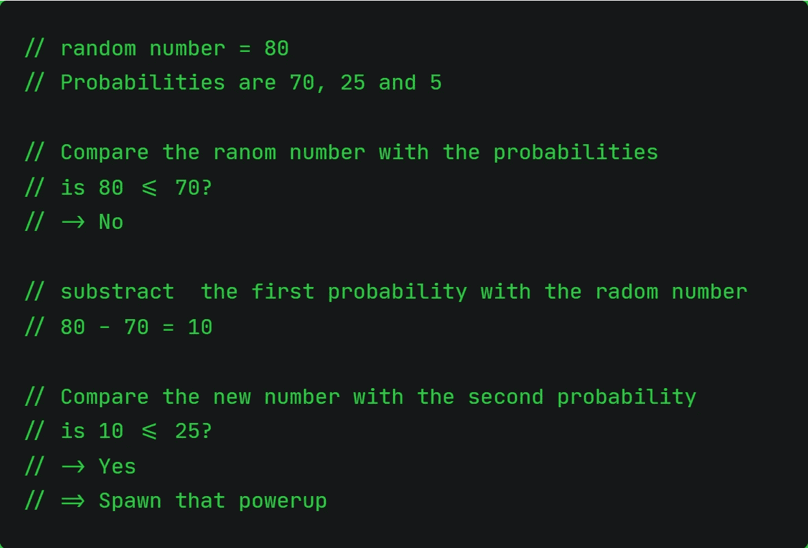
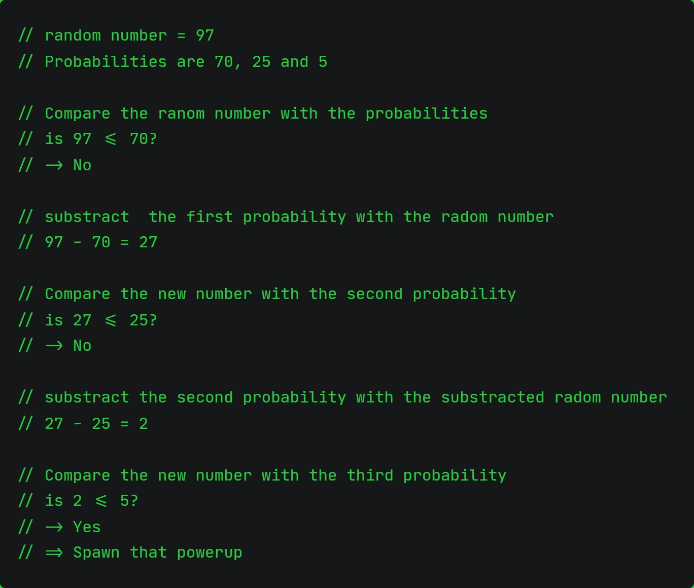
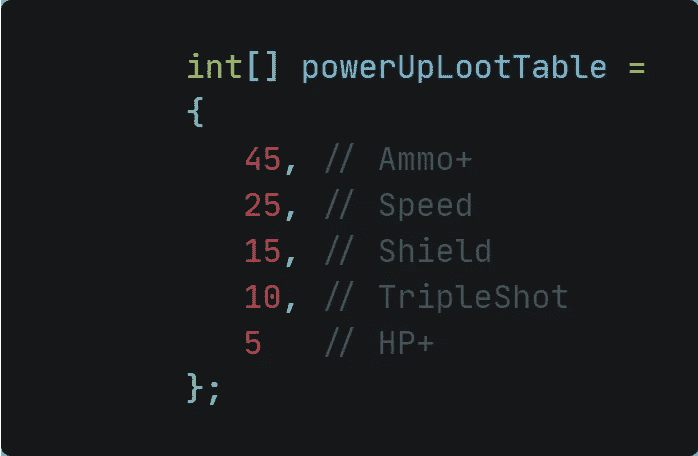

# 调整了一个随机循环表的平衡加电产卵系统

> 原文：<https://medium.com/nerd-for-tech/tweaking-balanced-powerup-spawn-system-with-a-random-loop-table-f3c5a790895?source=collection_archive---------19----------------------->

## 以模块化的方式随机化物品掉落！

由 [Unsplash](https://unsplash.com?utm_source=medium&utm_medium=referral) 上的 [Edge2Edge 媒体](https://unsplash.com/@edge2edgemedia?utm_source=medium&utm_medium=referral)拍摄

好吧，这个挑战很有挑战性。不知道如何实现这样的行为，只有一种方法来解决这个问题。研究中。一种叫做“加权概率”的东西出现了，这正是我所需要的。然而，所有的代码片段、解释和文档对我来说都有点让人不知所措。因此，我试图寻找一些更详细的信息，并在 YouTube 上找到了 GameDevHQ 的深入[教程。就在那时，我开始明白了！](https://www.youtube.com/watch?v=OUlxP4rZap0)

让我们现在接受挑战。

截至目前，太空射手包含五个电源:

*   0:三枪
*   1:速度提升
*   2:盾牌
*   3:弹药+
*   4: HP+

如果我现在在脑海中给它们排序，我会给弹药+最高的产卵率，因为我们经常需要它。HP+ powerup 应该是比较少见的。因此它产卵的可能性最小。其他都介于两者之间。

当然，这些值必须在事后决定和调整，但这在最后会很快完成。

**算法的基本思想** 我们有一个加权表，最大值上升到 100。为了简单起见，让我们想象一下，在那张桌子里有三个电源。一个有 70%的概率掉下来，另一个有 25%的概率掉下来，最后一个有 5%的概率掉下来。

为了从中选择一个，我们需要一个随机数发生器来产生一个 0 到 100 之间的数。假设生成器返回一个数字 80。我们要做什么？我们来看看伪代码。这应该足以理解算法的基本思想，无需进一步解释。

我们来做第二个例子。这次抽到了随机数 97。

随机数与概率进行比较。如果概率越小，该项目就越多。如果不是，这个数字将被减去，然后与下一个数字进行比较。

**实施进入游戏** 要做的第一件事是决定如何对功率进行加权。

因为可用的弹药会很快耗尽，所以我决定放弃弹药+能量。盾，三枪，HP+应该很少掉。HP+是最稀有的一种，其次是三倍投。护盾加电应该不会像加速加电那么频繁。

因此，战利品表看起来像这样:

***为了不破坏算法的功能，重要的是从最高机会到最低机会列出加权功率。***

完整的算法如下所示:

我们将所有单独的权重相加，形成一个变量，称为*总权重*。然后，生成随机数，并与 *powerUpLootTable* 数组中的每一项进行比较。如果随机数比权重小，将会产生能量。如果它更高，索引 *i* 增加 1，权重将从随机数中减去。

这就是我们在本文前面讨论过的算法:)

今天的文章就讲到这里！让我们看看明天会有什么实现或调整吧！