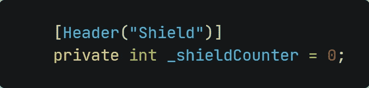
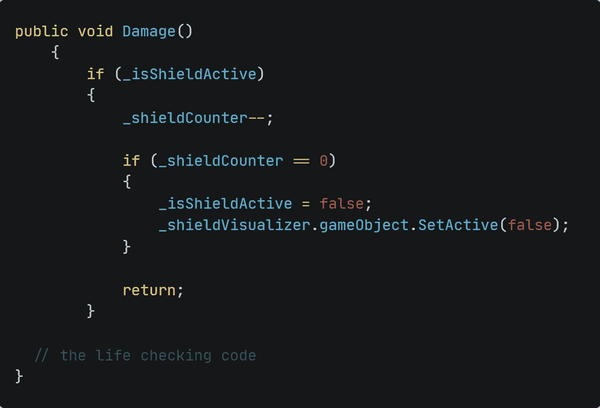
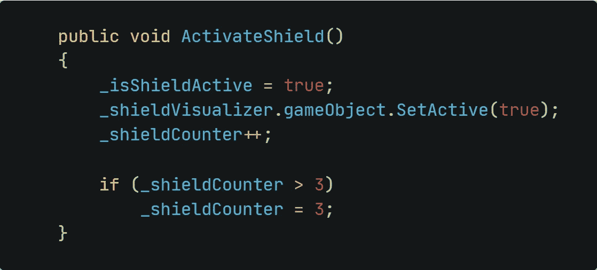
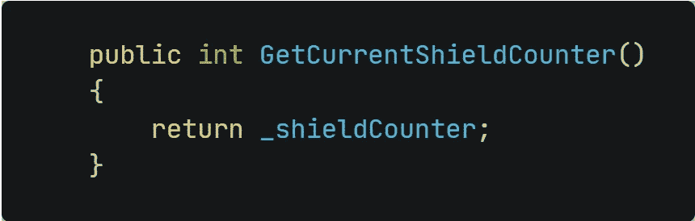
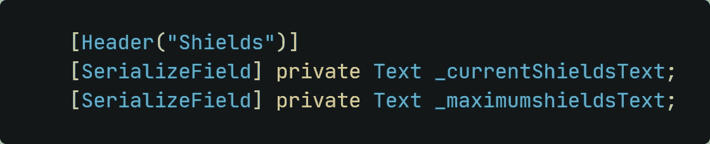
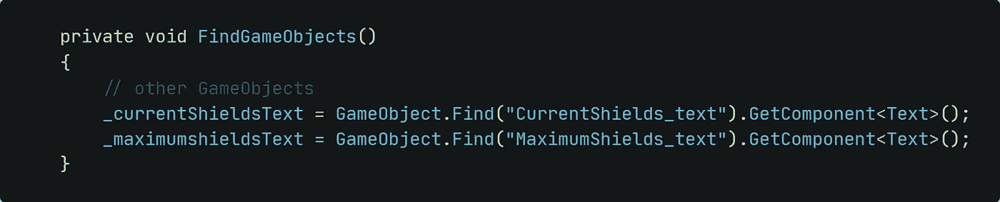
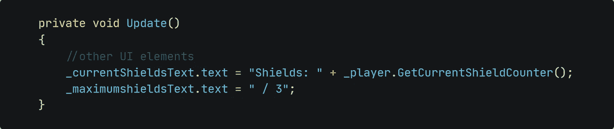
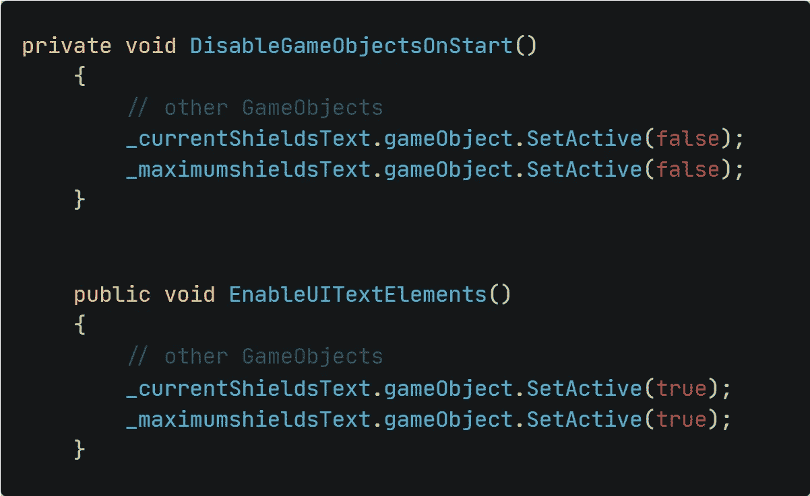
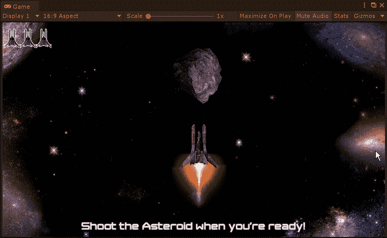

# 调整-多重护盾

> 原文：<https://medium.com/nerd-for-tech/tweaking-multiple-shields-cf7325b5a4be?source=collection_archive---------29----------------------->

## 更多的防守？那好吧。

蒂姆·米尔克在 [Unsplash](https://unsplash.com?utm_source=medium&utm_medium=referral) 上的照片

我们已经有一个机械师来防御敌人的攻击。让我们稍微调整一下，把你能拥有的护盾最大化到三个。

**一、设置 *Player.cs 脚本***

**I.1 -变量**首先，我们需要添加一个变量来存储我们当前拥有的盾量。姑且称之为 *_shieldCounter。*

**I.2 伤害()方法**当我们被击中并且护盾处于激活状态时，我们不想每次都禁用护盾 bool。首先，我们希望将 _shieldCounter 变量减少 1，并且仅在 _shieldCounter 达到 0 时禁用屏蔽状态。

ActivateShield()方法
因为我们有一个 _shieldCounter 变量存储玩家当前拥有的盾牌数量，我们不应该忘记在脚本中正确地实现它。

*   每当我们收集一个护盾能量，我们就增加 _shieldCounter 的计数。
*   然而，当我们达到最大值*(在本例中为 3)*时，我们不想增加计数器，而是将它保持在最大值。

创建一个新的 GetCurrentShieldCount()方法
由于我们已经为盾牌添加了 UI 元素，我们需要一个方法来返回当前的盾牌数量，以便正确地更新屏幕上的 UI。

***二世。设置 UIManager.cs 脚本***

**II.1 变量**我们这里需要两个 Text 类型的 GameObjects。一个显示当前我们拥有的护盾数量，另一个显示最大允许护盾数量。

**II.2 分配文本元素**简单的告诉 Unity 搜索两个游戏对象，抓取其中的文本组件。

**II.3 设置 UI 逻辑**
要显示当前的盾量，我们只需访问之前在 *Player.cs* 脚本中创建的方法。现在，我们可以键入最大金额的文本。

**二. 4 细节** 这个做的挺快的。

*   我们想在玩家拍摄小行星之前隐藏文本元素
*   在小行星被摧毁后，我们想展示用户界面元素

当我们在需要的地方调用方法时，我们只需要在这里添加游戏对象。

完成的实现看起来是这样的:

隐藏和显示用户界面元素