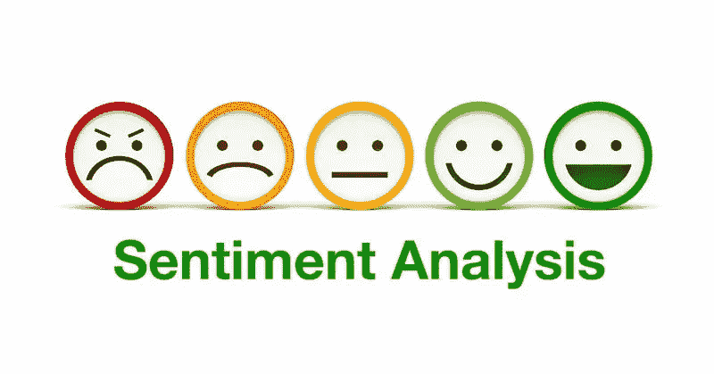
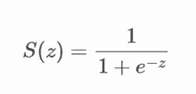
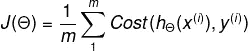
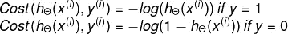
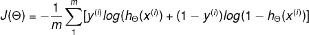
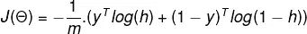

# 使用逻辑回归的推特情感分析

> 原文：<https://medium.com/nerd-for-tech/twitter-sentiment-analysis-using-logistic-regression-ff9944982c67?source=collection_archive---------3----------------------->



图片来源: [Reputationx](https://blog.reputationx.com/reputation-sentiment)

**情绪分析:**

情感分析是一种 NLP 技术，它允许我们将一条文本、推文或评论分为正面、中性或负面。今天的技术使用户能够比以往任何时候都更公开地在社交平台上表达他们的情感和思想。因此，情感分析已经成为每个企业了解用户情感和衡量其绩效的强制性工具，以便根据用户需求定制产品和服务，从而使系统更加高效。

**逻辑回归:**

逻辑回归是一种用于分类问题的监督机器学习技术。监督机器学习算法在带标签的数据集上进行训练，并使用答案来训练和评估其准确性。该模型的目标是学习和逼近从输入变量{x1，x2，xn}到输出变量(Y)的映射函数 f(Xi) = Y。它被称为有监督的，因为模型预测被反复评估并根据输出值进行修正，直到达到可接受的性能。

**使用逻辑回归的情感分析:**

作为使用逻辑回归建立情感分类器的一部分，我们在 twitter 样本数据集上训练该模型。可用的数据集是推特的自然人类格式，这对于模型来说不太容易理解。因此，我们必须做一些数据预处理和清理工作，将给定的文本分解成易于理解的模型格式。

推文的预处理包括以下步骤:

1.  移除标点符号、超链接和标签
2.  标记化——将句子转换成单词列表
3.  将单词转换成小写
4.  删除停用词
5.  词汇化/词干化——将单词转换为其词根

```
def process_tweet(tweet):
    tweet = re.sub(r’\$\w*’, ‘’, tweet)
    tweet = re.sub(r’https?:\/\/.*[\r\n]*’, ‘’, tweet)
    tweet = re.sub(r’#’, ‘’, tweet)
    tokenizer = TweetTokenizer(preserve_case=False, strip_handles=True,reduce_len=True)
    tweet_tokens = tokenizer.tokenize(tweet)
    stopwords_english = stopwords.words(‘english’)
    stemmer = PorterStemmer()
    tweets_stem = []
    for word in tweet_tokens:
        if(word not in stopwords_english and word not in string.punctuation):
        tweets_stem.append(word)
        stem_word = stemmer.stem(word)
        tweets_stem.append(stem_word)
    return tweets_stem
```

对于这个模型，我们将使用 NLTK 的 twitter_samples 语料库作为我们的标记训练数据。twitter_samples 语料库包含 3 个文件。

1.  包含 5000 条负面推文
2.  包含 5000 条正面推文
3.  tweets . 2015 04 30–223406 . JSON:包含 20k 条正面和负面推文

让我们考虑分析的前两个文件

```
positive_tweets = twitter_samples.strings(‘positive_tweets.json’)
negative_tweets = twitter_samples.strings(‘negative_tweets.json’)
```

我们以 20:80 的比例将数据分成训练测试集，并将它们组合起来，以使用训练集来训练模型，并使用测试集来测试模型性能。

```
test_positive = positive_tweets[4000:]
train_positive = positive_tweets[:4000]
test_negative = negative_tweets[4000:]
train_negative = negative_tweets[:4000]
train_x = train_positive + train_negative
test_x = test_positive + test_negative
```

将正负标签组合成目标变量的数组。正面推文附加 1，负面推文附加 0。

```
train_y = np.append(np.ones((len(train_positive), 1)), np.zeros((len(train_negative), 1)), axis=0)test_y = np.append(np.ones((len(test_positive), 1)), np.zeros((len(test_negative), 1)), axis=0)
```

**建立频率字典:**

目前的情况是一个二元分类问题，每条推文可以是正面的，也可以是负面的。所以很少有词在正面或负面的推文中出现得更频繁。因此，了解这些信息有助于我们预测包含这些词的推文/句子是积极的还是消极的。

例如，如果“快乐”一词在标记为积极的推文中出现得更频繁，那么下次当推文中包含“快乐”一词时，它会增加推文情绪积极的可能性。

所以我们计算每个单词在正面和负面推文中出现的次数。我们使用字典来表示它，其中关键字是(单词、情感)对，频率是值。

假设如果 happy 在情绪积极的推文中出现 40 次(1)，在情绪消极的推文中出现 8 次(0)，则表示为 dictionary={("happy "，1):40，(" happy "，0):8}。

让我们通过将每个(单词、情感)对映射到其在语料库中的频率来创建字典。

```
freqs = {}
for y, tweet in zip(y, tweets):
    for word in process_tweet(tweet):
        pair = (word, y)
        freqs[pair] = freqs.get(pair, 0) + 1
```

**特征提取:**

机器学习模型只能处理数字而不是文本，因为它们只能理解二进制数字的语言。因此，我们需要将这些推文转换成向量，这些向量可以在以后输入到我们的模型中进行训练。根据上下文，有很多方法可以将文本表示为向量。

我们将使用上一节构建的频率字典将每条推文转换为三维向量，如下所示:

tweet = [1，正类词的σfreq，负类词的σfreq]

因为每条 tweet 都表示为一个向量，所以我们可以将所有向量组合成一个矩阵

```
*# loop through each word in the list of words* **for** word **in** word_l:
*# increment the word count for the positive label 1* **if** (word,1.0) **in** freqs:
        x[0,1] += freqs[(word,1.0)]
    **else**:
        x[0,1] += 0*# increment the word count for the negative label 0* **if** (word,0.0) **in** freqs:
        x[0,2] += freqs[(word,0.0)]
    **else**:
        x[0,2] += 0
```

现在我们已经为训练准备好了数据集和要素，让我们来看看逻辑回归及其工作原理。

**乙状结肠激活功能:**

逻辑回归使用最大似然技术实现最佳预测。Sigmoid 是一个数学函数，其特征是可以取-∞和+∞之间的任何实数值，并将其映射到 0 到 1 之间的实数值。因此，如果 sigmoid 函数的结果大于 0.5，则我们将其归类为正类，如果小于 0.5，则我们可以将其归类为负类。



**成本函数和梯度下降:**

在逻辑回归的情况下，我们使用交叉熵或对数损失成本函数。交叉熵成本函数可以分为两个成本函数，每个输出一个。



成本函数的向量形式由下式给出



在上述等式中乘以 y 和(1y)是一个技巧，让我们可以使用同一个等式来求解 y=1 和 y=0 的两种情况，消除另一种情况，并且在每种情况下只执行所需的运算。

给定输入为特征矩阵 X、目标变量 Y、学习率α和迭代次数 num_iters，使用梯度下降迭代计算θ

```
**def** gradientDescent(x, y, theta, alpha, num_iters):
    **for** i **in** range(0, num_iters):
        z = np.dot(x, theta)
        h = sigmoid(z)
        J = (-1/m)*sum(np.dot(np.transpose(y), np.log(h))+ np.dot(np.transpose(1-y),np.log(1-h)))
        theta = theta — (alpha/m)*(np.dot(np.transpose(x),(h-y)))
```

**训练&评估情感分类器:**

应用梯度下降，并获得最佳权重的合成θ向量。使用提取的特征向量 x 和θ向量的点积的 sigmoid 来预测新推文的情感

```
y_pred = sigmoid(np.dot(x, theta))
```

阈值设置为 0.5。因此，如果 y_pred > 0.5，则预测为正面推文，否则为负面推文。

```
**if** y_pred > 0.5:
    y_hat.append(1)
**else**:
    y_hat.append(0)
```

对于给定的数据集，使用该模型获得了 99.5%的准确率，这几乎是完美的！

注意:这个博客是基于 https://www.deeplearning.ai/的新专业 NLP