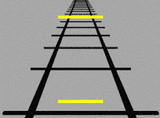
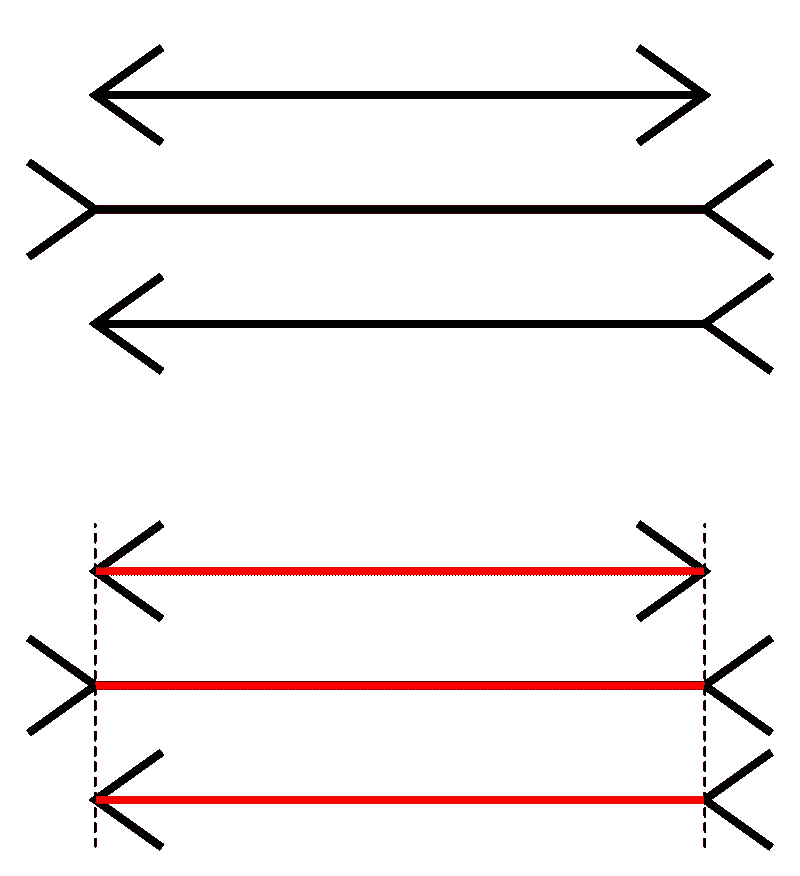

# 有助于界面设计的两种基本错觉。

> 原文：<https://medium.com/nerd-for-tech/two-basic-illusion-which-helps-in-interface-design-4d407647619c?source=collection_archive---------10----------------------->

在设计界面时，你应该注重对人类心理的理解。我们如何解读视觉信号？事物存在的方式和我们感知它们的方式。注意距离、配色方案和上下文对象。例如，如果你想让用户在屏幕底部显示错误信息，它最好是闪烁的。我们的期望影响人们对图像的感知方式。我们对大小的感知并不完全可靠。以下是基于物体大小的错觉，有助于理解界面设计。

## **庞索错觉:**

*一种视错觉，由于透视效果，两个相同的图形看起来大小不同。两条相同的线看起来大小不同的视错觉，因为它们重叠在一组独立的逐渐缩小的平行线上。*

庞索错觉影响了我们对尺寸的感知。庞佐假设，大脑依靠背景来判断它所看到的事物的大小。移除或扭曲上下文，最终你的大脑会被骗做出错误的判断。在庞索错觉中，是潜在线条造成的强制透视导致了所有的问题。

庞索错觉(GIF)

通过将两条相同的线叠加在一系列逐渐缩小的会聚线上，如火车轨道，庞索错觉欺骗我们的大脑，假设两条线的上部一定更长，因为它看起来——仅仅是因为它的背景——似乎“在远处”因此，要想和下面的线一样大，上面的线必须更大，因为我们感觉它“更远”当然不是，因为我们看到的是一幅平面图。但由于我们对背景中强制视角的感知，我们会感到困惑，并做出误判。

## 穆勒-莱尔错觉；

*Muller-Lyer 错觉是一种众所周知的视错觉，其中两条长度相同的线看起来长度不同。*

米勒-莱尔错觉

在上图中，哪条线出现的时间最长？对大多数人来说，箭头向外的线看起来最长，而箭头向内的线看起来更短。虽然你的眼睛可能会告诉你中间的线是最长的，但两条线的轴是完全一样长的。